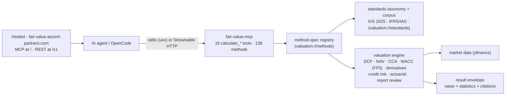
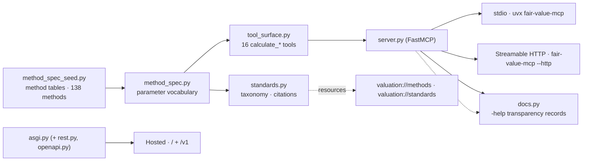
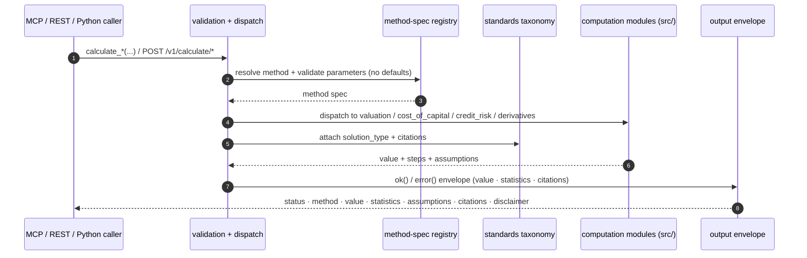
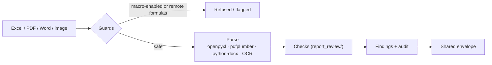

# Fair Value

[](https://pypi.org/project/fair-value/)
[](https://github.com/simonmak-ascent/fair-value/actions/workflows/ci.yml)
[](./LICENSE)
[](https://registry.modelcontextprotocol.io/v0/servers?search=fair-value)
[](https://glama.ai/mcp/servers/simonmak-ascent/fair-value)

Professional financial valuation system for OpenCode with IFRS/IVS compliance.

mcp-name: io.github.simonmak-ascent/fair-value

## Overview

A single valuation core — exposed as an **MCP server**, a **REST API**, and a
Python library — whose **16 native `calculate_*` tools / 138 methods** cover
corporate, startup, and intangible valuation aligned to **IVS 2025** and
**IFRS/IAS**:

- DCF / NAV / CCA / residual income, market multiples, cost of capital (WACC, Fama-French 5-Factor, build-up)
- Options, fixed income (term-structure curves), convertible bonds, structured products
- IFRS 9 / HKFRS 9 credit risk (ECL, PD/LGD, CVA/DVA), actuarial PV (IFRS 17, IAS 19, IAS 37)
- Fair-value adjustments (IFRS 13), expected value, loss-making-company methods, report review

Every result is a **deterministic-first** envelope carrying the centre value,
`solution_type`, `statistics` (σ / percentiles, and seeded samples for the few
stochastic methods), and `citations` resolving to verbatim `IVS`/`IFRS` clauses.
**120 / 138 methods carry standards citations and the taxonomy has 0 orphan
clauses**, enforced by a conformance gate in CI.

## Quick start (≤ 5 minutes)

Fastest path — no install:

- **Hosted MCP (Streamable HTTP):** `https://fair-value.ascent-partners.com/`
- **Hosted REST:** `https://fair-value.ascent-partners.com/v1/health`
- **Run locally, no install:** `uvx --from "fair-value[mcp]" fair-value-mcp`

Then call any of the 16 `calculate_*` tools (add `-help` / `help=true` for the
generated transparency record). Client config: [MCP Server](#mcp-server).

## Architecture



## Installation

```bash
pip install -r requirements.txt   # dev workflow
# or, as a package:
pip install .                     # base library
pip install ".[mcp]"              # + MCP server dependencies (fastmcp)
```

The console command `fair-value-mcp` runs the MCP server (stdio; add `--http` for Streamable HTTP).

## MCP Server

```bash
# run locally without installing (stdio)
uvx --from "fair-value[mcp]" fair-value-mcp

# or install and run
pip install "fair-value[mcp]"
fair-value-mcp            # stdio
fair-value-mcp --http     # Streamable HTTP
```

The server exposes 16 native `calculate_*` tools spanning DCF, cost of capital,
market multiples, residual/asset valuation, options, expected value, credit
risk, actuarial PV, sector metrics, fair-value adjustments, convertible bonds,
structured products, loss-making companies, fixed income, report review, and
company profiles — all derived from one method-spec registry. Add `-help` to any
tool (or `help=true`) for its generated documentation with formula reference,
inputs, and governing clauses.

**Adoption target:** ≥ 100 PyPI downloads and ≥ 1 directory listing within 90 days of the first release (tracked via the PyPI stats API and the directory listing).

## REST API

The same core is exposed at `/v1` (served next to MCP by `mcp_server.asgi:app`):

```bash
curl -s localhost:8000/v1/health
curl -s -X POST localhost:8000/v1/calculate/calculate_dcf \
  -H 'content-type: application/json' \
  -d '{"method":"dcf","cash_flows":[100,110],"discount_rate":0.1}'
```

Endpoints: `/v1/health`, `/v1/tools`, `/v1/methods`, `/v1/standards`,
`/v1/openapi.json`, `/v1/docs` (Swagger UI), `/v1/help/{tool}`,
`POST /v1/calculate/{tool}`. See [REST API](docs/api.md).

## Quick Start (Python)

```python
from valuation_engine import run_valuation, review_report, scan_directory

result = run_valuation('9988.HK', 'dcf')     # DCF valuation (shared envelope)
review = review_report('/path/to/model.xlsx')  # IVS/IFRS report review
files = scan_directory('/path/to/reports/')    # discover valuation files
```

## Standards & citations

The standards alignment is **data, not code**: `standards/taxonomy.json` maps
each method to its IVS and IFRS/IAS clauses, `standards/source/*.md` holds the
verbatim clause text (with `standards/provenance.json` recording edition and
source), and `standards/coverage-baseline.json` is the coverage ratchet. The
engine attaches `solution_type` and `citations` to every envelope, and
`scripts/check_conformance.py` fails CI if a published method loses its citation
or the taxonomy/corpus drifts. See [Standards reference](docs/standards.md).

## Module structure



```
src/
├── constants.py            # standards references
├── fetch_data.py           # data fetching (yfinance)
├── valuation/              # DCF, NAV, CCA, asset standards (relief-from-royalty, MPEEM, residual)
├── cost_of_capital/        # WACC, FF5, KMV
├── credit_risk/            # ECL, PD/LGD, CVA/DVA
├── derivatives/            # options, swaps, convertible bonds, structured products, fixed income
├── report_review/          # Excel / PDF / Word / image analysis (IVS/IFRS rule engine)
└── output/                 # shared result envelope (value + statistics + citations)
mcp_server/
├── method_spec.py + method_spec_seed.py   # single source of truth for tools/methods
├── standards.py                           # taxonomy loader, citations, coverage
├── tool_surface.py · engine.py · handlers.py · server.py
├── docs.py · rest.py · openapi.py · asgi.py
└── catalog.py · prompts.py                # valuation:// resources + guided prompts
standards/                                 # taxonomy.json · source/*.md · provenance · baseline
scripts/                                   # check_conformance.py · gen_docs.py
```

## Request lifecycle



## Report review pipeline



## Requirements

- Python 3.8+
- yfinance, pandas, numpy, scipy
- fastmcp (MCP extra), openpyxl, pdfplumber, python-docx
- QuantLib, pandas_datareader, pytesseract/easyocr (all optional, with native fallbacks)

## Documentation

- Docs site: `mkdocs build` (see `mkdocs.yml`); method reference auto-generated by `scripts/gen_docs.py`
- [MCP Server & REST](docs/mcp.md) · [REST API](docs/api.md) · [Hosting](docs/hosting.md)
- [Methods](docs/methods.md) · [Standards reference](docs/standards.md) · [Status & Roadmap](docs/status.md)
- `SKILL.md` — capability spec; `valuation://methods` / `valuation://standards` — machine-readable catalogues

## Standards compliance

- IVS 2025 — International Valuation Standards (103, 105, 210, 220, 230, 300, 400, 410, 500)
- IFRS 13 Fair Value Measurement; IFRS 9 Financial Instruments; IFRS 16 Leases; IFRS 17 Insurance Contracts
- IAS 36 Impairment of Assets; IAS 19 Employee Benefits; IAS 37 Provisions, Contingent Liabilities and Contingent Assets

## License

Released under the [MIT License](LICENSE).
