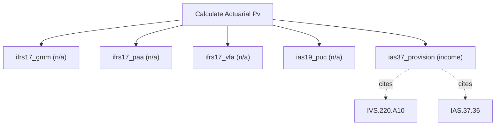

# Actuarial present value

Actuarial present value engine. Discount expected cash flows with mortality, survival, and risk adjustment for insurance and benefit obligations, generalising IFRS 17 (fulfilment cash flows), IAS 19 (employee benefits), IFRS 2 (share-based payments), and IAS 37 (provisions). Use this for regulated IFRS/HKFRS obligations only; it does NOT do generic project or scenario probability weighting (use calculate_expected_value).

## `ifrs17_gmm`

IFRS 17 general measurement model

**Formula:** fulfilment cash flows + risk adjustment + CSM

**Approach:** n/a  
**Solution:** n/a

**Inputs**

| Name | Type | Description |
|------|------|-------------|
| `cash_flows` | array | Projected cash flows in reporting currency, indexed t=1..n. |
| `discount_rate` | number | Discount rate as a decimal (0.10 = 10%); pre-tax when method=viu_pre_tax. |
| `risk_adjustment` | number | Explicit risk adjustment for non-financial risk. |

**Risks & limits**

- Standards alignment is declared per method; see the cited clauses.

## `ifrs17_paa`

IFRS 17 premium allocation approach

**Formula:** PAA liability for remaining coverage

**Approach:** n/a  
**Solution:** n/a

**Inputs**

| Name | Type | Description |
|------|------|-------------|
| `premiums` | number | Premiums in reporting currency. |
| `claims_cash` | number | Expected claims in reporting currency. |
| `acquisition_cash_flows` | number | Acquisition cash flows in reporting currency. |
| `coverage_periods` | integer | Coverage periods for the PAA (>=1). |

**Risks & limits**

- Standards alignment is declared per method; see the cited clauses.

## `ifrs17_vfa`

IFRS 17 variable fee approach

**Formula:** VFA fulfilment cash flows

**Approach:** n/a  
**Solution:** n/a

**Inputs**

| Name | Type | Description |
|------|------|-------------|
| `cash_flows` | array | Projected cash flows in reporting currency, indexed t=1..n. |
| `discount_rate` | number | Discount rate as a decimal (0.10 = 10%); pre-tax when method=viu_pre_tax. |
| `underlying_items_return` | number | Return on underlying items (decimal). |
| `risk_adjustment` | number | Explicit risk adjustment for non-financial risk. |

**Risks & limits**

- Standards alignment is declared per method; see the cited clauses.

## `ias19_puc`

IAS 19 projected unit credit defined-benefit obligation

**Formula:** PV of benefit obligation

**Approach:** n/a  
**Solution:** n/a

**Inputs**

| Name | Type | Description |
|------|------|-------------|
| `projected_benefits` | array | Projected benefits per service year. |
| `discount_rate` | number | Discount rate as a decimal (0.10 = 10%); pre-tax when method=viu_pre_tax. |
| `attribution_years` | integer | Years of service for attribution (>=1). |

**Risks & limits**

- Standards alignment is declared per method; see the cited clauses.

## `ias37_provision`

IAS 37 provision: expected value, discounted

**Formula:** IAS 37 best estimate, discounted

**Approach:** income  
**Solution:** closed_form

**Inputs**

| Name | Type | Description |
|------|------|-------------|
| `outcomes` | array | Outcome values aligned with probabilities. |
| `probabilities` | array | Cumulative success probability per period in [0,1], aligned with cash_flows. |
| `discount_rate` | number | Discount rate as a decimal (0.10 = 10%); pre-tax when method=viu_pre_tax. |
| `periods` | integer | Number of periods n (>=1). |

**Standards (verbatim)**

- **IVS.220.A10** — Non-financial liability (Bottom-Up)
  > 60.04 Under the Bottom-Up Method, the non-financial liability is measured as the costs required to fulfil the performance obligation, plus a reasonable mark-up on those costs, discounted to present value. These costs may or may not include certain overhead items.
  > — International Valuation Standards Council (IVSC) (source/ivs-2025.md#ivs-220-non-financial-liabilities)
- **IAS.37.36** — Best estimate of a provision
  > The amount recognised as a provision shall be the best estimate of the expenditure required to settle the present obligation at the end of the reporting period.
  > — IFRS Foundation (source/ias-37.md#paragraph-36)

**IVS ↔ IFRS/IAS divergences**

- `measurement_objective`: IVS — IVS 220 Bottom-Up: costs to fulfil plus a reasonable mark-up; IFRS/IAS — IAS 37.36 best estimate of the expenditure required to settle (no profit margin)

**Risks & limits**

- Deterministic model: the result is a point value with no modelled distribution; input error and model error are not quantified here.
- IVS/IFRS divergence on 'measurement_objective': the two regimes treat this differently (IVS 220 Bottom-Up: costs to fulfil plus a reasonable mark-up vs IAS 37.36 best estimate of the expenditure required to settle (no profit margin)); the choice is the caller's, not a default.
- Standards alignment is declared per method; see the cited clauses.
