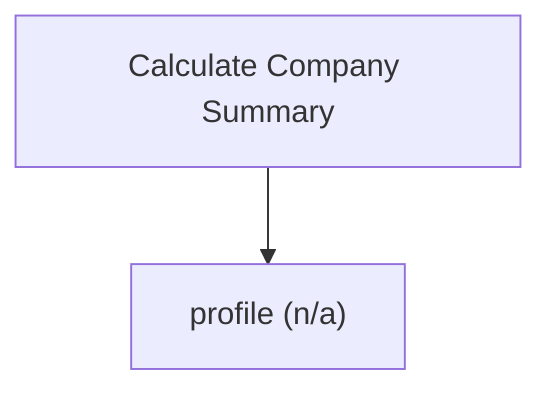

# Company profile and market inputs

Company-summary engine. Return a company profile with live market metrics (price, shares, beta, volatility, market capitalisation) to seed valuation inputs. Use this to seed inputs for the other calculate_* tools; it does not compute a valuation itself, and it omits missing fields rather than inventing them. Supplying a ticker performs a network fetch. Read-only. Returns the shared result envelope.

## `profile`

company profile and live market metrics for valuation inputs

**Formula:** market data

**Approach:** n/a  
**Solution:** n/a

**Inputs**

| Name | Type | Description |
|------|------|-------------|
| `ticker` | string | Equity ticker, e.g. '9988.HK'. |

**Risks & limits**
