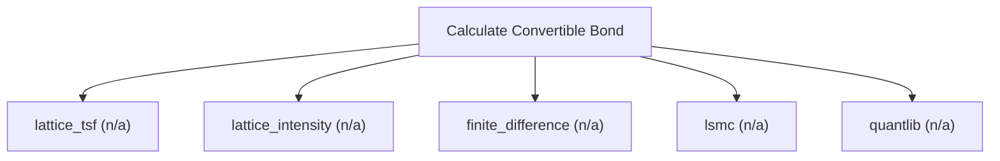

# Convertible and exchangeable bond valuation

Convertible-bond engine. Value callable and puttable convertible or exchangeable bonds with credit risk using a Tsiveriotis-Fernandes lattice (equity discounted at the risk-free rate, debt at a credit spread), with conversion, issuer call, holder put, coupon schedule, and a straight-bond floor. Use this for HK-listed convertible and exchangeable bonds. Read-only and deterministic. Returns the shared result envelope.

## `lattice_tsf`

callable/puttable convertible or exchangeable bond with credit

**Formula:** Tsiveriotis-Fernandes lattice / intensity / finite-difference / LSMC

**Approach:** n/a  
**Solution:** n/a

**Inputs**

| Name | Type | Description |
|------|------|-------------|
| `spot` | number | Spot price of the underlying (or FX rate for garman_kohlhagen). |
| `face` | number | Bond face value. |
| `coupon_rate` | number | Annual coupon rate (decimal). |
| `maturity` | number | Time to expiry in years (0.5 = six months); > 0. |
| `conversion_ratio` | number | Shares received per bond on conversion. |
| `volatility` | number | Annualized volatility (decimal, 0.30 = 30%); > 0. |
| `risk_free` | number | Continuously-compounded risk-free rate (decimal). |
| `credit_spread` | number | Credit spread over the risk-free rate (decimal). |
| `call_schedule` | array | Issuer call schedule [{date_years, price}]; pass [] when there is none. |
| `put_schedule` | array | Investor put schedule [{date_years, price}]; pass [] when there is none. |
| `rights_priority` | string | Which right prevails when call and put coincide. |

**Risks & limits**

- Standards alignment is declared per method; see the cited clauses.

## `lattice_intensity`

callable/puttable convertible or exchangeable bond with credit

**Formula:** Tsiveriotis-Fernandes lattice / intensity / finite-difference / LSMC

**Approach:** n/a  
**Solution:** n/a

**Inputs**

| Name | Type | Description |
|------|------|-------------|
| `spot` | number | Spot price of the underlying (or FX rate for garman_kohlhagen). |
| `face` | number | Bond face value. |
| `coupon_rate` | number | Annual coupon rate (decimal). |
| `maturity` | number | Time to expiry in years (0.5 = six months); > 0. |
| `conversion_ratio` | number | Shares received per bond on conversion. |
| `volatility` | number | Annualized volatility (decimal, 0.30 = 30%); > 0. |
| `risk_free` | number | Continuously-compounded risk-free rate (decimal). |
| `credit_spread` | number | Credit spread over the risk-free rate (decimal). |
| `call_schedule` | array | Issuer call schedule [{date_years, price}]; pass [] when there is none. |
| `put_schedule` | array | Investor put schedule [{date_years, price}]; pass [] when there is none. |
| `rights_priority` | string | Which right prevails when call and put coincide. |

**Risks & limits**

- Standards alignment is declared per method; see the cited clauses.

## `finite_difference`

callable/puttable convertible or exchangeable bond with credit

**Formula:** Tsiveriotis-Fernandes lattice / intensity / finite-difference / LSMC

**Approach:** n/a  
**Solution:** n/a

**Inputs**

| Name | Type | Description |
|------|------|-------------|
| `spot` | number | Spot price of the underlying (or FX rate for garman_kohlhagen). |
| `face` | number | Bond face value. |
| `coupon_rate` | number | Annual coupon rate (decimal). |
| `maturity` | number | Time to expiry in years (0.5 = six months); > 0. |
| `conversion_ratio` | number | Shares received per bond on conversion. |
| `volatility` | number | Annualized volatility (decimal, 0.30 = 30%); > 0. |
| `risk_free` | number | Continuously-compounded risk-free rate (decimal). |
| `credit_spread` | number | Credit spread over the risk-free rate (decimal). |
| `call_schedule` | array | Issuer call schedule [{date_years, price}]; pass [] when there is none. |
| `put_schedule` | array | Investor put schedule [{date_years, price}]; pass [] when there is none. |
| `rights_priority` | string | Which right prevails when call and put coincide. |

**Risks & limits**

- Standards alignment is declared per method; see the cited clauses.

## `lsmc`

callable/puttable convertible or exchangeable bond with credit

**Formula:** Tsiveriotis-Fernandes lattice / intensity / finite-difference / LSMC

**Approach:** n/a  
**Solution:** n/a

**Inputs**

| Name | Type | Description |
|------|------|-------------|
| `spot` | number | Spot price of the underlying (or FX rate for garman_kohlhagen). |
| `face` | number | Bond face value. |
| `coupon_rate` | number | Annual coupon rate (decimal). |
| `maturity` | number | Time to expiry in years (0.5 = six months); > 0. |
| `conversion_ratio` | number | Shares received per bond on conversion. |
| `volatility` | number | Annualized volatility (decimal, 0.30 = 30%); > 0. |
| `risk_free` | number | Continuously-compounded risk-free rate (decimal). |
| `credit_spread` | number | Credit spread over the risk-free rate (decimal). |
| `call_schedule` | array | Issuer call schedule [{date_years, price}]; pass [] when there is none. |
| `put_schedule` | array | Investor put schedule [{date_years, price}]; pass [] when there is none. |
| `rights_priority` | string | Which right prevails when call and put coincide. |

**Risks & limits**

- Standards alignment is declared per method; see the cited clauses.

## `quantlib`

callable/puttable convertible or exchangeable bond with credit

**Formula:** Tsiveriotis-Fernandes lattice / intensity / finite-difference / LSMC

**Approach:** n/a  
**Solution:** n/a

**Inputs**

| Name | Type | Description |
|------|------|-------------|
| `spot` | number | Spot price of the underlying (or FX rate for garman_kohlhagen). |
| `face` | number | Bond face value. |
| `coupon_rate` | number | Annual coupon rate (decimal). |
| `maturity` | number | Time to expiry in years (0.5 = six months); > 0. |
| `conversion_ratio` | number | Shares received per bond on conversion. |
| `volatility` | number | Annualized volatility (decimal, 0.30 = 30%); > 0. |
| `risk_free` | number | Continuously-compounded risk-free rate (decimal). |
| `credit_spread` | number | Credit spread over the risk-free rate (decimal). |
| `call_schedule` | array | Issuer call schedule [{date_years, price}]; pass [] when there is none. |
| `put_schedule` | array | Investor put schedule [{date_years, price}]; pass [] when there is none. |
| `rights_priority` | string | Which right prevails when call and put coincide. |

**Risks & limits**

- Standards alignment is declared per method; see the cited clauses.
