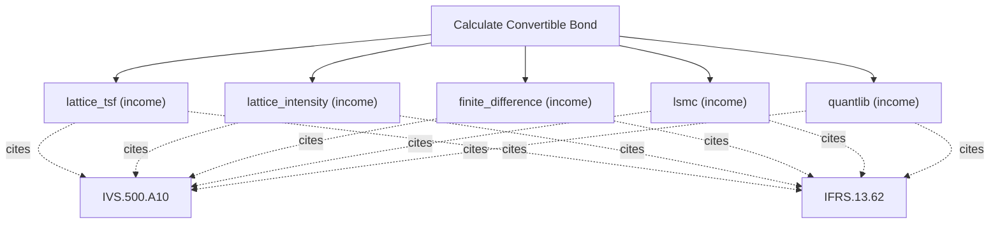

# Convertible and exchangeable bond valuation

Convertible-bond engine. Value callable and puttable convertible or exchangeable bonds with credit risk using a Tsiveriotis-Fernandes lattice (equity discounted at the risk-free rate, debt at a credit spread), with conversion, issuer call, holder put, coupon schedule, and a straight-bond floor. Use this for convertible and exchangeable bonds; for a plain bond or rate curve use calculate_fixed_income, and for a standalone option or warrant use calculate_option. The lattice_tsf, lattice_intensity, finite_difference, lsmc and quantlib methods are alternative numerical schemes for the same valuation and take identical inputs (Tsiveriotis-Fernandes is the reference, lsmc is Monte Carlo, quantlib needs the optional engine); choose one.

## `lattice_tsf`

callable/puttable convertible or exchangeable bond with credit

**Formula:** Tsiveriotis-Fernandes lattice / intensity / finite-difference / LSMC

**Approach:** income  
**Solution:** numeric

**Inputs**

| Name | Type | Description |
|------|------|-------------|
| `spot` | number | Spot price of the underlying (or FX rate for garman_kohlhagen). |
| `face` | number | Bond face value. |
| `coupon_rate` | number | Annual coupon rate (decimal). |
| `maturity` | number | Time to expiry in years (0.5 = six months); > 0. |
| `conversion_ratio` | number | Shares received per bond on conversion. |
| `volatility` | number | Annualized volatility (decimal, 0.30 = 30%); > 0. |
| `risk_free` | number | Continuously-compounded risk-free rate (decimal). |
| `credit_spread` | number | Credit spread over the risk-free rate (decimal). |
| `call_schedule` | array | Issuer call schedule [{date_years, price}]; pass [] when there is none. |
| `put_schedule` | array | Investor put schedule [{date_years, price}]; pass [] when there is none. |
| `rights_priority` | string | Which right prevails when call and put coincide. |

**Standards (verbatim)**

- **IVS.500.A10** — Financial instrument valuation models
  > 100.02 The valuer must determine that the valuation model is appropriate, which for the purposes of IVS 500 Financial Instruments means "fit for use" in terms of assets and/or liabilities being valued, the scope of work, and the valuation method.
  > — International Valuation Standards Council (IVSC) (source/ivs-2025.md#ivs-500-financial-instruments)
- **IFRS.13.62** — Three valuation techniques
  > The objective of using a valuation technique is to estimate the price at which an orderly transaction to sell the asset or to transfer the liability would take place between market participants at the measurement date under current market conditions. Three widely used valuation techniques are the market approach, the cost approach and the income approach. The main aspects of those approaches are summarised in paragraphs B5–B11. An entity shall use valuation techniques consistent with one or more of those approaches to measure fair value.
  > — IFRS Foundation (source/ifrs-13.md#paragraph-62)

**Risks & limits**

- Deterministic model: the result is a point value with no modelled distribution; input error and model error are not quantified here.
- Standards alignment is declared per method; see the cited clauses.

## `lattice_intensity`

callable/puttable convertible or exchangeable bond with credit

**Formula:** Tsiveriotis-Fernandes lattice / intensity / finite-difference / LSMC

**Approach:** income  
**Solution:** numeric

**Inputs**

| Name | Type | Description |
|------|------|-------------|
| `spot` | number | Spot price of the underlying (or FX rate for garman_kohlhagen). |
| `face` | number | Bond face value. |
| `coupon_rate` | number | Annual coupon rate (decimal). |
| `maturity` | number | Time to expiry in years (0.5 = six months); > 0. |
| `conversion_ratio` | number | Shares received per bond on conversion. |
| `volatility` | number | Annualized volatility (decimal, 0.30 = 30%); > 0. |
| `risk_free` | number | Continuously-compounded risk-free rate (decimal). |
| `credit_spread` | number | Credit spread over the risk-free rate (decimal). |
| `call_schedule` | array | Issuer call schedule [{date_years, price}]; pass [] when there is none. |
| `put_schedule` | array | Investor put schedule [{date_years, price}]; pass [] when there is none. |
| `rights_priority` | string | Which right prevails when call and put coincide. |

**Standards (verbatim)**

- **IVS.500.A10** — Financial instrument valuation models
  > 100.02 The valuer must determine that the valuation model is appropriate, which for the purposes of IVS 500 Financial Instruments means "fit for use" in terms of assets and/or liabilities being valued, the scope of work, and the valuation method.
  > — International Valuation Standards Council (IVSC) (source/ivs-2025.md#ivs-500-financial-instruments)
- **IFRS.13.62** — Three valuation techniques
  > The objective of using a valuation technique is to estimate the price at which an orderly transaction to sell the asset or to transfer the liability would take place between market participants at the measurement date under current market conditions. Three widely used valuation techniques are the market approach, the cost approach and the income approach. The main aspects of those approaches are summarised in paragraphs B5–B11. An entity shall use valuation techniques consistent with one or more of those approaches to measure fair value.
  > — IFRS Foundation (source/ifrs-13.md#paragraph-62)

**Risks & limits**

- Deterministic model: the result is a point value with no modelled distribution; input error and model error are not quantified here.
- Standards alignment is declared per method; see the cited clauses.

## `finite_difference`

callable/puttable convertible or exchangeable bond with credit

**Formula:** Tsiveriotis-Fernandes lattice / intensity / finite-difference / LSMC

**Approach:** income  
**Solution:** numeric

**Inputs**

| Name | Type | Description |
|------|------|-------------|
| `spot` | number | Spot price of the underlying (or FX rate for garman_kohlhagen). |
| `face` | number | Bond face value. |
| `coupon_rate` | number | Annual coupon rate (decimal). |
| `maturity` | number | Time to expiry in years (0.5 = six months); > 0. |
| `conversion_ratio` | number | Shares received per bond on conversion. |
| `volatility` | number | Annualized volatility (decimal, 0.30 = 30%); > 0. |
| `risk_free` | number | Continuously-compounded risk-free rate (decimal). |
| `credit_spread` | number | Credit spread over the risk-free rate (decimal). |
| `call_schedule` | array | Issuer call schedule [{date_years, price}]; pass [] when there is none. |
| `put_schedule` | array | Investor put schedule [{date_years, price}]; pass [] when there is none. |
| `rights_priority` | string | Which right prevails when call and put coincide. |

**Standards (verbatim)**

- **IVS.500.A10** — Financial instrument valuation models
  > 100.02 The valuer must determine that the valuation model is appropriate, which for the purposes of IVS 500 Financial Instruments means "fit for use" in terms of assets and/or liabilities being valued, the scope of work, and the valuation method.
  > — International Valuation Standards Council (IVSC) (source/ivs-2025.md#ivs-500-financial-instruments)
- **IFRS.13.62** — Three valuation techniques
  > The objective of using a valuation technique is to estimate the price at which an orderly transaction to sell the asset or to transfer the liability would take place between market participants at the measurement date under current market conditions. Three widely used valuation techniques are the market approach, the cost approach and the income approach. The main aspects of those approaches are summarised in paragraphs B5–B11. An entity shall use valuation techniques consistent with one or more of those approaches to measure fair value.
  > — IFRS Foundation (source/ifrs-13.md#paragraph-62)

**Risks & limits**

- Deterministic model: the result is a point value with no modelled distribution; input error and model error are not quantified here.
- Standards alignment is declared per method; see the cited clauses.

## `lsmc`

callable/puttable convertible or exchangeable bond with credit

**Formula:** Tsiveriotis-Fernandes lattice / intensity / finite-difference / LSMC

**Approach:** income  
**Solution:** numeric

**Inputs**

| Name | Type | Description |
|------|------|-------------|
| `spot` | number | Spot price of the underlying (or FX rate for garman_kohlhagen). |
| `face` | number | Bond face value. |
| `coupon_rate` | number | Annual coupon rate (decimal). |
| `maturity` | number | Time to expiry in years (0.5 = six months); > 0. |
| `conversion_ratio` | number | Shares received per bond on conversion. |
| `volatility` | number | Annualized volatility (decimal, 0.30 = 30%); > 0. |
| `risk_free` | number | Continuously-compounded risk-free rate (decimal). |
| `credit_spread` | number | Credit spread over the risk-free rate (decimal). |
| `call_schedule` | array | Issuer call schedule [{date_years, price}]; pass [] when there is none. |
| `put_schedule` | array | Investor put schedule [{date_years, price}]; pass [] when there is none. |
| `rights_priority` | string | Which right prevails when call and put coincide. |

**Standards (verbatim)**

- **IVS.500.A10** — Financial instrument valuation models
  > 100.02 The valuer must determine that the valuation model is appropriate, which for the purposes of IVS 500 Financial Instruments means "fit for use" in terms of assets and/or liabilities being valued, the scope of work, and the valuation method.
  > — International Valuation Standards Council (IVSC) (source/ivs-2025.md#ivs-500-financial-instruments)
- **IFRS.13.62** — Three valuation techniques
  > The objective of using a valuation technique is to estimate the price at which an orderly transaction to sell the asset or to transfer the liability would take place between market participants at the measurement date under current market conditions. Three widely used valuation techniques are the market approach, the cost approach and the income approach. The main aspects of those approaches are summarised in paragraphs B5–B11. An entity shall use valuation techniques consistent with one or more of those approaches to measure fair value.
  > — IFRS Foundation (source/ifrs-13.md#paragraph-62)

**Risks & limits**

- Deterministic model: the result is a point value with no modelled distribution; input error and model error are not quantified here.
- Standards alignment is declared per method; see the cited clauses.

## `quantlib`

callable/puttable convertible or exchangeable bond with credit

**Formula:** Tsiveriotis-Fernandes lattice / intensity / finite-difference / LSMC

**Approach:** income  
**Solution:** closed_form

**Inputs**

| Name | Type | Description |
|------|------|-------------|
| `spot` | number | Spot price of the underlying (or FX rate for garman_kohlhagen). |
| `face` | number | Bond face value. |
| `coupon_rate` | number | Annual coupon rate (decimal). |
| `maturity` | number | Time to expiry in years (0.5 = six months); > 0. |
| `conversion_ratio` | number | Shares received per bond on conversion. |
| `volatility` | number | Annualized volatility (decimal, 0.30 = 30%); > 0. |
| `risk_free` | number | Continuously-compounded risk-free rate (decimal). |
| `credit_spread` | number | Credit spread over the risk-free rate (decimal). |
| `call_schedule` | array | Issuer call schedule [{date_years, price}]; pass [] when there is none. |
| `put_schedule` | array | Investor put schedule [{date_years, price}]; pass [] when there is none. |
| `rights_priority` | string | Which right prevails when call and put coincide. |

**Standards (verbatim)**

- **IVS.500.A10** — Financial instrument valuation models
  > 100.02 The valuer must determine that the valuation model is appropriate, which for the purposes of IVS 500 Financial Instruments means "fit for use" in terms of assets and/or liabilities being valued, the scope of work, and the valuation method.
  > — International Valuation Standards Council (IVSC) (source/ivs-2025.md#ivs-500-financial-instruments)
- **IFRS.13.62** — Three valuation techniques
  > The objective of using a valuation technique is to estimate the price at which an orderly transaction to sell the asset or to transfer the liability would take place between market participants at the measurement date under current market conditions. Three widely used valuation techniques are the market approach, the cost approach and the income approach. The main aspects of those approaches are summarised in paragraphs B5–B11. An entity shall use valuation techniques consistent with one or more of those approaches to measure fair value.
  > — IFRS Foundation (source/ifrs-13.md#paragraph-62)

**Risks & limits**

- Deterministic model: the result is a point value with no modelled distribution; input error and model error are not quantified here.
- Standards alignment is declared per method; see the cited clauses.
