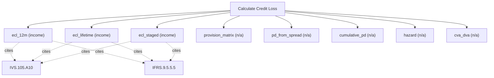

# Credit loss and impairment

Credit-risk engine (IFRS 9 / HKFRS 9). Compute 12-month, lifetime, and staged expected credit loss, PD/LGD/EAD, provision matrices, hazard rates, and CVA/DVA. Use this for impairment, fair-value credit adjustment, and loan-loss provisioning; for the credit component of a specific convertible bond use calculate_convertible_bond.

## `ecl_12m`

12-month expected credit loss

**Formula:** ECL = EAD*PD*LGD

**Approach:** income  
**Solution:** closed_form

**Inputs**

| Name | Type | Description |
|------|------|-------------|
| `ead` | number | Exposure at default in currency units. |
| `pd` | number | Probability of default over the horizon, in [0,1]. |
| `lgd` | number | Loss given default in [0,1] (1 - recovery rate). |

**Standards (verbatim)**

- **IVS.105.A10** — Valuation models
  > 30.01 The valuer must determine that the valuation model is appropriate, which for the purposes of IVS 105 Valuation Models means "fit for purpose" in terms of assets or liabilities being valued, the scope of work and the valuation method. The valuer must apply professional judgement to balance the characteristics of a valuation model in order to choose the most appropriate valuation model.
  > — International Valuation Standards Council (IVSC) (source/ivs-2025.md#ivs-105-valuation-models)
- **IFRS.9.5.5.5** — Measurement of expected credit losses
  > An entity shall measure expected credit losses of a financial instrument in a way that reflects: (a) an unbiased and probability-weighted amount that is determined by evaluating a range of possible outcomes; (b) the time value of money; and (c) reasonable and supportable information that is available without undue cost or effort at the reporting date about past events, current conditions and forecasts of future economic conditions.
  > — IFRS Foundation (source/ifrs-9.md#paragraph-5-5-5)

**IVS ↔ IFRS/IAS divergences**

- `horizon`: IVS — IVS 105 model inputs (probability-weighted); IFRS/IAS — IFRS 9 12-month expected credit losses

**Risks & limits**

- Deterministic model: the result is a point value with no modelled distribution; input error and model error are not quantified here.
- IVS/IFRS divergence on 'horizon': the two regimes treat this differently (IVS 105 model inputs (probability-weighted) vs IFRS 9 12-month expected credit losses); the choice is the caller's, not a default.
- Standards alignment is declared per method; see the cited clauses.

## `ecl_lifetime`

lifetime expected credit loss

**Formula:** ECL = EAD*PD_lifetime*LGD

**Approach:** income  
**Solution:** closed_form

**Inputs**

| Name | Type | Description |
|------|------|-------------|
| `ead` | number | Exposure at default in currency units. |
| `pd_lifetime` | number | Lifetime PD in [0,1]. |
| `lgd` | number | Loss given default in [0,1] (1 - recovery rate). |

**Standards (verbatim)**

- **IVS.105.A10** — Valuation models
  > 30.01 The valuer must determine that the valuation model is appropriate, which for the purposes of IVS 105 Valuation Models means "fit for purpose" in terms of assets or liabilities being valued, the scope of work and the valuation method. The valuer must apply professional judgement to balance the characteristics of a valuation model in order to choose the most appropriate valuation model.
  > — International Valuation Standards Council (IVSC) (source/ivs-2025.md#ivs-105-valuation-models)
- **IFRS.9.5.5.5** — Measurement of expected credit losses
  > An entity shall measure expected credit losses of a financial instrument in a way that reflects: (a) an unbiased and probability-weighted amount that is determined by evaluating a range of possible outcomes; (b) the time value of money; and (c) reasonable and supportable information that is available without undue cost or effort at the reporting date about past events, current conditions and forecasts of future economic conditions.
  > — IFRS Foundation (source/ifrs-9.md#paragraph-5-5-5)

**IVS ↔ IFRS/IAS divergences**

- `horizon`: IVS — IVS 105 model inputs (probability-weighted); IFRS/IAS — IFRS 9 lifetime expected credit losses

**Risks & limits**

- Deterministic model: the result is a point value with no modelled distribution; input error and model error are not quantified here.
- IVS/IFRS divergence on 'horizon': the two regimes treat this differently (IVS 105 model inputs (probability-weighted) vs IFRS 9 lifetime expected credit losses); the choice is the caller's, not a default.
- Standards alignment is declared per method; see the cited clauses.

## `ecl_staged`

staged ECL by IFRS 9 stage

**Formula:** IFRS 9 staging: 12m for stage 1, lifetime for stages 2-3

**Approach:** income  
**Solution:** closed_form

**Inputs**

| Name | Type | Description |
|------|------|-------------|
| `ead` | number | Exposure at default in currency units. |
| `pd_12m` | number | 12-month PD in [0,1]. |
| `pd_lifetime` | number | Lifetime PD in [0,1]. |
| `lgd` | number | Loss given default in [0,1] (1 - recovery rate). |
| `stage` | integer | IFRS 9 stage (1, 2 or 3). |

**Standards (verbatim)**

- **IVS.105.A10** — Valuation models
  > 30.01 The valuer must determine that the valuation model is appropriate, which for the purposes of IVS 105 Valuation Models means "fit for purpose" in terms of assets or liabilities being valued, the scope of work and the valuation method. The valuer must apply professional judgement to balance the characteristics of a valuation model in order to choose the most appropriate valuation model.
  > — International Valuation Standards Council (IVSC) (source/ivs-2025.md#ivs-105-valuation-models)
- **IFRS.9.5.5.5** — Measurement of expected credit losses
  > An entity shall measure expected credit losses of a financial instrument in a way that reflects: (a) an unbiased and probability-weighted amount that is determined by evaluating a range of possible outcomes; (b) the time value of money; and (c) reasonable and supportable information that is available without undue cost or effort at the reporting date about past events, current conditions and forecasts of future economic conditions.
  > — IFRS Foundation (source/ifrs-9.md#paragraph-5-5-5)

**IVS ↔ IFRS/IAS divergences**

- `stage`: IVS — IVS 105 model inputs (probability-weighted); IFRS/IAS — IFRS 9 §5.5 staging (12-month vs lifetime)

**Risks & limits**

- Deterministic model: the result is a point value with no modelled distribution; input error and model error are not quantified here.
- IVS/IFRS divergence on 'stage': the two regimes treat this differently (IVS 105 model inputs (probability-weighted) vs IFRS 9 §5.5 staging (12-month vs lifetime)); the choice is the caller's, not a default.
- Standards alignment is declared per method; see the cited clauses.

## `provision_matrix`

provision matrix over ageing buckets

**Formula:** sum(bucket amount * loss rate)

**Approach:** n/a  
**Solution:** n/a

**Inputs**

| Name | Type | Description |
|------|------|-------------|
| `receivables_ageing` | array | Ageing buckets [{bucket, amount}]. |
| `loss_rates` | array | Loss rate per ageing bucket. |

**Risks & limits**

- Standards alignment is declared per method; see the cited clauses.

## `pd_from_spread`

derive PD from a credit spread

**Formula:** PD approx spread/(1-recovery)

**Approach:** n/a  
**Solution:** n/a

**Inputs**

| Name | Type | Description |
|------|------|-------------|
| `credit_spread` | number | Credit spread over the risk-free rate (decimal). |
| `recovery` | number | Recovery rate in [0,1]. |
| `tenor_years` | number | Tenor in years (>0). |

**Risks & limits**

## `cumulative_pd`

cumulative PD from annual PD over years

**Formula:** 1-(1-pd)^n

**Approach:** n/a  
**Solution:** n/a

**Inputs**

| Name | Type | Description |
|------|------|-------------|
| `annual_pd` | number | Annual PD in [0,1]. |
| `years` | integer | Number of projection years n; equal len(cash_flows) when both are supplied. |

**Risks & limits**

## `hazard`

PD from a hazard rate over a tenor

**Formula:** PD = 1 - exp(-lambda*T)

**Approach:** n/a  
**Solution:** n/a

**Inputs**

| Name | Type | Description |
|------|------|-------------|
| `hazard_rate` | number | Default hazard rate as a decimal. |
| `tenor_years` | number | Tenor in years (>0). |

**Risks & limits**

## `cva_dva`

credit valuation adjustment on an exposure profile

**Formula:** CVA = sum DF*EE*PD*LGD

**Approach:** n/a  
**Solution:** n/a

**Inputs**

| Name | Type | Description |
|------|------|-------------|
| `exposure_profile` | array | Expected exposure per period. |
| `pd` | number | Probability of default over the horizon, in [0,1]. |
| `lgd` | number | Loss given default in [0,1] (1 - recovery rate). |
| `discount_rate` | number | Discount rate as a decimal (0.10 = 10%); pre-tax when method=viu_pre_tax. |

**Risks & limits**
