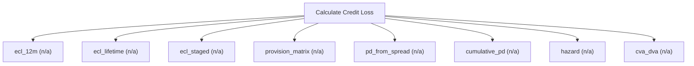

# Credit loss and impairment

Credit-risk engine (IFRS 9 / HKFRS 9). Compute 12-month, lifetime, and staged expected credit loss, PD/LGD/EAD, provision matrices, hazard rates, and CVA/DVA. Use this for impairment, fair-value credit adjustment, and loan-loss provisioning; for the credit component of a specific convertible bond use calculate_convertible_bond.

## `ecl_12m`

12-month expected credit loss

**Formula:** ECL = EAD*PD*LGD

**Approach:** n/a  
**Solution:** n/a

**Inputs**

| Name | Type | Description |
|------|------|-------------|
| `ead` | number | Exposure at default in currency units. |
| `pd` | number | Probability of default over the horizon, in [0,1]. |
| `lgd` | number | Loss given default in [0,1] (1 - recovery rate). |

**Risks & limits**

- Standards alignment is declared per method; see the cited clauses.

## `ecl_lifetime`

lifetime expected credit loss

**Formula:** ECL = EAD*PD_lifetime*LGD

**Approach:** n/a  
**Solution:** n/a

**Inputs**

| Name | Type | Description |
|------|------|-------------|
| `ead` | number | Exposure at default in currency units. |
| `pd_lifetime` | number | Lifetime PD in [0,1]. |
| `lgd` | number | Loss given default in [0,1] (1 - recovery rate). |

**Risks & limits**

- Standards alignment is declared per method; see the cited clauses.

## `ecl_staged`

staged ECL by IFRS 9 stage

**Formula:** IFRS 9 staging: 12m for stage 1, lifetime for stages 2-3

**Approach:** n/a  
**Solution:** n/a

**Inputs**

| Name | Type | Description |
|------|------|-------------|
| `ead` | number | Exposure at default in currency units. |
| `pd_12m` | number | 12-month PD in [0,1]. |
| `pd_lifetime` | number | Lifetime PD in [0,1]. |
| `lgd` | number | Loss given default in [0,1] (1 - recovery rate). |
| `stage` | integer | IFRS 9 stage (1, 2 or 3). |

**Risks & limits**

- Standards alignment is declared per method; see the cited clauses.

## `provision_matrix`

provision matrix over ageing buckets

**Formula:** sum(bucket amount * loss rate)

**Approach:** n/a  
**Solution:** n/a

**Inputs**

| Name | Type | Description |
|------|------|-------------|
| `receivables_ageing` | array | Ageing buckets [{bucket, amount}]. |
| `loss_rates` | array | Loss rate per ageing bucket. |

**Risks & limits**

- Standards alignment is declared per method; see the cited clauses.

## `pd_from_spread`

derive PD from a credit spread

**Formula:** PD approx spread/(1-recovery)

**Approach:** n/a  
**Solution:** n/a

**Inputs**

| Name | Type | Description |
|------|------|-------------|
| `credit_spread` | number | Credit spread over the risk-free rate (decimal). |
| `recovery` | number | Recovery rate in [0,1]. |
| `tenor_years` | number | Tenor in years (>0). |

**Risks & limits**

## `cumulative_pd`

cumulative PD from annual PD over years

**Formula:** 1-(1-pd)^n

**Approach:** n/a  
**Solution:** n/a

**Inputs**

| Name | Type | Description |
|------|------|-------------|
| `annual_pd` | number | Annual PD in [0,1]. |
| `years` | integer | Number of projection years n; equal len(cash_flows) when both are supplied. |

**Risks & limits**

## `hazard`

PD from a hazard rate over a tenor

**Formula:** PD = 1 - exp(-lambda*T)

**Approach:** n/a  
**Solution:** n/a

**Inputs**

| Name | Type | Description |
|------|------|-------------|
| `hazard_rate` | number | Default hazard rate as a decimal. |
| `tenor_years` | number | Tenor in years (>0). |

**Risks & limits**

## `cva_dva`

credit valuation adjustment on an exposure profile

**Formula:** CVA = sum DF*EE*PD*LGD

**Approach:** n/a  
**Solution:** n/a

**Inputs**

| Name | Type | Description |
|------|------|-------------|
| `exposure_profile` | array | Expected exposure per period. |
| `pd` | number | Probability of default over the horizon, in [0,1]. |
| `lgd` | number | Loss given default in [0,1] (1 - recovery rate). |
| `discount_rate` | number | Discount rate as a decimal (0.10 = 10%); pre-tax when method=viu_pre_tax. |

**Risks & limits**
