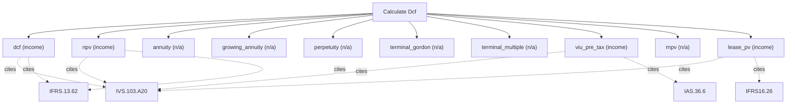

# Discounted cash flow valuation

Discounted cash flow valuation engine. Choose a method and supply its exact inputs to value a business from projected free cash flows, dividends, residual income, or economic profit. Covers FCFF/FCFE DCF, NPV/IRR, terminal values, and multi-stage growth. Use this for going-concern cash-flow businesses; for asset-anchored or financial firms use calculate_residual, for peer-based pricing use calculate_market_multiple, and for pre-profit companies use calculate_loss_making_company.

## `dcf`

per-year FCFF plus a terminal value

**Formula:** IVS 105 income approach; PV of projected FCFF

**Approach:** income  
**Solution:** closed_form

**Inputs**

| Name | Type | Description |
|------|------|-------------|
| `cash_flows` | array | Projected cash flows in reporting currency, indexed t=1..n. |
| `discount_rate` | number | Discount rate as a decimal (0.10 = 10%); pre-tax when method=viu_pre_tax. |

**Standards (verbatim)**

- **IVS.103.A20** — Income approach and DCF
  > 30.01 The income approach provides an indication of value by converting projected cash flows to a single current value. Under the income approach, the value of an asset is determined by reference to the value of income, cash flow or cost savings generated by the asset. A20.01 Although there are many ways to implement the income approach, methods under the income approach are effectively based on discounting future amounts of cash flow to present value. They are variations of the Discounted Cash Flow (DCF) method and the concepts in the following paragraphs apply in part or in full to all income approach methods.
  > — International Valuation Standards Council (IVSC) (source/ivs-2025.md#ivs-103-income-approach)
- **IFRS.13.62** — Three valuation techniques
  > The objective of using a valuation technique is to estimate the price at which an orderly transaction to sell the asset or to transfer the liability would take place between market participants at the measurement date under current market conditions. Three widely used valuation techniques are the market approach, the cost approach and the income approach. The main aspects of those approaches are summarised in paragraphs B5–B11. An entity shall use valuation techniques consistent with one or more of those approaches to measure fair value.
  > — IFRS Foundation (source/ifrs-13.md#paragraph-62)

**Risks & limits**

- Deterministic model: the result is a point value with no modelled distribution; input error and model error are not quantified here.
- Standards alignment is declared per method; see the cited clauses.

## `npv`

discount a cash-flow stream with no terminal value

**Formula:** NPV = sum CF_t/(1+r)^t

**Approach:** income  
**Solution:** closed_form

**Inputs**

| Name | Type | Description |
|------|------|-------------|
| `cash_flows` | array | Projected cash flows in reporting currency, indexed t=1..n. |
| `discount_rate` | number | Discount rate as a decimal (0.10 = 10%); pre-tax when method=viu_pre_tax. |

**Standards (verbatim)**

- **IVS.103.A20** — Income approach and DCF
  > 30.01 The income approach provides an indication of value by converting projected cash flows to a single current value. Under the income approach, the value of an asset is determined by reference to the value of income, cash flow or cost savings generated by the asset. A20.01 Although there are many ways to implement the income approach, methods under the income approach are effectively based on discounting future amounts of cash flow to present value. They are variations of the Discounted Cash Flow (DCF) method and the concepts in the following paragraphs apply in part or in full to all income approach methods.
  > — International Valuation Standards Council (IVSC) (source/ivs-2025.md#ivs-103-income-approach)
- **IFRS.13.62** — Three valuation techniques
  > The objective of using a valuation technique is to estimate the price at which an orderly transaction to sell the asset or to transfer the liability would take place between market participants at the measurement date under current market conditions. Three widely used valuation techniques are the market approach, the cost approach and the income approach. The main aspects of those approaches are summarised in paragraphs B5–B11. An entity shall use valuation techniques consistent with one or more of those approaches to measure fair value.
  > — IFRS Foundation (source/ifrs-13.md#paragraph-62)

**Risks & limits**

- Deterministic model: the result is a point value with no modelled distribution; input error and model error are not quantified here.

## `annuity`

present value of a level payment for n periods

**Formula:** PV = PMT*[1-(1+r)^-n]/r

**Approach:** n/a  
**Solution:** n/a

**Inputs**

| Name | Type | Description |
|------|------|-------------|
| `payment` | number | Level periodic payment in reporting currency. |
| `discount_rate` | number | Discount rate as a decimal (0.10 = 10%); pre-tax when method=viu_pre_tax. |
| `periods` | integer | Number of periods n (>=1). |

**Risks & limits**

## `growing_annuity`

present value of a payment growing at a constant rate

**Formula:** PV = PMT*[1-((1+g)/(1+r))^n]/(r-g)

**Approach:** n/a  
**Solution:** n/a

**Inputs**

| Name | Type | Description |
|------|------|-------------|
| `payment` | number | Level periodic payment in reporting currency. |
| `discount_rate` | number | Discount rate as a decimal (0.10 = 10%); pre-tax when method=viu_pre_tax. |
| `growth_rate` | number | Periodic growth rate as a decimal (0.03 = 3%). |
| `periods` | integer | Number of periods n (>=1). |

**Risks & limits**

## `perpetuity`

present value of a level perpetuity

**Formula:** PV = PMT/r

**Approach:** n/a  
**Solution:** n/a

**Inputs**

| Name | Type | Description |
|------|------|-------------|
| `payment` | number | Level periodic payment in reporting currency. |
| `discount_rate` | number | Discount rate as a decimal (0.10 = 10%); pre-tax when method=viu_pre_tax. |

**Risks & limits**

## `terminal_gordon`

Gordon-growth terminal value

**Formula:** TV = FCF*(1+g)/(r-g)

**Approach:** n/a  
**Solution:** n/a

**Inputs**

| Name | Type | Description |
|------|------|-------------|
| `final_cash_flow` | number | Final-period cash flow for the terminal value. |
| `discount_rate` | number | Discount rate as a decimal (0.10 = 10%); pre-tax when method=viu_pre_tax. |
| `perpetual_growth` | number | Gordon growth rate (decimal); strictly below discount_rate. |

**Risks & limits**

## `terminal_multiple`

exit-multiple terminal value

**Formula:** TV = FCF*exit_multiple

**Approach:** n/a  
**Solution:** n/a

**Inputs**

| Name | Type | Description |
|------|------|-------------|
| `final_cash_flow` | number | Final-period cash flow for the terminal value. |
| `exit_multiple` | number | Exit multiple on the final flow, e.g. 8.0 for 8x. |

**Risks & limits**

## `viu_pre_tax`

IAS 36 value in use with pre-tax cash flows and rate

**Formula:** IAS 36 value in use

**Approach:** income  
**Solution:** closed_form

**Inputs**

| Name | Type | Description |
|------|------|-------------|
| `cash_flows` | array | Projected cash flows in reporting currency, indexed t=1..n. |
| `pre_tax_discount_rate` | number | Pre-tax discount rate (decimal), required by viu_pre_tax (IAS 36). |

**Standards (verbatim)**

- **IVS.103.A20** — Income approach and DCF
  > 30.01 The income approach provides an indication of value by converting projected cash flows to a single current value. Under the income approach, the value of an asset is determined by reference to the value of income, cash flow or cost savings generated by the asset. A20.01 Although there are many ways to implement the income approach, methods under the income approach are effectively based on discounting future amounts of cash flow to present value. They are variations of the Discounted Cash Flow (DCF) method and the concepts in the following paragraphs apply in part or in full to all income approach methods.
  > — International Valuation Standards Council (IVSC) (source/ivs-2025.md#ivs-103-income-approach)
- **IAS.36.6** — Value in use
  > Value in use is the present value of the future cash flows expected to be derived from an asset or cash-generating unit. The recoverable amount of an asset or a cash-generating unit is the higher of its fair value less costs of disposal and its value in use.
  > — IFRS Foundation (source/ias-36.md#paragraph-6)

**IVS ↔ IFRS/IAS divergences**

- `discount_rate`: IVS — IVS 103 market-participant discount rate (post-tax); IFRS/IAS — IAS 36.55 pre-tax rate consistent with value-in-use

**Risks & limits**

- Deterministic model: the result is a point value with no modelled distribution; input error and model error are not quantified here.
- IVS/IFRS divergence on 'discount_rate': the two regimes treat this differently (IVS 103 market-participant discount rate (post-tax) vs IAS 36.55 pre-tax rate consistent with value-in-use); the choice is the caller's, not a default.
- Standards alignment is declared per method; see the cited clauses.

## `rnpv`

each flow multiplied by its cumulative success probability

**Formula:** rNPV = sum p_t*CF_t/(1+r)^t

**Approach:** n/a  
**Solution:** n/a

**Inputs**

| Name | Type | Description |
|------|------|-------------|
| `cash_flows` | array | Projected cash flows in reporting currency, indexed t=1..n. |
| `discount_rate` | number | Discount rate as a decimal (0.10 = 10%); pre-tax when method=viu_pre_tax. |
| `probabilities` | array | Cumulative success probability per period in [0,1], aligned with cash_flows. |

**Risks & limits**

- Standards alignment is declared per method; see the cited clauses.

## `lease_pv`

IFRS 16 present value of lease payments at the incremental borrowing rate

**Formula:** IFRS 16 lease liability

**Approach:** income  
**Solution:** closed_form

**Inputs**

| Name | Type | Description |
|------|------|-------------|
| `lease_payments` | array | Contractual lease payments in reporting currency, t=1..n. |
| `incremental_borrowing_rate` | number | Lessee incremental borrowing rate (decimal), IFRS 16. |

**Standards (verbatim)**

- **IVS.103.A20** — Income approach and DCF
  > 30.01 The income approach provides an indication of value by converting projected cash flows to a single current value. Under the income approach, the value of an asset is determined by reference to the value of income, cash flow or cost savings generated by the asset. A20.01 Although there are many ways to implement the income approach, methods under the income approach are effectively based on discounting future amounts of cash flow to present value. They are variations of the Discounted Cash Flow (DCF) method and the concepts in the following paragraphs apply in part or in full to all income approach methods.
  > — International Valuation Standards Council (IVSC) (source/ivs-2025.md#ivs-103-income-approach)
- **IFRS16.26** — Lease liability measurement
  > At the commencement date, a lessee shall measure the lease liability at the present value of the lease payments that are not paid at that date. The lease payments shall be discounted using the interest rate implicit in the lease, if that rate can be readily determined. If that rate cannot be readily determined, the lessee shall use the lessee's incremental borrowing rate.
  > — IFRS Foundation (source/ifrs-16.md#paragraph-26)

**Risks & limits**

- Deterministic model: the result is a point value with no modelled distribution; input error and model error are not quantified here.
- Standards alignment is declared per method; see the cited clauses.
