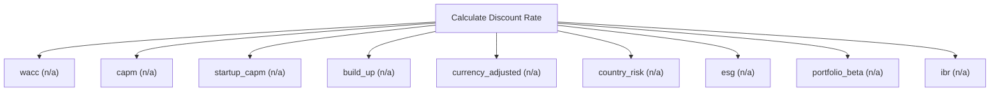

# Cost of capital and discount rates

Cost-of-capital engine. Compute WACC, cost of equity (CAPM), cost of debt, unlevered/relevered beta, and country or size premiums from an explicit capital structure and market inputs. Use this to derive the discount rate an income-approach valuation needs. Read-only and deterministic. Returns the shared result envelope.

## `wacc`

weighted average cost of capital

**Formula:** WACC = we*ke + wd*kd*(1-t)

**Approach:** n/a  
**Solution:** n/a

**Inputs**

| Name | Type | Description |
|------|------|-------------|
| `equity_weight` | number | Market-value weight of equity (decimal); with debt_weight must sum to 1. |
| `debt_weight` | number | Market-value weight of debt (decimal); with equity_weight must sum to 1. |
| `cost_equity` | number | Cost of equity as a decimal (0.12 = 12%). |
| `cost_debt` | number | Pre-tax cost of debt as a decimal. |
| `tax_rate` | number | Marginal corporate tax rate as a decimal. |

**Risks & limits**

- Standards alignment is declared per method; see the cited clauses.

## `capm`

capital asset pricing model cost of equity

**Formula:** E(R) = Rf + beta*(Rm - Rf)

**Approach:** n/a  
**Solution:** n/a

**Inputs**

| Name | Type | Description |
|------|------|-------------|
| `risk_free` | number | Continuously-compounded risk-free rate (decimal). |
| `beta` | number | Equity beta (market = 1.0). |
| `market_return` | number | Expected market return (decimal). |

**Risks & limits**

## `startup_capm`

CAPM plus size and illiquidity premiums

**Formula:** r = Rf + beta*MRP + size + illiquidity

**Approach:** n/a  
**Solution:** n/a

**Inputs**

| Name | Type | Description |
|------|------|-------------|
| `risk_free` | number | Continuously-compounded risk-free rate (decimal). |
| `beta` | number | Equity beta (market = 1.0). |
| `market_risk_premium` | number | Market risk premium (decimal). |
| `size_premium` | number | Small-size premium (decimal). |
| `illiquidity_premium` | number | Illiquidity premium (decimal). |

**Risks & limits**

## `build_up`

additive build-up of risk premiums

**Formula:** r = Rf + ERP + size + industry + specific

**Approach:** n/a  
**Solution:** n/a

**Inputs**

| Name | Type | Description |
|------|------|-------------|
| `risk_free` | number | Continuously-compounded risk-free rate (decimal). |
| `equity_risk_premium` | number | Equity risk premium (decimal). |
| `size_premium` | number | Small-size premium (decimal). |
| `industry_premium` | number | Industry risk premium (decimal). |
| `specific_premium` | number | Company-specific risk premium (decimal). |

**Risks & limits**

## `currency_adjusted`

base rate plus currency and country premiums

**Formula:** r = base + currency + country

**Approach:** n/a  
**Solution:** n/a

**Inputs**

| Name | Type | Description |
|------|------|-------------|
| `base_rate` | number | Base rate before currency/country/ESG adjustment (decimal). |
| `currency_risk_premium` | number | Currency risk premium (decimal). |
| `country_risk_premium` | number | Country risk premium (decimal). |

**Risks & limits**

## `country_risk`

country risk premium as a sovereign spread

**Formula:** CRP = sovereign yield - US risk-free

**Approach:** n/a  
**Solution:** n/a

**Inputs**

| Name | Type | Description |
|------|------|-------------|
| `sovereign_yield` | number | Sovereign bond yield (decimal). |
| `us_risk_free` | number | US Treasury risk-free yield (decimal). |

**Risks & limits**

## `esg`

base rate adjusted for ESG risk and opportunity

**Formula:** r = base + ESG risk premium - ESG opportunity discount

**Approach:** n/a  
**Solution:** n/a

**Inputs**

| Name | Type | Description |
|------|------|-------------|
| `base_rate` | number | Base rate before currency/country/ESG adjustment (decimal). |
| `esg_risk_premium` | number | ESG risk premium added to the base rate (decimal). |
| `esg_opportunity_discount` | number | ESG opportunity discount subtracted from the base rate (decimal). |

**Risks & limits**

## `portfolio_beta`

weighted-average beta of a portfolio

**Formula:** beta_p = sum w_i*beta_i

**Approach:** n/a  
**Solution:** n/a

**Inputs**

| Name | Type | Description |
|------|------|-------------|
| `weights` | array | Weights that must sum to 1. |
| `betas` | array | Asset/segment betas aligned with weights. |

**Risks & limits**

## `ibr`

incremental borrowing rate: risk-free plus credit spread

**Formula:** IBR = Rf + credit spread

**Approach:** n/a  
**Solution:** n/a

**Inputs**

| Name | Type | Description |
|------|------|-------------|
| `risk_free` | number | Continuously-compounded risk-free rate (decimal). |
| `credit_spread` | number | Credit spread over the risk-free rate (decimal). |
| `tenor_years` | number | Tenor in years (>0). |

**Risks & limits**

- Standards alignment is declared per method; see the cited clauses.
