# Cost of capital and discount rates

Cost-of-capital engine. Compute WACC, cost of equity (CAPM), cost of debt, unlevered/relevered beta, and country or size premiums from an explicit capital structure and market inputs. Use this to derive the discount rate an income-approach valuation needs; it returns a rate, not a valuation, so feed the result to calculate_dcf, or to calculate_residual for IFRS-basis measurement.

```mermaid
flowchart TD
  T[Calculate Discount Rate]
  T --> calculate_discount_rate_wacc["wacc (income)"]
  calculate_discount_rate_wacc -. cites .-> IVS_103_A20[IVS.103.A20]
  calculate_discount_rate_wacc -. cites .-> IFRS_13_61[IFRS.13.61]
  T --> calculate_discount_rate_capm["capm (income)"]
  calculate_discount_rate_capm -. cites .-> IVS_103_A20[IVS.103.A20]
  calculate_discount_rate_capm -. cites .-> IFRS_13_61[IFRS.13.61]
  T --> calculate_discount_rate_startup_capm["startup_capm (income)"]
  calculate_discount_rate_startup_capm -. cites .-> IVS_103_A20[IVS.103.A20]
  calculate_discount_rate_startup_capm -. cites .-> IFRS_13_61[IFRS.13.61]
  T --> calculate_discount_rate_build_up["build_up (income)"]
  calculate_discount_rate_build_up -. cites .-> IVS_103_A20[IVS.103.A20]
  calculate_discount_rate_build_up -. cites .-> IFRS_13_61[IFRS.13.61]
  T --> calculate_discount_rate_currency_adjusted["currency_adjusted (income)"]
  calculate_discount_rate_currency_adjusted -. cites .-> IVS_103_A20[IVS.103.A20]
  calculate_discount_rate_currency_adjusted -. cites .-> IFRS_13_61[IFRS.13.61]
  T --> calculate_discount_rate_country_risk["country_risk (income)"]
  calculate_discount_rate_country_risk -. cites .-> IVS_103_A20[IVS.103.A20]
  calculate_discount_rate_country_risk -. cites .-> IFRS_13_61[IFRS.13.61]
  T --> calculate_discount_rate_esg["esg (income)"]
  calculate_discount_rate_esg -. cites .-> IVS_103_A20[IVS.103.A20]
  calculate_discount_rate_esg -. cites .-> IFRS_13_61[IFRS.13.61]
  T --> calculate_discount_rate_portfolio_beta["portfolio_beta (income)"]
  calculate_discount_rate_portfolio_beta -. cites .-> IVS_105_A10[IVS.105.A10]
  calculate_discount_rate_portfolio_beta -. cites .-> IFRS_13_61[IFRS.13.61]
  T --> calculate_discount_rate_ibr["ibr (income)"]
  calculate_discount_rate_ibr -. cites .-> IVS_103_A20[IVS.103.A20]
  calculate_discount_rate_ibr -. cites .-> IFRS16_26[IFRS16.26]
```

## `wacc`

weighted average cost of capital

**Formula:** WACC = we*ke + wd*kd*(1-t)

**Approach:** income  
**Solution:** closed_form

**Inputs**

| Name | Type | Description |
|------|------|-------------|
| `equity_weight` | number | Market-value weight of equity (decimal); with debt_weight must sum to 1. |
| `debt_weight` | number | Market-value weight of debt (decimal); with equity_weight must sum to 1. |
| `cost_equity` | number | Cost of equity as a decimal (0.12 = 12%). |
| `cost_debt` | number | Pre-tax cost of debt as a decimal. |
| `tax_rate` | number | Marginal corporate tax rate as a decimal. |

**Standards (verbatim)**

- **IVS.103.A20** — Income approach and DCF
  > 30.01 The income approach provides an indication of value by converting projected cash flows to a single current value. Under the income approach, the value of an asset is determined by reference to the value of income, cash flow or cost savings generated by the asset. A20.01 Although there are many ways to implement the income approach, methods under the income approach are effectively based on discounting future amounts of cash flow to present value. They are variations of the Discounted Cash Flow (DCF) method and the concepts in the following paragraphs apply in part or in full to all income approach methods.
  > — International Valuation Standards Council (IVSC) (source/ivs-2025.md#ivs-103-income-approach)
- **IFRS.13.61** — Valuation techniques
  > An entity shall use valuation techniques that are appropriate in the circumstances and for which sufficient data are available to measure fair value, maximising the use of relevant observable inputs and minimising the use of unobservable inputs.
  > — IFRS Foundation (source/ifrs-13.md#paragraph-61)

**Risks & limits**

- Deterministic model: the result is a point value with no modelled distribution; input error and model error are not quantified here.
- Standards alignment is declared per method; see the cited clauses.

## `capm`

capital asset pricing model cost of equity

**Formula:** E(R) = Rf + beta*(Rm - Rf)

**Approach:** income  
**Solution:** closed_form

**Inputs**

| Name | Type | Description |
|------|------|-------------|
| `risk_free` | number | Continuously-compounded risk-free rate (decimal). |
| `beta` | number | Equity beta (market = 1.0). |
| `market_return` | number | Expected market return (decimal). |

**Standards (verbatim)**

- **IVS.103.A20** — Income approach and DCF
  > 30.01 The income approach provides an indication of value by converting projected cash flows to a single current value. Under the income approach, the value of an asset is determined by reference to the value of income, cash flow or cost savings generated by the asset. A20.01 Although there are many ways to implement the income approach, methods under the income approach are effectively based on discounting future amounts of cash flow to present value. They are variations of the Discounted Cash Flow (DCF) method and the concepts in the following paragraphs apply in part or in full to all income approach methods.
  > — International Valuation Standards Council (IVSC) (source/ivs-2025.md#ivs-103-income-approach)
- **IFRS.13.61** — Valuation techniques
  > An entity shall use valuation techniques that are appropriate in the circumstances and for which sufficient data are available to measure fair value, maximising the use of relevant observable inputs and minimising the use of unobservable inputs.
  > — IFRS Foundation (source/ifrs-13.md#paragraph-61)

**Risks & limits**

- Deterministic model: the result is a point value with no modelled distribution; input error and model error are not quantified here.

## `startup_capm`

CAPM plus size and illiquidity premiums

**Formula:** r = Rf + beta*MRP + size + illiquidity

**Approach:** income  
**Solution:** closed_form

**Inputs**

| Name | Type | Description |
|------|------|-------------|
| `risk_free` | number | Continuously-compounded risk-free rate (decimal). |
| `beta` | number | Equity beta (market = 1.0). |
| `market_risk_premium` | number | Market risk premium (decimal). |
| `size_premium` | number | Small-size premium (decimal). |
| `illiquidity_premium` | number | Illiquidity premium (decimal). |

**Standards (verbatim)**

- **IVS.103.A20** — Income approach and DCF
  > 30.01 The income approach provides an indication of value by converting projected cash flows to a single current value. Under the income approach, the value of an asset is determined by reference to the value of income, cash flow or cost savings generated by the asset. A20.01 Although there are many ways to implement the income approach, methods under the income approach are effectively based on discounting future amounts of cash flow to present value. They are variations of the Discounted Cash Flow (DCF) method and the concepts in the following paragraphs apply in part or in full to all income approach methods.
  > — International Valuation Standards Council (IVSC) (source/ivs-2025.md#ivs-103-income-approach)
- **IFRS.13.61** — Valuation techniques
  > An entity shall use valuation techniques that are appropriate in the circumstances and for which sufficient data are available to measure fair value, maximising the use of relevant observable inputs and minimising the use of unobservable inputs.
  > — IFRS Foundation (source/ifrs-13.md#paragraph-61)

**Risks & limits**

- Deterministic model: the result is a point value with no modelled distribution; input error and model error are not quantified here.

## `build_up`

additive build-up of risk premiums

**Formula:** r = Rf + ERP + size + industry + specific

**Approach:** income  
**Solution:** closed_form

**Inputs**

| Name | Type | Description |
|------|------|-------------|
| `risk_free` | number | Continuously-compounded risk-free rate (decimal). |
| `equity_risk_premium` | number | Equity risk premium (decimal). |
| `size_premium` | number | Small-size premium (decimal). |
| `industry_premium` | number | Industry risk premium (decimal). |
| `specific_premium` | number | Company-specific risk premium (decimal). |

**Standards (verbatim)**

- **IVS.103.A20** — Income approach and DCF
  > 30.01 The income approach provides an indication of value by converting projected cash flows to a single current value. Under the income approach, the value of an asset is determined by reference to the value of income, cash flow or cost savings generated by the asset. A20.01 Although there are many ways to implement the income approach, methods under the income approach are effectively based on discounting future amounts of cash flow to present value. They are variations of the Discounted Cash Flow (DCF) method and the concepts in the following paragraphs apply in part or in full to all income approach methods.
  > — International Valuation Standards Council (IVSC) (source/ivs-2025.md#ivs-103-income-approach)
- **IFRS.13.61** — Valuation techniques
  > An entity shall use valuation techniques that are appropriate in the circumstances and for which sufficient data are available to measure fair value, maximising the use of relevant observable inputs and minimising the use of unobservable inputs.
  > — IFRS Foundation (source/ifrs-13.md#paragraph-61)

**Risks & limits**

- Deterministic model: the result is a point value with no modelled distribution; input error and model error are not quantified here.

## `currency_adjusted`

base rate plus currency and country premiums

**Formula:** r = base + currency + country

**Approach:** income  
**Solution:** closed_form

**Inputs**

| Name | Type | Description |
|------|------|-------------|
| `base_rate` | number | Base rate before currency/country/ESG adjustment (decimal). |
| `currency_risk_premium` | number | Currency risk premium (decimal). |
| `country_risk_premium` | number | Country risk premium (decimal). |

**Standards (verbatim)**

- **IVS.103.A20** — Income approach and DCF
  > 30.01 The income approach provides an indication of value by converting projected cash flows to a single current value. Under the income approach, the value of an asset is determined by reference to the value of income, cash flow or cost savings generated by the asset. A20.01 Although there are many ways to implement the income approach, methods under the income approach are effectively based on discounting future amounts of cash flow to present value. They are variations of the Discounted Cash Flow (DCF) method and the concepts in the following paragraphs apply in part or in full to all income approach methods.
  > — International Valuation Standards Council (IVSC) (source/ivs-2025.md#ivs-103-income-approach)
- **IFRS.13.61** — Valuation techniques
  > An entity shall use valuation techniques that are appropriate in the circumstances and for which sufficient data are available to measure fair value, maximising the use of relevant observable inputs and minimising the use of unobservable inputs.
  > — IFRS Foundation (source/ifrs-13.md#paragraph-61)

**Risks & limits**

- Deterministic model: the result is a point value with no modelled distribution; input error and model error are not quantified here.

## `country_risk`

country risk premium as a sovereign spread

**Formula:** CRP = sovereign yield - US risk-free

**Approach:** income  
**Solution:** closed_form

**Inputs**

| Name | Type | Description |
|------|------|-------------|
| `sovereign_yield` | number | Sovereign bond yield (decimal). |
| `us_risk_free` | number | US Treasury risk-free yield (decimal). |

**Standards (verbatim)**

- **IVS.103.A20** — Income approach and DCF
  > 30.01 The income approach provides an indication of value by converting projected cash flows to a single current value. Under the income approach, the value of an asset is determined by reference to the value of income, cash flow or cost savings generated by the asset. A20.01 Although there are many ways to implement the income approach, methods under the income approach are effectively based on discounting future amounts of cash flow to present value. They are variations of the Discounted Cash Flow (DCF) method and the concepts in the following paragraphs apply in part or in full to all income approach methods.
  > — International Valuation Standards Council (IVSC) (source/ivs-2025.md#ivs-103-income-approach)
- **IFRS.13.61** — Valuation techniques
  > An entity shall use valuation techniques that are appropriate in the circumstances and for which sufficient data are available to measure fair value, maximising the use of relevant observable inputs and minimising the use of unobservable inputs.
  > — IFRS Foundation (source/ifrs-13.md#paragraph-61)

**Risks & limits**

- Deterministic model: the result is a point value with no modelled distribution; input error and model error are not quantified here.

## `esg`

base rate adjusted for ESG risk and opportunity

**Formula:** r = base + ESG risk premium - ESG opportunity discount

**Approach:** income  
**Solution:** closed_form

**Inputs**

| Name | Type | Description |
|------|------|-------------|
| `base_rate` | number | Base rate before currency/country/ESG adjustment (decimal). |
| `esg_risk_premium` | number | ESG risk premium added to the base rate (decimal). |
| `esg_opportunity_discount` | number | ESG opportunity discount subtracted from the base rate (decimal). |

**Standards (verbatim)**

- **IVS.103.A20** — Income approach and DCF
  > 30.01 The income approach provides an indication of value by converting projected cash flows to a single current value. Under the income approach, the value of an asset is determined by reference to the value of income, cash flow or cost savings generated by the asset. A20.01 Although there are many ways to implement the income approach, methods under the income approach are effectively based on discounting future amounts of cash flow to present value. They are variations of the Discounted Cash Flow (DCF) method and the concepts in the following paragraphs apply in part or in full to all income approach methods.
  > — International Valuation Standards Council (IVSC) (source/ivs-2025.md#ivs-103-income-approach)
- **IFRS.13.61** — Valuation techniques
  > An entity shall use valuation techniques that are appropriate in the circumstances and for which sufficient data are available to measure fair value, maximising the use of relevant observable inputs and minimising the use of unobservable inputs.
  > — IFRS Foundation (source/ifrs-13.md#paragraph-61)

**Risks & limits**

- Deterministic model: the result is a point value with no modelled distribution; input error and model error are not quantified here.

## `portfolio_beta`

weighted-average beta of a portfolio

**Formula:** beta_p = sum w_i*beta_i

**Approach:** income  
**Solution:** closed_form

**Inputs**

| Name | Type | Description |
|------|------|-------------|
| `weights` | array | Weights that must sum to 1. |
| `betas` | array | Asset/segment betas aligned with weights. |

**Standards (verbatim)**

- **IVS.105.A10** — Valuation models
  > 30.01 The valuer must determine that the valuation model is appropriate, which for the purposes of IVS 105 Valuation Models means "fit for purpose" in terms of assets or liabilities being valued, the scope of work and the valuation method. The valuer must apply professional judgement to balance the characteristics of a valuation model in order to choose the most appropriate valuation model.
  > — International Valuation Standards Council (IVSC) (source/ivs-2025.md#ivs-105-valuation-models)
- **IFRS.13.61** — Valuation techniques
  > An entity shall use valuation techniques that are appropriate in the circumstances and for which sufficient data are available to measure fair value, maximising the use of relevant observable inputs and minimising the use of unobservable inputs.
  > — IFRS Foundation (source/ifrs-13.md#paragraph-61)

**Risks & limits**

- Deterministic model: the result is a point value with no modelled distribution; input error and model error are not quantified here.

## `ibr`

incremental borrowing rate: risk-free plus credit spread

**Formula:** IBR = Rf + credit spread

**Approach:** income  
**Solution:** closed_form

**Inputs**

| Name | Type | Description |
|------|------|-------------|
| `risk_free` | number | Continuously-compounded risk-free rate (decimal). |
| `credit_spread` | number | Credit spread over the risk-free rate (decimal). |
| `tenor_years` | number | Tenor in years (>0). |

**Standards (verbatim)**

- **IVS.103.A20** — Income approach and DCF
  > 30.01 The income approach provides an indication of value by converting projected cash flows to a single current value. Under the income approach, the value of an asset is determined by reference to the value of income, cash flow or cost savings generated by the asset. A20.01 Although there are many ways to implement the income approach, methods under the income approach are effectively based on discounting future amounts of cash flow to present value. They are variations of the Discounted Cash Flow (DCF) method and the concepts in the following paragraphs apply in part or in full to all income approach methods.
  > — International Valuation Standards Council (IVSC) (source/ivs-2025.md#ivs-103-income-approach)
- **IFRS16.26** — Lease liability measurement
  > At the commencement date, a lessee shall measure the lease liability at the present value of the lease payments that are not paid at that date. The lease payments shall be discounted using the interest rate implicit in the lease, if that rate can be readily determined. If that rate cannot be readily determined, the lessee shall use the lessee's incremental borrowing rate.
  > — IFRS Foundation (source/ifrs-16.md#paragraph-26)

**Risks & limits**

- Deterministic model: the result is a point value with no modelled distribution; input error and model error are not quantified here.
- Standards alignment is declared per method; see the cited clauses.
