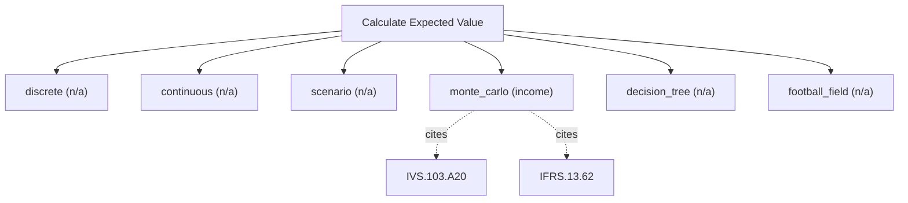

# Expected value and probability weighting

Expected-value engine. Compute expected values over discrete, continuous, simulated, or tree-structured uncertainty, plus football-field ranges. Use this for generic probability weighting of scenarios, Monte-Carlo and decision trees; it does NOT perform IFRS/HKFRS measurement of provisions, insurance or employee-benefit obligations (use calculate_actuarial_pv), and it does not price path-dependent payoffs (use calculate_structured_product).

## `discrete`

expected value of a discrete distribution

**Formula:** E[X] = sum p_i*x_i

**Approach:** n/a  
**Solution:** n/a

**Inputs**

| Name | Type | Description |
|------|------|-------------|
| `outcomes` | array | Outcome values aligned with probabilities. |
| `probabilities` | array | Cumulative success probability per period in [0,1], aligned with cash_flows. |

**Risks & limits**

## `continuous`

expected value under a normal distribution over a range

**Formula:** E[X] over [a,b]

**Approach:** n/a  
**Solution:** n/a

**Inputs**

| Name | Type | Description |
|------|------|-------------|
| `distribution` | string | Continuous distribution to integrate over. |
| `mean` | number | Distribution mean. |
| `std` | number | Distribution standard deviation (>0). |
| `lower` | number | Lower integration bound. |
| `upper` | number | Upper integration bound. |

**Risks & limits**

## `scenario`

probability-weighted scenario value

**Formula:** E[V] = sum p_i*V_i

**Approach:** n/a  
**Solution:** n/a

**Inputs**

| Name | Type | Description |
|------|------|-------------|
| `scenarios` | array | Scenarios [{probability, value}] with probabilities summing to 1. |

**Risks & limits**

## `monte_carlo`

simulated distribution of an outcome

**Formula:** Monte-Carlo; mean/median/std/percentiles (seeded, reproducible)

**Approach:** income  
**Solution:** simulation

**Inputs**

| Name | Type | Description |
|------|------|-------------|
| `iterations` | integer | Monte-Carlo iterations (>=1000). |
| `distributions` | array | Input distributions [{parameter, type, mean, std}]. |
| `base_params` | object | Base parameter values for simulation. |
| `seed` | integer | Deterministic RNG seed (required by simulation methods for reproducibility). |

**Standards (verbatim)**

- **IVS.103.A20** — Income approach and DCF
  > 30.01 The income approach provides an indication of value by converting projected cash flows to a single current value. Under the income approach, the value of an asset is determined by reference to the value of income, cash flow or cost savings generated by the asset. A20.01 Although there are many ways to implement the income approach, methods under the income approach are effectively based on discounting future amounts of cash flow to present value. They are variations of the Discounted Cash Flow (DCF) method and the concepts in the following paragraphs apply in part or in full to all income approach methods.
  > — International Valuation Standards Council (IVSC) (source/ivs-2025.md#ivs-103-income-approach)
- **IFRS.13.62** — Three valuation techniques
  > The objective of using a valuation technique is to estimate the price at which an orderly transaction to sell the asset or to transfer the liability would take place between market participants at the measurement date under current market conditions. Three widely used valuation techniques are the market approach, the cost approach and the income approach. The main aspects of those approaches are summarised in paragraphs B5–B11. An entity shall use valuation techniques consistent with one or more of those approaches to measure fair value.
  > — IFRS Foundation (source/ifrs-13.md#paragraph-62)

**IVS ↔ IFRS/IAS divergences**

- `measurement_objective`: IVS — IVS 103/105 probability-weighted inputs for a market-participant value; IFRS/IAS — IFRS 13 expected-present-value technique (probability-weighted cash flows)

**Risks & limits**

- Monte-Carlo (simulation): the value is an estimate from a seeded sample; re-run with the same seed to reproduce, and treat the distribution, not the point value, as the result.
- IVS/IFRS divergence on 'measurement_objective': the two regimes treat this differently (IVS 103/105 probability-weighted inputs for a market-participant value vs IFRS 13 expected-present-value technique (probability-weighted cash flows)); the choice is the caller's, not a default.
- Standards alignment is declared per method; see the cited clauses.

## `decision_tree`

expected value over a decision tree

**Formula:** roll back chance/decision nodes

**Approach:** n/a  
**Solution:** n/a

**Inputs**

| Name | Type | Description |
|------|------|-------------|
| `tree` | object | Decision tree with chance/decision nodes. |

**Risks & limits**

## `football_field`

blend model estimates into a range

**Formula:** football-field range; no mechanical average

**Approach:** n/a  
**Solution:** n/a

**Inputs**

| Name | Type | Description |
|------|------|-------------|
| `estimates` | array | Estimates [{method, central, low, high}] for a football field. |

**Risks & limits**
