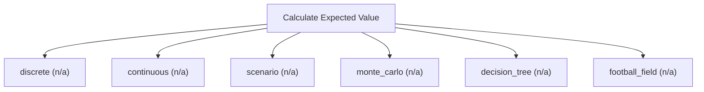

# Expected value and probability weighting

Expected-value engine. Compute expected values over discrete, continuous, simulated, or tree-structured uncertainty, plus football-field ranges. Use this for generic probability weighting of scenarios, Monte-Carlo and decision trees; it does NOT perform IFRS/HKFRS measurement of provisions, insurance or employee-benefit obligations (use calculate_actuarial_pv), and it does not price path-dependent payoffs (use calculate_structured_product).

## `discrete`

expected value of a discrete distribution

**Formula:** E[X] = sum p_i*x_i

**Approach:** n/a  
**Solution:** n/a

**Inputs**

| Name | Type | Description |
|------|------|-------------|
| `outcomes` | array | Outcome values aligned with probabilities. |
| `probabilities` | array | Cumulative success probability per period in [0,1], aligned with cash_flows. |

**Risks & limits**

## `continuous`

expected value under a normal distribution over a range

**Formula:** E[X] over [a,b]

**Approach:** n/a  
**Solution:** n/a

**Inputs**

| Name | Type | Description |
|------|------|-------------|
| `distribution` | string | Continuous distribution to integrate over. |
| `mean` | number | Distribution mean. |
| `std` | number | Distribution standard deviation (>0). |
| `lower` | number | Lower integration bound. |
| `upper` | number | Upper integration bound. |

**Risks & limits**

## `scenario`

probability-weighted scenario value

**Formula:** E[V] = sum p_i*V_i

**Approach:** n/a  
**Solution:** n/a

**Inputs**

| Name | Type | Description |
|------|------|-------------|
| `scenarios` | array | Scenarios [{probability, value}] with probabilities summing to 1. |

**Risks & limits**

## `monte_carlo`

simulated distribution of an outcome

**Formula:** Monte-Carlo; mean/median/std/percentiles

**Approach:** n/a  
**Solution:** n/a

**Inputs**

| Name | Type | Description |
|------|------|-------------|
| `iterations` | integer | Monte-Carlo iterations (>=1000). |
| `distributions` | array | Input distributions [{parameter, type, mean, std}]. |
| `base_params` | object | Base parameter values for simulation. |

**Risks & limits**

## `decision_tree`

expected value over a decision tree

**Formula:** roll back chance/decision nodes

**Approach:** n/a  
**Solution:** n/a

**Inputs**

| Name | Type | Description |
|------|------|-------------|
| `tree` | object | Decision tree with chance/decision nodes. |

**Risks & limits**

## `football_field`

blend model estimates into a range

**Formula:** football-field range; no mechanical average

**Approach:** n/a  
**Solution:** n/a

**Inputs**

| Name | Type | Description |
|------|------|-------------|
| `estimates` | array | Estimates [{method, central, low, high}] for a football field. |

**Risks & limits**
