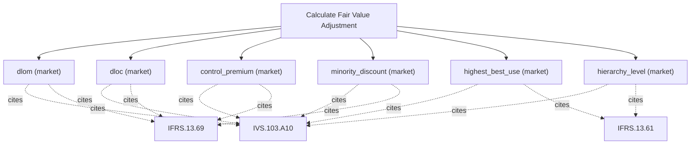

# Fair value adjustments (IFRS 13)

Fair-value-adjustment engine (IFRS 13). Compute exit-price adjustments including credit, liquidity, control and marketability discounts, blockage, and the fair-value hierarchy level. Use this to move from an indicated value to the fair value recognised in the accounts. Read-only and deterministic. Returns the shared result envelope.

## `dlom`

discount for lack of marketability (Finnerty put)

**Formula:** IFRS 13 DLOM via average-strike put

**Approach:** market  
**Solution:** closed_form

**Inputs**

| Name | Type | Description |
|------|------|-------------|
| `base_value` | number | Base valuation before the adjustment. |
| `restricted_period` | number | Restricted/marketability period in years (>=0). |
| `volatility` | number | Annualized volatility (decimal, 0.30 = 30%); > 0. |
| `risk_free` | number | Continuously-compounded risk-free rate (decimal). |

**Standards (verbatim)**

- **IVS.103.A10** — Valuation approaches
  > 10.01 Consideration must be given to the relevant and appropriate valuation approaches. One or more valuation approaches may be used in order to arrive at the value in accordance with the basis of value. The three approaches described and defined below are the principle valuation approaches: 20.01 The market approach provides an indication of value by comparing the asset and/or liability with identical or comparable (that is similar) asset and/or liability for which price information is available. 40.01 The cost approach provides an indication of value using the economic principle that a buyer would not pay more for an asset than the amount for which it could replace the asset with an equivalent asset.
  > — International Valuation Standards Council (IVSC) (source/ivs-2025.md#ivs-103-valuation-approaches)
- **IFRS.13.69** — Blockage factors
  > [...] a fair value measurement shall not incorporate a premium or discount that is inconsistent with the unit of account in the Standard that requires or permits the fair value measurement. Premiums or discounts that reflect size as a characteristic of the entity's holding (specifically, a blockage factor that adjusts the quoted price of an asset or a liability because the market's normal daily trading volume is not sufficient to absorb the quantity held by the entity, as described in paragraph 80) rather than as a characteristic of the asset or liability (eg a control premium when measuring the fair value of a controlling interest) are not permitted in a fair value measurement.
  > — IFRS Foundation (source/ifrs-13.md#paragraph-69)

**Risks & limits**

- Deterministic model: the result is a point value with no modelled distribution; input error and model error are not quantified here.
- Standards alignment is declared per method; see the cited clauses.

## `dloc`

discount for lack of control

**Formula:** value*(1-cost)

**Approach:** market  
**Solution:** closed_form

**Inputs**

| Name | Type | Description |
|------|------|-------------|
| `base_value` | number | Base valuation before the adjustment. |
| `transaction_cost_pct` | number | Transaction cost as a fraction of value. |

**Standards (verbatim)**

- **IVS.103.A10** — Valuation approaches
  > 10.01 Consideration must be given to the relevant and appropriate valuation approaches. One or more valuation approaches may be used in order to arrive at the value in accordance with the basis of value. The three approaches described and defined below are the principle valuation approaches: 20.01 The market approach provides an indication of value by comparing the asset and/or liability with identical or comparable (that is similar) asset and/or liability for which price information is available. 40.01 The cost approach provides an indication of value using the economic principle that a buyer would not pay more for an asset than the amount for which it could replace the asset with an equivalent asset.
  > — International Valuation Standards Council (IVSC) (source/ivs-2025.md#ivs-103-valuation-approaches)
- **IFRS.13.69** — Blockage factors
  > [...] a fair value measurement shall not incorporate a premium or discount that is inconsistent with the unit of account in the Standard that requires or permits the fair value measurement. Premiums or discounts that reflect size as a characteristic of the entity's holding (specifically, a blockage factor that adjusts the quoted price of an asset or a liability because the market's normal daily trading volume is not sufficient to absorb the quantity held by the entity, as described in paragraph 80) rather than as a characteristic of the asset or liability (eg a control premium when measuring the fair value of a controlling interest) are not permitted in a fair value measurement.
  > — IFRS Foundation (source/ifrs-13.md#paragraph-69)

**Risks & limits**

- Deterministic model: the result is a point value with no modelled distribution; input error and model error are not quantified here.
- Standards alignment is declared per method; see the cited clauses.

## `control_premium`

control premium over the minority value

**Formula:** value*(1+premium)

**Approach:** market  
**Solution:** closed_form

**Inputs**

| Name | Type | Description |
|------|------|-------------|
| `base_value` | number | Base valuation before the adjustment. |
| `control_premium_pct` | number | Control premium as a fraction of value. |

**Standards (verbatim)**

- **IVS.103.A10** — Valuation approaches
  > 10.01 Consideration must be given to the relevant and appropriate valuation approaches. One or more valuation approaches may be used in order to arrive at the value in accordance with the basis of value. The three approaches described and defined below are the principle valuation approaches: 20.01 The market approach provides an indication of value by comparing the asset and/or liability with identical or comparable (that is similar) asset and/or liability for which price information is available. 40.01 The cost approach provides an indication of value using the economic principle that a buyer would not pay more for an asset than the amount for which it could replace the asset with an equivalent asset.
  > — International Valuation Standards Council (IVSC) (source/ivs-2025.md#ivs-103-valuation-approaches)
- **IFRS.13.69** — Blockage factors
  > [...] a fair value measurement shall not incorporate a premium or discount that is inconsistent with the unit of account in the Standard that requires or permits the fair value measurement. Premiums or discounts that reflect size as a characteristic of the entity's holding (specifically, a blockage factor that adjusts the quoted price of an asset or a liability because the market's normal daily trading volume is not sufficient to absorb the quantity held by the entity, as described in paragraph 80) rather than as a characteristic of the asset or liability (eg a control premium when measuring the fair value of a controlling interest) are not permitted in a fair value measurement.
  > — IFRS Foundation (source/ifrs-13.md#paragraph-69)

**Risks & limits**

- Deterministic model: the result is a point value with no modelled distribution; input error and model error are not quantified here.
- Standards alignment is declared per method; see the cited clauses.

## `minority_discount`

minority discount

**Formula:** value*(1-discount)

**Approach:** market  
**Solution:** closed_form

**Inputs**

| Name | Type | Description |
|------|------|-------------|
| `base_value` | number | Base valuation before the adjustment. |
| `minority_discount_pct` | number | Minority discount as a fraction of value. |

**Standards (verbatim)**

- **IVS.103.A10** — Valuation approaches
  > 10.01 Consideration must be given to the relevant and appropriate valuation approaches. One or more valuation approaches may be used in order to arrive at the value in accordance with the basis of value. The three approaches described and defined below are the principle valuation approaches: 20.01 The market approach provides an indication of value by comparing the asset and/or liability with identical or comparable (that is similar) asset and/or liability for which price information is available. 40.01 The cost approach provides an indication of value using the economic principle that a buyer would not pay more for an asset than the amount for which it could replace the asset with an equivalent asset.
  > — International Valuation Standards Council (IVSC) (source/ivs-2025.md#ivs-103-valuation-approaches)
- **IFRS.13.69** — Blockage factors
  > [...] a fair value measurement shall not incorporate a premium or discount that is inconsistent with the unit of account in the Standard that requires or permits the fair value measurement. Premiums or discounts that reflect size as a characteristic of the entity's holding (specifically, a blockage factor that adjusts the quoted price of an asset or a liability because the market's normal daily trading volume is not sufficient to absorb the quantity held by the entity, as described in paragraph 80) rather than as a characteristic of the asset or liability (eg a control premium when measuring the fair value of a controlling interest) are not permitted in a fair value measurement.
  > — IFRS Foundation (source/ifrs-13.md#paragraph-69)

**Risks & limits**

- Deterministic model: the result is a point value with no modelled distribution; input error and model error are not quantified here.
- Standards alignment is declared per method; see the cited clauses.

## `highest_best_use`

highest-and-best-use value

**Formula:** max(base, financially feasible alternatives)

**Approach:** market  
**Solution:** closed_form

**Inputs**

| Name | Type | Description |
|------|------|-------------|
| `base_value` | number | Base valuation before the adjustment. |
| `alternative_use_values` | array | Financially feasible alternative-use values. |

**Standards (verbatim)**

- **IVS.103.A10** — Valuation approaches
  > 10.01 Consideration must be given to the relevant and appropriate valuation approaches. One or more valuation approaches may be used in order to arrive at the value in accordance with the basis of value. The three approaches described and defined below are the principle valuation approaches: 20.01 The market approach provides an indication of value by comparing the asset and/or liability with identical or comparable (that is similar) asset and/or liability for which price information is available. 40.01 The cost approach provides an indication of value using the economic principle that a buyer would not pay more for an asset than the amount for which it could replace the asset with an equivalent asset.
  > — International Valuation Standards Council (IVSC) (source/ivs-2025.md#ivs-103-valuation-approaches)
- **IFRS.13.61** — Valuation techniques
  > An entity shall use valuation techniques that are appropriate in the circumstances and for which sufficient data are available to measure fair value, maximising the use of relevant observable inputs and minimising the use of unobservable inputs.
  > — IFRS Foundation (source/ifrs-13.md#paragraph-61)

**Risks & limits**

- Deterministic model: the result is a point value with no modelled distribution; input error and model error are not quantified here.
- Standards alignment is declared per method; see the cited clauses.

## `hierarchy_level`

IFRS 13 hierarchy level of an input

**Formula:** lowest significant input level

**Approach:** market  
**Solution:** closed_form

**Inputs**

| Name | Type | Description |
|------|------|-------------|
| `inputs` | array | Inputs [{value, level}] used to determine the hierarchy level. |

**Standards (verbatim)**

- **IVS.103.A10** — Valuation approaches
  > 10.01 Consideration must be given to the relevant and appropriate valuation approaches. One or more valuation approaches may be used in order to arrive at the value in accordance with the basis of value. The three approaches described and defined below are the principle valuation approaches: 20.01 The market approach provides an indication of value by comparing the asset and/or liability with identical or comparable (that is similar) asset and/or liability for which price information is available. 40.01 The cost approach provides an indication of value using the economic principle that a buyer would not pay more for an asset than the amount for which it could replace the asset with an equivalent asset.
  > — International Valuation Standards Council (IVSC) (source/ivs-2025.md#ivs-103-valuation-approaches)
- **IFRS.13.61** — Valuation techniques
  > An entity shall use valuation techniques that are appropriate in the circumstances and for which sufficient data are available to measure fair value, maximising the use of relevant observable inputs and minimising the use of unobservable inputs.
  > — IFRS Foundation (source/ifrs-13.md#paragraph-61)

**Risks & limits**

- Deterministic model: the result is a point value with no modelled distribution; input error and model error are not quantified here.
- Standards alignment is declared per method; see the cited clauses.
