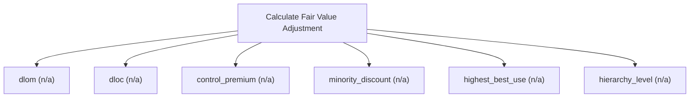

# Fair value adjustments (IFRS 13)

Fair-value-adjustment engine (IFRS 13). Compute exit-price adjustments including credit, liquidity, control and marketability discounts, blockage, and the fair-value hierarchy level. Use this to move from an indicated value to the fair value recognised in the accounts. Read-only and deterministic. Returns the shared result envelope.

## `dlom`

discount for lack of marketability (Finnerty put)

**Formula:** IFRS 13 DLOM via average-strike put

**Approach:** n/a  
**Solution:** n/a

**Inputs**

| Name | Type | Description |
|------|------|-------------|
| `base_value` | number | Base valuation before the adjustment. |
| `restricted_period` | number | Restricted/marketability period in years (>=0). |
| `volatility` | number | Annualized volatility (decimal, 0.30 = 30%); > 0. |
| `risk_free` | number | Continuously-compounded risk-free rate (decimal). |

**Risks & limits**

- Standards alignment is declared per method; see the cited clauses.

## `dloc`

discount for lack of control

**Formula:** value*(1-cost)

**Approach:** n/a  
**Solution:** n/a

**Inputs**

| Name | Type | Description |
|------|------|-------------|
| `base_value` | number | Base valuation before the adjustment. |
| `transaction_cost_pct` | number | Transaction cost as a fraction of value. |

**Risks & limits**

- Standards alignment is declared per method; see the cited clauses.

## `control_premium`

control premium over the minority value

**Formula:** value*(1+premium)

**Approach:** n/a  
**Solution:** n/a

**Inputs**

| Name | Type | Description |
|------|------|-------------|
| `base_value` | number | Base valuation before the adjustment. |
| `control_premium_pct` | number | Control premium as a fraction of value. |

**Risks & limits**

- Standards alignment is declared per method; see the cited clauses.

## `minority_discount`

minority discount

**Formula:** value*(1-discount)

**Approach:** n/a  
**Solution:** n/a

**Inputs**

| Name | Type | Description |
|------|------|-------------|
| `base_value` | number | Base valuation before the adjustment. |
| `minority_discount_pct` | number | Minority discount as a fraction of value. |

**Risks & limits**

- Standards alignment is declared per method; see the cited clauses.

## `highest_best_use`

highest-and-best-use value

**Formula:** max(base, financially feasible alternatives)

**Approach:** n/a  
**Solution:** n/a

**Inputs**

| Name | Type | Description |
|------|------|-------------|
| `base_value` | number | Base valuation before the adjustment. |
| `alternative_use_values` | array | Financially feasible alternative-use values. |

**Risks & limits**

- Standards alignment is declared per method; see the cited clauses.

## `hierarchy_level`

IFRS 13 hierarchy level of an input

**Formula:** lowest significant input level

**Approach:** n/a  
**Solution:** n/a

**Inputs**

| Name | Type | Description |
|------|------|-------------|
| `inputs` | array | Inputs [{value, level}] used to determine the hierarchy level. |

**Risks & limits**

- Standards alignment is declared per method; see the cited clauses.
