# Fixed income and term structure analytics

Fixed-income engine. Price plain coupon bonds, solve for yield to maturity, measure interest-rate sensitivity via Macaulay and modified duration and convexity, and build a HIBOR/HKD-style term structure: bootstrap a zero curve from par rates, infer forward rates, and discount cash flows on the curve. Use this for vanilla bonds, rate risk and discount curves; for convertibles use calculate_convertible_bond and for structured payoffs use calculate_structured_product.

```mermaid
flowchart TD
  T[Calculate Fixed Income]
  T --> calculate_fixed_income_bond_price["bond_price (income)"]
  calculate_fixed_income_bond_price -. cites .-> IVS_500_A10[IVS.500.A10]
  calculate_fixed_income_bond_price -. cites .-> IFRS_13_62[IFRS.13.62]
  T --> calculate_fixed_income_bond_yield["bond_yield (income)"]
  calculate_fixed_income_bond_yield -. cites .-> IVS_500_A10[IVS.500.A10]
  calculate_fixed_income_bond_yield -. cites .-> IFRS_13_62[IFRS.13.62]
  T --> calculate_fixed_income_duration["duration (income)"]
  calculate_fixed_income_duration -. cites .-> IVS_500_A10[IVS.500.A10]
  calculate_fixed_income_duration -. cites .-> IFRS_13_62[IFRS.13.62]
  T --> calculate_fixed_income_convexity["convexity (income)"]
  calculate_fixed_income_convexity -. cites .-> IVS_500_A10[IVS.500.A10]
  calculate_fixed_income_convexity -. cites .-> IFRS_13_62[IFRS.13.62]
  T --> calculate_fixed_income_matrix_pricing["matrix_pricing (market)"]
  calculate_fixed_income_matrix_pricing -. cites .-> IVS_103_A05[IVS.103.A05]
  calculate_fixed_income_matrix_pricing -. cites .-> IFRS_13_62[IFRS.13.62]
  T --> calculate_fixed_income_discount_factor["discount_factor (income)"]
  calculate_fixed_income_discount_factor -. cites .-> IVS_500_A10[IVS.500.A10]
  calculate_fixed_income_discount_factor -. cites .-> IFRS_13_62[IFRS.13.62]
  T --> calculate_fixed_income_zero_curve["zero_curve (income)"]
  calculate_fixed_income_zero_curve -. cites .-> IVS_500_A10[IVS.500.A10]
  calculate_fixed_income_zero_curve -. cites .-> IFRS_13_62[IFRS.13.62]
  T --> calculate_fixed_income_forward_rate["forward_rate (income)"]
  calculate_fixed_income_forward_rate -. cites .-> IVS_500_A10[IVS.500.A10]
  calculate_fixed_income_forward_rate -. cites .-> IFRS_13_62[IFRS.13.62]
  T --> calculate_fixed_income_pv_curve["pv_curve (income)"]
  calculate_fixed_income_pv_curve -. cites .-> IVS_500_A10[IVS.500.A10]
  calculate_fixed_income_pv_curve -. cites .-> IFRS_13_62[IFRS.13.62]
```

## `bond_price`

present value of coupons and face from a yield

**Formula:** Discounted cash flows at ytm/frequency

**Approach:** income  
**Solution:** closed_form

**Inputs**

| Name | Type | Description |
|------|------|-------------|
| `face` | number | Bond face value. |
| `coupon_rate` | number | Annual coupon rate (decimal). |
| `years` | integer | Number of projection years n; equal len(cash_flows) when both are supplied. |
| `ytm` | number | Yield to maturity (decimal, annualised). |
| `frequency` | integer | Coupon payments per year (1=annual, 2=semi-annual). |

**Standards (verbatim)**

- **IVS.500.A10** — Financial instrument valuation models
  > 100.02 The valuer must determine that the valuation model is appropriate, which for the purposes of IVS 500 Financial Instruments means "fit for use" in terms of assets and/or liabilities being valued, the scope of work, and the valuation method.
  > — International Valuation Standards Council (IVSC) (source/ivs-2025.md#ivs-500-financial-instruments)
- **IFRS.13.62** — Three valuation techniques
  > The objective of using a valuation technique is to estimate the price at which an orderly transaction to sell the asset or to transfer the liability would take place between market participants at the measurement date under current market conditions. Three widely used valuation techniques are the market approach, the cost approach and the income approach. The main aspects of those approaches are summarised in paragraphs B5–B11. An entity shall use valuation techniques consistent with one or more of those approaches to measure fair value.
  > — IFRS Foundation (source/ifrs-13.md#paragraph-62)

**IVS ↔ IFRS/IAS divergences**

- `measurement_objective`: IVS — IVS 500 fit-for-use financial-instrument model (IVS 105); IFRS/IAS — IFRS 13 fair value (income approach) / IFRS 9 amortised cost

**Risks & limits**

- Deterministic model: the result is a point value with no modelled distribution; input error and model error are not quantified here.
- IVS/IFRS divergence on 'measurement_objective': the two regimes treat this differently (IVS 500 fit-for-use financial-instrument model (IVS 105) vs IFRS 13 fair value (income approach) / IFRS 9 amortised cost); the choice is the caller's, not a default.
- Standards alignment is declared per method; see the cited clauses.

## `bond_yield`

yield to maturity implied by a price

**Formula:** Bisection on ytm

**Approach:** income  
**Solution:** closed_form

**Inputs**

| Name | Type | Description |
|------|------|-------------|
| `face` | number | Bond face value. |
| `coupon_rate` | number | Annual coupon rate (decimal). |
| `years` | integer | Number of projection years n; equal len(cash_flows) when both are supplied. |
| `price` | number | Dirty price of the instrument in reporting currency. |
| `frequency` | integer | Coupon payments per year (1=annual, 2=semi-annual). |

**Standards (verbatim)**

- **IVS.500.A10** — Financial instrument valuation models
  > 100.02 The valuer must determine that the valuation model is appropriate, which for the purposes of IVS 500 Financial Instruments means "fit for use" in terms of assets and/or liabilities being valued, the scope of work, and the valuation method.
  > — International Valuation Standards Council (IVSC) (source/ivs-2025.md#ivs-500-financial-instruments)
- **IFRS.13.62** — Three valuation techniques
  > The objective of using a valuation technique is to estimate the price at which an orderly transaction to sell the asset or to transfer the liability would take place between market participants at the measurement date under current market conditions. Three widely used valuation techniques are the market approach, the cost approach and the income approach. The main aspects of those approaches are summarised in paragraphs B5–B11. An entity shall use valuation techniques consistent with one or more of those approaches to measure fair value.
  > — IFRS Foundation (source/ifrs-13.md#paragraph-62)

**Risks & limits**

- Deterministic model: the result is a point value with no modelled distribution; input error and model error are not quantified here.
- Standards alignment is declared per method; see the cited clauses.

## `duration`

Macaulay and modified duration

**Formula:** PV-weighted time to cash flows

**Approach:** income  
**Solution:** closed_form

**Inputs**

| Name | Type | Description |
|------|------|-------------|
| `face` | number | Bond face value. |
| `coupon_rate` | number | Annual coupon rate (decimal). |
| `years` | integer | Number of projection years n; equal len(cash_flows) when both are supplied. |
| `ytm` | number | Yield to maturity (decimal, annualised). |
| `frequency` | integer | Coupon payments per year (1=annual, 2=semi-annual). |

**Standards (verbatim)**

- **IVS.500.A10** — Financial instrument valuation models
  > 100.02 The valuer must determine that the valuation model is appropriate, which for the purposes of IVS 500 Financial Instruments means "fit for use" in terms of assets and/or liabilities being valued, the scope of work, and the valuation method.
  > — International Valuation Standards Council (IVSC) (source/ivs-2025.md#ivs-500-financial-instruments)
- **IFRS.13.62** — Three valuation techniques
  > The objective of using a valuation technique is to estimate the price at which an orderly transaction to sell the asset or to transfer the liability would take place between market participants at the measurement date under current market conditions. Three widely used valuation techniques are the market approach, the cost approach and the income approach. The main aspects of those approaches are summarised in paragraphs B5–B11. An entity shall use valuation techniques consistent with one or more of those approaches to measure fair value.
  > — IFRS Foundation (source/ifrs-13.md#paragraph-62)

**Risks & limits**

- Deterministic model: the result is a point value with no modelled distribution; input error and model error are not quantified here.
- Standards alignment is declared per method; see the cited clauses.

## `convexity`

second-order price sensitivity

**Formula:** Convexity of the price-yield curve

**Approach:** income  
**Solution:** closed_form

**Inputs**

| Name | Type | Description |
|------|------|-------------|
| `face` | number | Bond face value. |
| `coupon_rate` | number | Annual coupon rate (decimal). |
| `years` | integer | Number of projection years n; equal len(cash_flows) when both are supplied. |
| `ytm` | number | Yield to maturity (decimal, annualised). |
| `frequency` | integer | Coupon payments per year (1=annual, 2=semi-annual). |

**Standards (verbatim)**

- **IVS.500.A10** — Financial instrument valuation models
  > 100.02 The valuer must determine that the valuation model is appropriate, which for the purposes of IVS 500 Financial Instruments means "fit for use" in terms of assets and/or liabilities being valued, the scope of work, and the valuation method.
  > — International Valuation Standards Council (IVSC) (source/ivs-2025.md#ivs-500-financial-instruments)
- **IFRS.13.62** — Three valuation techniques
  > The objective of using a valuation technique is to estimate the price at which an orderly transaction to sell the asset or to transfer the liability would take place between market participants at the measurement date under current market conditions. Three widely used valuation techniques are the market approach, the cost approach and the income approach. The main aspects of those approaches are summarised in paragraphs B5–B11. An entity shall use valuation techniques consistent with one or more of those approaches to measure fair value.
  > — IFRS Foundation (source/ifrs-13.md#paragraph-62)

**Risks & limits**

- Deterministic model: the result is a point value with no modelled distribution; input error and model error are not quantified here.
- Standards alignment is declared per method; see the cited clauses.

## `matrix_pricing`

interpolate a yield from benchmark securities by their relationship

**Formula:** IVS 103 A10.05 matrix pricing: interpolated benchmark yield

**Approach:** market  
**Solution:** closed_form

**Inputs**

| Name | Type | Description |
|------|------|-------------|
| `target_tenor` | number | Target tenor in years for matrix pricing (interpolated). |
| `benchmark_tenors` | array | Benchmark tenors in years, sorted, aligned with benchmark_yields. |
| `benchmark_yields` | array | Benchmark yields (decimal) at each benchmark tenor. |

**Standards (verbatim)**

- **IVS.103.A05** — Matrix pricing
  > A10.05 A subset of the comparable transactions method is matrix pricing, which is principally used to value some types of financial instruments, such as debt securities, without relying exclusively on quoted prices for the specific securities, but rather relying on the securities' relationship to other benchmark quoted securities and their attributes (ie, yield).
  > — International Valuation Standards Council (IVSC) (source/ivs-2025.md#ivs-103-market-approach-methods)
- **IFRS.13.62** — Three valuation techniques
  > The objective of using a valuation technique is to estimate the price at which an orderly transaction to sell the asset or to transfer the liability would take place between market participants at the measurement date under current market conditions. Three widely used valuation techniques are the market approach, the cost approach and the income approach. The main aspects of those approaches are summarised in paragraphs B5–B11. An entity shall use valuation techniques consistent with one or more of those approaches to measure fair value.
  > — IFRS Foundation (source/ifrs-13.md#paragraph-62)

**IVS ↔ IFRS/IAS divergences**

- `evidence_hierarchy`: IVS — IVS 103 comparable-evidence grading (market-derived inputs); IFRS/IAS — IFRS 13 input hierarchy (Level 2 observable inputs where quoted prices are unavailable)

**Risks & limits**

- Deterministic model: the result is a point value with no modelled distribution; input error and model error are not quantified here.
- IVS/IFRS divergence on 'evidence_hierarchy': the two regimes treat this differently (IVS 103 comparable-evidence grading (market-derived inputs) vs IFRS 13 input hierarchy (Level 2 observable inputs where quoted prices are unavailable)); the choice is the caller's, not a default.
- Standards alignment is declared per method; see the cited clauses.

## `discount_factor`

present value of one unit at a single rate

**Formula:** DF = (1 + r/m)^(-m t)

**Approach:** income  
**Solution:** closed_form

**Inputs**

| Name | Type | Description |
|------|------|-------------|
| `rate` | number | A single interest/zero rate (decimal). |
| `years` | integer | Number of projection years n; equal len(cash_flows) when both are supplied. |
| `frequency` | integer | Coupon payments per year (1=annual, 2=semi-annual). |

**Standards (verbatim)**

- **IVS.500.A10** — Financial instrument valuation models
  > 100.02 The valuer must determine that the valuation model is appropriate, which for the purposes of IVS 500 Financial Instruments means "fit for use" in terms of assets and/or liabilities being valued, the scope of work, and the valuation method.
  > — International Valuation Standards Council (IVSC) (source/ivs-2025.md#ivs-500-financial-instruments)
- **IFRS.13.62** — Three valuation techniques
  > The objective of using a valuation technique is to estimate the price at which an orderly transaction to sell the asset or to transfer the liability would take place between market participants at the measurement date under current market conditions. Three widely used valuation techniques are the market approach, the cost approach and the income approach. The main aspects of those approaches are summarised in paragraphs B5–B11. An entity shall use valuation techniques consistent with one or more of those approaches to measure fair value.
  > — IFRS Foundation (source/ifrs-13.md#paragraph-62)

**Risks & limits**

- Deterministic model: the result is a point value with no modelled distribution; input error and model error are not quantified here.
- Standards alignment is declared per method; see the cited clauses.

## `zero_curve`

bootstrap zero rates from par rates on a tenor grid

**Formula:** Sequential par-bond bootstrap, annual compounding

**Approach:** income  
**Solution:** closed_form

**Inputs**

| Name | Type | Description |
|------|------|-------------|
| `par_rates` | array | Par (coupon) rates per tenor, aligned with tenors (decimal). |
| `tenors` | array | Tenors in years, aligned with par_rates or zero_rates. |
| `frequency` | integer | Coupon payments per year (1=annual, 2=semi-annual). |

**Standards (verbatim)**

- **IVS.500.A10** — Financial instrument valuation models
  > 100.02 The valuer must determine that the valuation model is appropriate, which for the purposes of IVS 500 Financial Instruments means "fit for use" in terms of assets and/or liabilities being valued, the scope of work, and the valuation method.
  > — International Valuation Standards Council (IVSC) (source/ivs-2025.md#ivs-500-financial-instruments)
- **IFRS.13.62** — Three valuation techniques
  > The objective of using a valuation technique is to estimate the price at which an orderly transaction to sell the asset or to transfer the liability would take place between market participants at the measurement date under current market conditions. Three widely used valuation techniques are the market approach, the cost approach and the income approach. The main aspects of those approaches are summarised in paragraphs B5–B11. An entity shall use valuation techniques consistent with one or more of those approaches to measure fair value.
  > — IFRS Foundation (source/ifrs-13.md#paragraph-62)

**Risks & limits**

- Deterministic model: the result is a point value with no modelled distribution; input error and model error are not quantified here.
- Standards alignment is declared per method; see the cited clauses.

## `forward_rate`

implied forward rate between two tenors

**Formula:** Forward from two bootstrapped zero rates

**Approach:** income  
**Solution:** closed_form

**Inputs**

| Name | Type | Description |
|------|------|-------------|
| `zero_rates` | array | Zero (spot) rates per tenor, decimal, annual compounding. |
| `tenors` | array | Tenors in years, aligned with par_rates or zero_rates. |
| `t1` | number | Forward period start in years (>=0). |
| `t2` | number | Forward period end in years (> t1). |

**Standards (verbatim)**

- **IVS.500.A10** — Financial instrument valuation models
  > 100.02 The valuer must determine that the valuation model is appropriate, which for the purposes of IVS 500 Financial Instruments means "fit for use" in terms of assets and/or liabilities being valued, the scope of work, and the valuation method.
  > — International Valuation Standards Council (IVSC) (source/ivs-2025.md#ivs-500-financial-instruments)
- **IFRS.13.62** — Three valuation techniques
  > The objective of using a valuation technique is to estimate the price at which an orderly transaction to sell the asset or to transfer the liability would take place between market participants at the measurement date under current market conditions. Three widely used valuation techniques are the market approach, the cost approach and the income approach. The main aspects of those approaches are summarised in paragraphs B5–B11. An entity shall use valuation techniques consistent with one or more of those approaches to measure fair value.
  > — IFRS Foundation (source/ifrs-13.md#paragraph-62)

**Risks & limits**

- Deterministic model: the result is a point value with no modelled distribution; input error and model error are not quantified here.
- Standards alignment is declared per method; see the cited clauses.

## `pv_curve`

discount cash flows on a zero curve

**Formula:** Curve interpolation and discounting

**Approach:** income  
**Solution:** closed_form

**Inputs**

| Name | Type | Description |
|------|------|-------------|
| `cash_flows` | array | Projected cash flows in reporting currency, indexed t=1..n. |
| `times` | array | Cash-flow times in years, aligned with cash_flows. |
| `zero_rates` | array | Zero (spot) rates per tenor, decimal, annual compounding. |
| `tenors` | array | Tenors in years, aligned with par_rates or zero_rates. |

**Standards (verbatim)**

- **IVS.500.A10** — Financial instrument valuation models
  > 100.02 The valuer must determine that the valuation model is appropriate, which for the purposes of IVS 500 Financial Instruments means "fit for use" in terms of assets and/or liabilities being valued, the scope of work, and the valuation method.
  > — International Valuation Standards Council (IVSC) (source/ivs-2025.md#ivs-500-financial-instruments)
- **IFRS.13.62** — Three valuation techniques
  > The objective of using a valuation technique is to estimate the price at which an orderly transaction to sell the asset or to transfer the liability would take place between market participants at the measurement date under current market conditions. Three widely used valuation techniques are the market approach, the cost approach and the income approach. The main aspects of those approaches are summarised in paragraphs B5–B11. An entity shall use valuation techniques consistent with one or more of those approaches to measure fair value.
  > — IFRS Foundation (source/ifrs-13.md#paragraph-62)

**Risks & limits**

- Deterministic model: the result is a point value with no modelled distribution; input error and model error are not quantified here.
- Standards alignment is declared per method; see the cited clauses.
