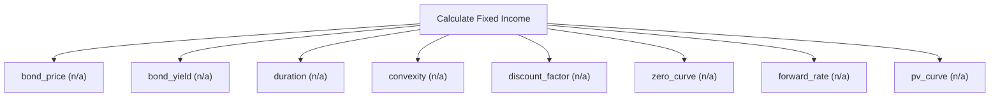

# Fixed income and term structure analytics

Fixed-income engine. Price plain coupon bonds, solve for yield to maturity, measure interest-rate sensitivity via Macaulay and modified duration and convexity, and build a HIBOR/HKD-style term structure: bootstrap a zero curve from par rates, infer forward rates, and discount cash flows on the curve. Use this for vanilla bonds, rate risk and discount curves; for convertibles use calculate_convertible_bond and for structured payoffs use calculate_structured_product.

## `bond_price`

present value of coupons and face from a yield

**Formula:** Discounted cash flows at ytm/frequency

**Approach:** n/a  
**Solution:** n/a

**Inputs**

| Name | Type | Description |
|------|------|-------------|
| `face` | number | Bond face value. |
| `coupon_rate` | number | Annual coupon rate (decimal). |
| `years` | integer | Number of projection years n; equal len(cash_flows) when both are supplied. |
| `ytm` | number | Yield to maturity (decimal, annualised). |
| `frequency` | integer | Coupon payments per year (1=annual, 2=semi-annual). |

**Risks & limits**

- Standards alignment is declared per method; see the cited clauses.

## `bond_yield`

yield to maturity implied by a price

**Formula:** Bisection on ytm

**Approach:** n/a  
**Solution:** n/a

**Inputs**

| Name | Type | Description |
|------|------|-------------|
| `face` | number | Bond face value. |
| `coupon_rate` | number | Annual coupon rate (decimal). |
| `years` | integer | Number of projection years n; equal len(cash_flows) when both are supplied. |
| `price` | number | Dirty price of the instrument in reporting currency. |
| `frequency` | integer | Coupon payments per year (1=annual, 2=semi-annual). |

**Risks & limits**

- Standards alignment is declared per method; see the cited clauses.

## `duration`

Macaulay and modified duration

**Formula:** PV-weighted time to cash flows

**Approach:** n/a  
**Solution:** n/a

**Inputs**

| Name | Type | Description |
|------|------|-------------|
| `face` | number | Bond face value. |
| `coupon_rate` | number | Annual coupon rate (decimal). |
| `years` | integer | Number of projection years n; equal len(cash_flows) when both are supplied. |
| `ytm` | number | Yield to maturity (decimal, annualised). |
| `frequency` | integer | Coupon payments per year (1=annual, 2=semi-annual). |

**Risks & limits**

- Standards alignment is declared per method; see the cited clauses.

## `convexity`

second-order price sensitivity

**Formula:** Convexity of the price-yield curve

**Approach:** n/a  
**Solution:** n/a

**Inputs**

| Name | Type | Description |
|------|------|-------------|
| `face` | number | Bond face value. |
| `coupon_rate` | number | Annual coupon rate (decimal). |
| `years` | integer | Number of projection years n; equal len(cash_flows) when both are supplied. |
| `ytm` | number | Yield to maturity (decimal, annualised). |
| `frequency` | integer | Coupon payments per year (1=annual, 2=semi-annual). |

**Risks & limits**

- Standards alignment is declared per method; see the cited clauses.

## `discount_factor`

present value of one unit at a single rate

**Formula:** DF = (1 + r/m)^(-m t)

**Approach:** n/a  
**Solution:** n/a

**Inputs**

| Name | Type | Description |
|------|------|-------------|
| `rate` | number | A single interest/zero rate (decimal). |
| `years` | integer | Number of projection years n; equal len(cash_flows) when both are supplied. |
| `frequency` | integer | Coupon payments per year (1=annual, 2=semi-annual). |

**Risks & limits**

- Standards alignment is declared per method; see the cited clauses.

## `zero_curve`

bootstrap zero rates from par rates on a tenor grid

**Formula:** Sequential par-bond bootstrap, annual compounding

**Approach:** n/a  
**Solution:** n/a

**Inputs**

| Name | Type | Description |
|------|------|-------------|
| `par_rates` | array | Par (coupon) rates per tenor, aligned with tenors (decimal). |
| `tenors` | array | Tenors in years, aligned with par_rates or zero_rates. |
| `frequency` | integer | Coupon payments per year (1=annual, 2=semi-annual). |

**Risks & limits**

- Standards alignment is declared per method; see the cited clauses.

## `forward_rate`

implied forward rate between two tenors

**Formula:** Forward from two bootstrapped zero rates

**Approach:** n/a  
**Solution:** n/a

**Inputs**

| Name | Type | Description |
|------|------|-------------|
| `zero_rates` | array | Zero (spot) rates per tenor, decimal, annual compounding. |
| `tenors` | array | Tenors in years, aligned with par_rates or zero_rates. |
| `t1` | number | Forward period start in years (>=0). |
| `t2` | number | Forward period end in years (> t1). |

**Risks & limits**

- Standards alignment is declared per method; see the cited clauses.

## `pv_curve`

discount cash flows on a zero curve

**Formula:** Curve interpolation and discounting

**Approach:** n/a  
**Solution:** n/a

**Inputs**

| Name | Type | Description |
|------|------|-------------|
| `cash_flows` | array | Projected cash flows in reporting currency, indexed t=1..n. |
| `times` | array | Cash-flow times in years, aligned with cash_flows. |
| `zero_rates` | array | Zero (spot) rates per tenor, decimal, annual compounding. |
| `tenors` | array | Tenors in years, aligned with par_rates or zero_rates. |

**Risks & limits**

- Standards alignment is declared per method; see the cited clauses.
