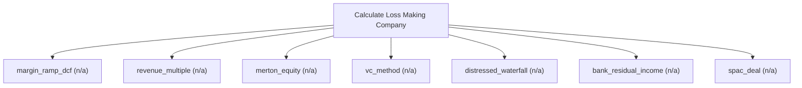

# Loss-making and pre-profit company valuation

Loss-making-company engine. Value currently unprofitable companies with margin-ramp DCF, revenue multiples, Merton structural equity, the VC method, distressed waterfalls, bank residual income, and SPAC deals; every method returns a central value plus a dispersion (sigma, percentiles, long-tail). Use this when earnings-based multiples break down; for standalone probability weighting of arbitrary scenarios use calculate_expected_value, and for a single going-concern DCF use calculate_dcf.

## `margin_ramp_dcf`

margin-ramp DCF for a currently loss-making company

**Formula:** FCFF with margin ramp; central value + dispersion

**Approach:** n/a  
**Solution:** n/a

**Inputs**

| Name | Type | Description |
|------|------|-------------|
| `revenue` | number | Base-year revenue in reporting currency. |
| `growth_rate` | number | Periodic growth rate as a decimal (0.03 = 3%). |
| `start_margin` | number | Opening operating margin (decimal, may be negative); margin_ramp. |
| `target_margin` | number | Normalized margin reached after ramp_years; margin_ramp. |
| `ramp_years` | integer | Years to move from start_margin to target_margin (>=1). |
| `discount_rate` | number | Discount rate as a decimal (0.10 = 10%); pre-tax when method=viu_pre_tax. |
| `years` | integer | Number of projection years n; equal len(cash_flows) when both are supplied. |
| `shares_outstanding` | number | Shares outstanding. |
| `net_debt` | number | Total debt minus cash and equivalents. |
| `range_method` | string | Statistic returned as the headline value; the full dispersion is always included. |

**Risks & limits**

- Standards alignment is declared per method; see the cited clauses.

## `revenue_multiple`

revenue/ARR multiple value

**Formula:** Equity = EV - net debt

**Approach:** n/a  
**Solution:** n/a

**Inputs**

| Name | Type | Description |
|------|------|-------------|
| `revenue` | number | Base-year revenue in reporting currency. |
| `ev_revenue_multiple` | number | EV/Revenue multiple. |
| `net_debt` | number | Total debt minus cash and equivalents. |
| `shares_outstanding` | number | Shares outstanding. |
| `range_method` | string | Statistic returned as the headline value; the full dispersion is always included. |

**Risks & limits**

- Standards alignment is declared per method; see the cited clauses.

## `merton_equity`

equity as a call on firm assets

**Formula:** Merton structural model

**Approach:** n/a  
**Solution:** n/a

**Inputs**

| Name | Type | Description |
|------|------|-------------|
| `firm_value` | number | Firm/asset value for the Merton equity model. |
| `firm_volatility` | number | Asset volatility for the Merton equity model (decimal). |
| `debt` | number | Debt face value (default point) for the Merton equity model. |
| `risk_free` | number | Continuously-compounded risk-free rate (decimal). |
| `maturity` | number | Time to expiry in years (0.5 = six months); > 0. |
| `range_method` | string | Statistic returned as the headline value; the full dispersion is always included. |

**Risks & limits**

- Standards alignment is declared per method; see the cited clauses.

## `vc_method`

venture-capital exit method

**Formula:** Exit value discounted at the target return; dilution-aware

**Approach:** n/a  
**Solution:** n/a

**Inputs**

| Name | Type | Description |
|------|------|-------------|
| `terminal_value` | number | Exit/terminal value (VC method). |
| `target_return` | number | VC target return multiple. |
| `investment` | number | Amount invested (VC method). |
| `shares_outstanding` | number | Shares outstanding. |
| `range_method` | string | Statistic returned as the headline value; the full dispersion is always included. |

**Risks & limits**

## `distressed_waterfall`

distressed/recovery waterfall

**Formula:** Priority waterfall, recovery values

**Approach:** n/a  
**Solution:** n/a

**Inputs**

| Name | Type | Description |
|------|------|-------------|
| `enterprise_value` | number | Enterprise value distributed across claims. |
| `claims` | array | Ordered claims [{name, amount, priority}] for a waterfall. |
| `range_method` | string | Statistic returned as the headline value; the full dispersion is always included. |

**Risks & limits**

## `bank_residual_income`

bank residual-income/justified P/B

**Formula:** Residual income over equity

**Approach:** n/a  
**Solution:** n/a

**Inputs**

| Name | Type | Description |
|------|------|-------------|
| `book_value` | number | Book value of equity in reporting currency. |
| `net_income` | number | Net income in reporting currency. |
| `cost_equity` | number | Cost of equity as a decimal (0.12 = 12%). |
| `growth_rate` | number | Periodic growth rate as a decimal (0.03 = 3%). |
| `range_method` | string | Statistic returned as the headline value; the full dispersion is always included. |

**Risks & limits**

- Standards alignment is declared per method; see the cited clauses.

## `spac_deal`

SPAC redemption and deal-outcome value

**Formula:** Redemption value plus probability-weighted outcome

**Approach:** n/a  
**Solution:** n/a

**Inputs**

| Name | Type | Description |
|------|------|-------------|
| `trust_cash` | number | SPAC trust cash available for redemption. |
| `shares_outstanding` | number | Shares outstanding. |
| `redemption_price` | number | SPAC redemption price per share. |
| `range_method` | string | Statistic returned as the headline value; the full dispersion is always included. |

**Risks & limits**

- Standards alignment is declared per method; see the cited clauses.
