# Loss-making and pre-profit company valuation

Loss-making-company engine. Value currently unprofitable companies with margin-ramp DCF, revenue multiples, Merton structural equity, the VC method, distressed waterfalls, bank residual income, and SPAC deals; every method returns a central value plus a dispersion (sigma, percentiles, long-tail). Use this when earnings-based multiples break down; for standalone probability weighting of arbitrary scenarios use calculate_expected_value, and for a single going-concern DCF use calculate_dcf.

```mermaid
flowchart TD
  T[Calculate Loss Making Company]
  T --> calculate_loss_making_company_margin_ramp_dcf["margin_ramp_dcf (income)"]
  calculate_loss_making_company_margin_ramp_dcf -. cites .-> IVS_103_A20[IVS.103.A20]
  calculate_loss_making_company_margin_ramp_dcf -. cites .-> IFRS_13_62[IFRS.13.62]
  T --> calculate_loss_making_company_revenue_multiple["revenue_multiple (market)"]
  calculate_loss_making_company_revenue_multiple -. cites .-> IVS_103_A10[IVS.103.A10]
  calculate_loss_making_company_revenue_multiple -. cites .-> IFRS_13_62[IFRS.13.62]
  T --> calculate_loss_making_company_merton_equity["merton_equity (income)"]
  calculate_loss_making_company_merton_equity -. cites .-> IVS_103_A20[IVS.103.A20]
  calculate_loss_making_company_merton_equity -. cites .-> IFRS_13_62[IFRS.13.62]
  T --> calculate_loss_making_company_vc_method["vc_method (income)"]
  calculate_loss_making_company_vc_method -. cites .-> IVS_103_A20[IVS.103.A20]
  calculate_loss_making_company_vc_method -. cites .-> IFRS_13_62[IFRS.13.62]
  T --> calculate_loss_making_company_distressed_waterfall["distressed_waterfall (income)"]
  calculate_loss_making_company_distressed_waterfall -. cites .-> IVS_103_A20[IVS.103.A20]
  calculate_loss_making_company_distressed_waterfall -. cites .-> IFRS_13_62[IFRS.13.62]
  T --> calculate_loss_making_company_bank_residual_income["bank_residual_income (income)"]
  calculate_loss_making_company_bank_residual_income -. cites .-> IVS_103_A20[IVS.103.A20]
  calculate_loss_making_company_bank_residual_income -. cites .-> IFRS_13_61[IFRS.13.61]
  T --> calculate_loss_making_company_spac_deal["spac_deal (income)"]
  calculate_loss_making_company_spac_deal -. cites .-> IVS_103_A10[IVS.103.A10]
  calculate_loss_making_company_spac_deal -. cites .-> IFRS_13_62[IFRS.13.62]
```

## `margin_ramp_dcf`

margin-ramp DCF for a currently loss-making company

**Formula:** FCFF with margin ramp; central value + dispersion

**Approach:** income  
**Solution:** closed_form

**Inputs**

| Name | Type | Description |
|------|------|-------------|
| `revenue` | number | Base-year revenue in reporting currency. |
| `growth_rate` | number | Periodic growth rate as a decimal (0.03 = 3%). |
| `start_margin` | number | Opening operating margin (decimal, may be negative); margin_ramp. |
| `target_margin` | number | Normalized margin reached after ramp_years; margin_ramp. |
| `ramp_years` | integer | Years to move from start_margin to target_margin (>=1). |
| `discount_rate` | number | Discount rate as a decimal (0.10 = 10%); pre-tax when method=viu_pre_tax. |
| `years` | integer | Number of projection years n; equal len(cash_flows) when both are supplied. |
| `shares_outstanding` | number | Shares outstanding. |
| `net_debt` | number | Total debt minus cash and equivalents. |
| `range_method` | string | Statistic returned as the headline value; the full dispersion is always included. |

**Standards (verbatim)**

- **IVS.103.A20** — Income approach and DCF
  > 30.01 The income approach provides an indication of value by converting projected cash flows to a single current value. Under the income approach, the value of an asset is determined by reference to the value of income, cash flow or cost savings generated by the asset. A20.01 Although there are many ways to implement the income approach, methods under the income approach are effectively based on discounting future amounts of cash flow to present value. They are variations of the Discounted Cash Flow (DCF) method and the concepts in the following paragraphs apply in part or in full to all income approach methods.
  > — International Valuation Standards Council (IVSC) (source/ivs-2025.md#ivs-103-income-approach)
- **IFRS.13.62** — Three valuation techniques
  > The objective of using a valuation technique is to estimate the price at which an orderly transaction to sell the asset or to transfer the liability would take place between market participants at the measurement date under current market conditions. Three widely used valuation techniques are the market approach, the cost approach and the income approach. The main aspects of those approaches are summarised in paragraphs B5–B11. An entity shall use valuation techniques consistent with one or more of those approaches to measure fair value.
  > — IFRS Foundation (source/ifrs-13.md#paragraph-62)

**Risks & limits**

- Deterministic model: the result is a point value with no modelled distribution; input error and model error are not quantified here.
- Standards alignment is declared per method; see the cited clauses.

## `revenue_multiple`

revenue/ARR multiple value

**Formula:** Equity = EV - net debt

**Approach:** market  
**Solution:** closed_form

**Inputs**

| Name | Type | Description |
|------|------|-------------|
| `revenue` | number | Base-year revenue in reporting currency. |
| `ev_revenue_multiple` | number | EV/Revenue multiple. |
| `net_debt` | number | Total debt minus cash and equivalents. |
| `shares_outstanding` | number | Shares outstanding. |
| `range_method` | string | Statistic returned as the headline value; the full dispersion is always included. |

**Standards (verbatim)**

- **IVS.103.A10** — Valuation approaches
  > 10.01 Consideration must be given to the relevant and appropriate valuation approaches. One or more valuation approaches may be used in order to arrive at the value in accordance with the basis of value. The three approaches described and defined below are the principle valuation approaches: 20.01 The market approach provides an indication of value by comparing the asset and/or liability with identical or comparable (that is similar) asset and/or liability for which price information is available. 40.01 The cost approach provides an indication of value using the economic principle that a buyer would not pay more for an asset than the amount for which it could replace the asset with an equivalent asset.
  > — International Valuation Standards Council (IVSC) (source/ivs-2025.md#ivs-103-valuation-approaches)
- **IFRS.13.62** — Three valuation techniques
  > The objective of using a valuation technique is to estimate the price at which an orderly transaction to sell the asset or to transfer the liability would take place between market participants at the measurement date under current market conditions. Three widely used valuation techniques are the market approach, the cost approach and the income approach. The main aspects of those approaches are summarised in paragraphs B5–B11. An entity shall use valuation techniques consistent with one or more of those approaches to measure fair value.
  > — IFRS Foundation (source/ifrs-13.md#paragraph-62)

**Risks & limits**

- Deterministic model: the result is a point value with no modelled distribution; input error and model error are not quantified here.
- Standards alignment is declared per method; see the cited clauses.

## `merton_equity`

equity as a call on firm assets

**Formula:** Merton structural model

**Approach:** income  
**Solution:** closed_form

**Inputs**

| Name | Type | Description |
|------|------|-------------|
| `firm_value` | number | Firm/asset value for the Merton equity model. |
| `firm_volatility` | number | Asset volatility for the Merton equity model (decimal). |
| `debt` | number | Debt face value (default point) for the Merton equity model. |
| `risk_free` | number | Continuously-compounded risk-free rate (decimal). |
| `maturity` | number | Time to expiry in years (0.5 = six months); > 0. |
| `range_method` | string | Statistic returned as the headline value; the full dispersion is always included. |

**Standards (verbatim)**

- **IVS.103.A20** — Income approach and DCF
  > 30.01 The income approach provides an indication of value by converting projected cash flows to a single current value. Under the income approach, the value of an asset is determined by reference to the value of income, cash flow or cost savings generated by the asset. A20.01 Although there are many ways to implement the income approach, methods under the income approach are effectively based on discounting future amounts of cash flow to present value. They are variations of the Discounted Cash Flow (DCF) method and the concepts in the following paragraphs apply in part or in full to all income approach methods.
  > — International Valuation Standards Council (IVSC) (source/ivs-2025.md#ivs-103-income-approach)
- **IFRS.13.62** — Three valuation techniques
  > The objective of using a valuation technique is to estimate the price at which an orderly transaction to sell the asset or to transfer the liability would take place between market participants at the measurement date under current market conditions. Three widely used valuation techniques are the market approach, the cost approach and the income approach. The main aspects of those approaches are summarised in paragraphs B5–B11. An entity shall use valuation techniques consistent with one or more of those approaches to measure fair value.
  > — IFRS Foundation (source/ifrs-13.md#paragraph-62)

**Risks & limits**

- Deterministic model: the result is a point value with no modelled distribution; input error and model error are not quantified here.
- Standards alignment is declared per method; see the cited clauses.

## `vc_method`

venture-capital exit method

**Formula:** Exit value discounted at the target return; dilution-aware

**Approach:** income  
**Solution:** closed_form

**Inputs**

| Name | Type | Description |
|------|------|-------------|
| `terminal_value` | number | Exit/terminal value (VC method). |
| `target_return` | number | VC target return multiple. |
| `investment` | number | Amount invested (VC method). |
| `shares_outstanding` | number | Shares outstanding. |
| `range_method` | string | Statistic returned as the headline value; the full dispersion is always included. |

**Standards (verbatim)**

- **IVS.103.A20** — Income approach and DCF
  > 30.01 The income approach provides an indication of value by converting projected cash flows to a single current value. Under the income approach, the value of an asset is determined by reference to the value of income, cash flow or cost savings generated by the asset. A20.01 Although there are many ways to implement the income approach, methods under the income approach are effectively based on discounting future amounts of cash flow to present value. They are variations of the Discounted Cash Flow (DCF) method and the concepts in the following paragraphs apply in part or in full to all income approach methods.
  > — International Valuation Standards Council (IVSC) (source/ivs-2025.md#ivs-103-income-approach)
- **IFRS.13.62** — Three valuation techniques
  > The objective of using a valuation technique is to estimate the price at which an orderly transaction to sell the asset or to transfer the liability would take place between market participants at the measurement date under current market conditions. Three widely used valuation techniques are the market approach, the cost approach and the income approach. The main aspects of those approaches are summarised in paragraphs B5–B11. An entity shall use valuation techniques consistent with one or more of those approaches to measure fair value.
  > — IFRS Foundation (source/ifrs-13.md#paragraph-62)

**Risks & limits**

- Deterministic model: the result is a point value with no modelled distribution; input error and model error are not quantified here.

## `distressed_waterfall`

distressed/recovery waterfall

**Formula:** Priority waterfall, recovery values

**Approach:** income  
**Solution:** closed_form

**Inputs**

| Name | Type | Description |
|------|------|-------------|
| `enterprise_value` | number | Enterprise value distributed across claims. |
| `claims` | array | Ordered claims [{name, amount, priority}] for a waterfall. |
| `range_method` | string | Statistic returned as the headline value; the full dispersion is always included. |

**Standards (verbatim)**

- **IVS.103.A20** — Income approach and DCF
  > 30.01 The income approach provides an indication of value by converting projected cash flows to a single current value. Under the income approach, the value of an asset is determined by reference to the value of income, cash flow or cost savings generated by the asset. A20.01 Although there are many ways to implement the income approach, methods under the income approach are effectively based on discounting future amounts of cash flow to present value. They are variations of the Discounted Cash Flow (DCF) method and the concepts in the following paragraphs apply in part or in full to all income approach methods.
  > — International Valuation Standards Council (IVSC) (source/ivs-2025.md#ivs-103-income-approach)
- **IFRS.13.62** — Three valuation techniques
  > The objective of using a valuation technique is to estimate the price at which an orderly transaction to sell the asset or to transfer the liability would take place between market participants at the measurement date under current market conditions. Three widely used valuation techniques are the market approach, the cost approach and the income approach. The main aspects of those approaches are summarised in paragraphs B5–B11. An entity shall use valuation techniques consistent with one or more of those approaches to measure fair value.
  > — IFRS Foundation (source/ifrs-13.md#paragraph-62)

**Risks & limits**

- Deterministic model: the result is a point value with no modelled distribution; input error and model error are not quantified here.

## `bank_residual_income`

bank residual-income/justified P/B

**Formula:** Residual income over equity

**Approach:** income  
**Solution:** closed_form

**Inputs**

| Name | Type | Description |
|------|------|-------------|
| `book_value` | number | Book value of equity in reporting currency. |
| `net_income` | number | Net income in reporting currency. |
| `cost_equity` | number | Cost of equity as a decimal (0.12 = 12%). |
| `growth_rate` | number | Periodic growth rate as a decimal (0.03 = 3%). |
| `range_method` | string | Statistic returned as the headline value; the full dispersion is always included. |

**Standards (verbatim)**

- **IVS.103.A20** — Income approach and DCF
  > 30.01 The income approach provides an indication of value by converting projected cash flows to a single current value. Under the income approach, the value of an asset is determined by reference to the value of income, cash flow or cost savings generated by the asset. A20.01 Although there are many ways to implement the income approach, methods under the income approach are effectively based on discounting future amounts of cash flow to present value. They are variations of the Discounted Cash Flow (DCF) method and the concepts in the following paragraphs apply in part or in full to all income approach methods.
  > — International Valuation Standards Council (IVSC) (source/ivs-2025.md#ivs-103-income-approach)
- **IFRS.13.61** — Valuation techniques
  > An entity shall use valuation techniques that are appropriate in the circumstances and for which sufficient data are available to measure fair value, maximising the use of relevant observable inputs and minimising the use of unobservable inputs.
  > — IFRS Foundation (source/ifrs-13.md#paragraph-61)

**Risks & limits**

- Deterministic model: the result is a point value with no modelled distribution; input error and model error are not quantified here.
- Standards alignment is declared per method; see the cited clauses.

## `spac_deal`

SPAC redemption and deal-outcome value

**Formula:** Redemption value plus probability-weighted outcome

**Approach:** income  
**Solution:** closed_form

**Inputs**

| Name | Type | Description |
|------|------|-------------|
| `trust_cash` | number | SPAC trust cash available for redemption. |
| `shares_outstanding` | number | Shares outstanding. |
| `redemption_price` | number | SPAC redemption price per share. |
| `range_method` | string | Statistic returned as the headline value; the full dispersion is always included. |

**Standards (verbatim)**

- **IVS.103.A10** — Valuation approaches
  > 10.01 Consideration must be given to the relevant and appropriate valuation approaches. One or more valuation approaches may be used in order to arrive at the value in accordance with the basis of value. The three approaches described and defined below are the principle valuation approaches: 20.01 The market approach provides an indication of value by comparing the asset and/or liability with identical or comparable (that is similar) asset and/or liability for which price information is available. 40.01 The cost approach provides an indication of value using the economic principle that a buyer would not pay more for an asset than the amount for which it could replace the asset with an equivalent asset.
  > — International Valuation Standards Council (IVSC) (source/ivs-2025.md#ivs-103-valuation-approaches)
- **IFRS.13.62** — Three valuation techniques
  > The objective of using a valuation technique is to estimate the price at which an orderly transaction to sell the asset or to transfer the liability would take place between market participants at the measurement date under current market conditions. Three widely used valuation techniques are the market approach, the cost approach and the income approach. The main aspects of those approaches are summarised in paragraphs B5–B11. An entity shall use valuation techniques consistent with one or more of those approaches to measure fair value.
  > — IFRS Foundation (source/ifrs-13.md#paragraph-62)

**Risks & limits**

- Deterministic model: the result is a point value with no modelled distribution; input error and model error are not quantified here.
- Standards alignment is declared per method; see the cited clauses.
