# Market multiples and comparable pricing

Market-multiple engine. Apply peer multiples (P/E, P/B, EV/EBITDA, EV/Sales, PEG and more) or derive implied multiples to price a company on a comparable basis. Use this for market-approach pricing where peers exist; it does peer multiples only — for intrinsic cash-flow value use calculate_dcf, and for residual-income or IFRS-basis measurement use calculate_residual.

```mermaid
flowchart TD
  T[Calculate Market Multiple]
  T --> calculate_market_multiple_ev_revenue["ev_revenue (market)"]
  calculate_market_multiple_ev_revenue -. cites .-> IVS_103_A10[IVS.103.A10]
  calculate_market_multiple_ev_revenue -. cites .-> IFRS_13_62[IFRS.13.62]
  T --> calculate_market_multiple_ev_ebitda["ev_ebitda (market)"]
  calculate_market_multiple_ev_ebitda -. cites .-> IVS_103_A10[IVS.103.A10]
  calculate_market_multiple_ev_ebitda -. cites .-> IFRS_13_62[IFRS.13.62]
  T --> calculate_market_multiple_ev_arr["ev_arr (market)"]
  calculate_market_multiple_ev_arr -. cites .-> IVS_103_A10[IVS.103.A10]
  calculate_market_multiple_ev_arr -. cites .-> IFRS_13_62[IFRS.13.62]
  T --> calculate_market_multiple_ev_gmv["ev_gmv (market)"]
  calculate_market_multiple_ev_gmv -. cites .-> IVS_103_A10[IVS.103.A10]
  calculate_market_multiple_ev_gmv -. cites .-> IFRS_13_62[IFRS.13.62]
  T --> calculate_market_multiple_pe["pe (market)"]
  calculate_market_multiple_pe -. cites .-> IVS_103_A10[IVS.103.A10]
  calculate_market_multiple_pe -. cites .-> IFRS_13_62[IFRS.13.62]
  T --> calculate_market_multiple_pb["pb (market)"]
  calculate_market_multiple_pb -. cites .-> IVS_103_A10[IVS.103.A10]
  calculate_market_multiple_pb -. cites .-> IFRS_13_62[IFRS.13.62]
  T --> calculate_market_multiple_ps["ps (market)"]
  calculate_market_multiple_ps -. cites .-> IVS_103_A10[IVS.103.A10]
  calculate_market_multiple_ps -. cites .-> IFRS_13_62[IFRS.13.62]
  T --> calculate_market_multiple_cap_rate["cap_rate (income)"]
  calculate_market_multiple_cap_rate -. cites .-> IVS_103_A20[IVS.103.A20]
  calculate_market_multiple_cap_rate -. cites .-> IFRS_13_62[IFRS.13.62]
  T --> calculate_market_multiple_regression["regression (market)"]
  calculate_market_multiple_regression -. cites .-> IVS_103_A10[IVS.103.A10]
  calculate_market_multiple_regression -. cites .-> IFRS_13_62[IFRS.13.62]
  T --> calculate_market_multiple_royalty_cap["royalty_cap (income)"]
  calculate_market_multiple_royalty_cap -. cites .-> IVS_210_A10[IVS.210.A10]
  calculate_market_multiple_royalty_cap -. cites .-> IFRS_13_62[IFRS.13.62]
  T --> calculate_market_multiple_ddm["ddm (income)"]
  calculate_market_multiple_ddm -. cites .-> IVS_103_A20[IVS.103.A20]
  calculate_market_multiple_ddm -. cites .-> IFRS_13_62[IFRS.13.62]
```

## `ev_revenue`

EV/Revenue multiple applied to revenue

**Formula:** EV = revenue * multiple

**Approach:** market  
**Solution:** closed_form

**Inputs**

| Name | Type | Description |
|------|------|-------------|
| `revenue` | number | Base-year revenue in reporting currency. |
| `ev_revenue_multiple` | number | EV/Revenue multiple. |

**Standards (verbatim)**

- **IVS.103.A10** — Valuation approaches
  > 10.01 Consideration must be given to the relevant and appropriate valuation approaches. One or more valuation approaches may be used in order to arrive at the value in accordance with the basis of value. The three approaches described and defined below are the principle valuation approaches: 20.01 The market approach provides an indication of value by comparing the asset and/or liability with identical or comparable (that is similar) asset and/or liability for which price information is available. 40.01 The cost approach provides an indication of value using the economic principle that a buyer would not pay more for an asset than the amount for which it could replace the asset with an equivalent asset.
  > — International Valuation Standards Council (IVSC) (source/ivs-2025.md#ivs-103-valuation-approaches)
- **IFRS.13.62** — Three valuation techniques
  > The objective of using a valuation technique is to estimate the price at which an orderly transaction to sell the asset or to transfer the liability would take place between market participants at the measurement date under current market conditions. Three widely used valuation techniques are the market approach, the cost approach and the income approach. The main aspects of those approaches are summarised in paragraphs B5–B11. An entity shall use valuation techniques consistent with one or more of those approaches to measure fair value.
  > — IFRS Foundation (source/ifrs-13.md#paragraph-62)

**Risks & limits**

- Deterministic model: the result is a point value with no modelled distribution; input error and model error are not quantified here.

## `ev_ebitda`

EV/EBITDA multiple applied to EBITDA

**Formula:** EV = EBITDA * multiple

**Approach:** market  
**Solution:** closed_form

**Inputs**

| Name | Type | Description |
|------|------|-------------|
| `ebitda` | number | EBITDA in reporting currency. |
| `ev_ebitda_multiple` | number | EV/EBITDA multiple. |

**Standards (verbatim)**

- **IVS.103.A10** — Valuation approaches
  > 10.01 Consideration must be given to the relevant and appropriate valuation approaches. One or more valuation approaches may be used in order to arrive at the value in accordance with the basis of value. The three approaches described and defined below are the principle valuation approaches: 20.01 The market approach provides an indication of value by comparing the asset and/or liability with identical or comparable (that is similar) asset and/or liability for which price information is available. 40.01 The cost approach provides an indication of value using the economic principle that a buyer would not pay more for an asset than the amount for which it could replace the asset with an equivalent asset.
  > — International Valuation Standards Council (IVSC) (source/ivs-2025.md#ivs-103-valuation-approaches)
- **IFRS.13.62** — Three valuation techniques
  > The objective of using a valuation technique is to estimate the price at which an orderly transaction to sell the asset or to transfer the liability would take place between market participants at the measurement date under current market conditions. Three widely used valuation techniques are the market approach, the cost approach and the income approach. The main aspects of those approaches are summarised in paragraphs B5–B11. An entity shall use valuation techniques consistent with one or more of those approaches to measure fair value.
  > — IFRS Foundation (source/ifrs-13.md#paragraph-62)

**Risks & limits**

- Deterministic model: the result is a point value with no modelled distribution; input error and model error are not quantified here.

## `ev_arr`

EV/ARR multiple applied to ARR

**Formula:** EV = ARR * multiple

**Approach:** market  
**Solution:** closed_form

**Inputs**

| Name | Type | Description |
|------|------|-------------|
| `arr` | number | Annual recurring revenue in reporting currency. |
| `ev_arr_multiple` | number | EV/ARR multiple. |

**Standards (verbatim)**

- **IVS.103.A10** — Valuation approaches
  > 10.01 Consideration must be given to the relevant and appropriate valuation approaches. One or more valuation approaches may be used in order to arrive at the value in accordance with the basis of value. The three approaches described and defined below are the principle valuation approaches: 20.01 The market approach provides an indication of value by comparing the asset and/or liability with identical or comparable (that is similar) asset and/or liability for which price information is available. 40.01 The cost approach provides an indication of value using the economic principle that a buyer would not pay more for an asset than the amount for which it could replace the asset with an equivalent asset.
  > — International Valuation Standards Council (IVSC) (source/ivs-2025.md#ivs-103-valuation-approaches)
- **IFRS.13.62** — Three valuation techniques
  > The objective of using a valuation technique is to estimate the price at which an orderly transaction to sell the asset or to transfer the liability would take place between market participants at the measurement date under current market conditions. Three widely used valuation techniques are the market approach, the cost approach and the income approach. The main aspects of those approaches are summarised in paragraphs B5–B11. An entity shall use valuation techniques consistent with one or more of those approaches to measure fair value.
  > — IFRS Foundation (source/ifrs-13.md#paragraph-62)

**Risks & limits**

- Deterministic model: the result is a point value with no modelled distribution; input error and model error are not quantified here.

## `ev_gmv`

EV/GMV multiple applied to GMV

**Formula:** EV = GMV * multiple

**Approach:** market  
**Solution:** closed_form

**Inputs**

| Name | Type | Description |
|------|------|-------------|
| `gmv` | number | Gross merchandise value in reporting currency. |
| `ev_gmv_multiple` | number | EV/GMV multiple. |

**Standards (verbatim)**

- **IVS.103.A10** — Valuation approaches
  > 10.01 Consideration must be given to the relevant and appropriate valuation approaches. One or more valuation approaches may be used in order to arrive at the value in accordance with the basis of value. The three approaches described and defined below are the principle valuation approaches: 20.01 The market approach provides an indication of value by comparing the asset and/or liability with identical or comparable (that is similar) asset and/or liability for which price information is available. 40.01 The cost approach provides an indication of value using the economic principle that a buyer would not pay more for an asset than the amount for which it could replace the asset with an equivalent asset.
  > — International Valuation Standards Council (IVSC) (source/ivs-2025.md#ivs-103-valuation-approaches)
- **IFRS.13.62** — Three valuation techniques
  > The objective of using a valuation technique is to estimate the price at which an orderly transaction to sell the asset or to transfer the liability would take place between market participants at the measurement date under current market conditions. Three widely used valuation techniques are the market approach, the cost approach and the income approach. The main aspects of those approaches are summarised in paragraphs B5–B11. An entity shall use valuation techniques consistent with one or more of those approaches to measure fair value.
  > — IFRS Foundation (source/ifrs-13.md#paragraph-62)

**Risks & limits**

- Deterministic model: the result is a point value with no modelled distribution; input error and model error are not quantified here.

## `pe`

price/earnings multiple applied to EPS

**Formula:** P = EPS * P/E

**Approach:** market  
**Solution:** closed_form

**Inputs**

| Name | Type | Description |
|------|------|-------------|
| `eps` | number | Earnings per share. |
| `pe_multiple` | number | Price/Earnings multiple. |

**Standards (verbatim)**

- **IVS.103.A10** — Valuation approaches
  > 10.01 Consideration must be given to the relevant and appropriate valuation approaches. One or more valuation approaches may be used in order to arrive at the value in accordance with the basis of value. The three approaches described and defined below are the principle valuation approaches: 20.01 The market approach provides an indication of value by comparing the asset and/or liability with identical or comparable (that is similar) asset and/or liability for which price information is available. 40.01 The cost approach provides an indication of value using the economic principle that a buyer would not pay more for an asset than the amount for which it could replace the asset with an equivalent asset.
  > — International Valuation Standards Council (IVSC) (source/ivs-2025.md#ivs-103-valuation-approaches)
- **IFRS.13.62** — Three valuation techniques
  > The objective of using a valuation technique is to estimate the price at which an orderly transaction to sell the asset or to transfer the liability would take place between market participants at the measurement date under current market conditions. Three widely used valuation techniques are the market approach, the cost approach and the income approach. The main aspects of those approaches are summarised in paragraphs B5–B11. An entity shall use valuation techniques consistent with one or more of those approaches to measure fair value.
  > — IFRS Foundation (source/ifrs-13.md#paragraph-62)

**Risks & limits**

- Deterministic model: the result is a point value with no modelled distribution; input error and model error are not quantified here.

## `pb`

price/book multiple applied to book value per share

**Formula:** P = BVPS * P/B

**Approach:** market  
**Solution:** closed_form

**Inputs**

| Name | Type | Description |
|------|------|-------------|
| `book_value_per_share` | number | Book value per share. |
| `pb_multiple` | number | Price/Book multiple. |

**Standards (verbatim)**

- **IVS.103.A10** — Valuation approaches
  > 10.01 Consideration must be given to the relevant and appropriate valuation approaches. One or more valuation approaches may be used in order to arrive at the value in accordance with the basis of value. The three approaches described and defined below are the principle valuation approaches: 20.01 The market approach provides an indication of value by comparing the asset and/or liability with identical or comparable (that is similar) asset and/or liability for which price information is available. 40.01 The cost approach provides an indication of value using the economic principle that a buyer would not pay more for an asset than the amount for which it could replace the asset with an equivalent asset.
  > — International Valuation Standards Council (IVSC) (source/ivs-2025.md#ivs-103-valuation-approaches)
- **IFRS.13.62** — Three valuation techniques
  > The objective of using a valuation technique is to estimate the price at which an orderly transaction to sell the asset or to transfer the liability would take place between market participants at the measurement date under current market conditions. Three widely used valuation techniques are the market approach, the cost approach and the income approach. The main aspects of those approaches are summarised in paragraphs B5–B11. An entity shall use valuation techniques consistent with one or more of those approaches to measure fair value.
  > — IFRS Foundation (source/ifrs-13.md#paragraph-62)

**Risks & limits**

- Deterministic model: the result is a point value with no modelled distribution; input error and model error are not quantified here.

## `ps`

price/sales multiple applied to sales per share

**Formula:** P = SPS * P/S

**Approach:** market  
**Solution:** closed_form

**Inputs**

| Name | Type | Description |
|------|------|-------------|
| `sales_per_share` | number | Sales per share. |
| `ps_multiple` | number | Price/Sales multiple. |

**Standards (verbatim)**

- **IVS.103.A10** — Valuation approaches
  > 10.01 Consideration must be given to the relevant and appropriate valuation approaches. One or more valuation approaches may be used in order to arrive at the value in accordance with the basis of value. The three approaches described and defined below are the principle valuation approaches: 20.01 The market approach provides an indication of value by comparing the asset and/or liability with identical or comparable (that is similar) asset and/or liability for which price information is available. 40.01 The cost approach provides an indication of value using the economic principle that a buyer would not pay more for an asset than the amount for which it could replace the asset with an equivalent asset.
  > — International Valuation Standards Council (IVSC) (source/ivs-2025.md#ivs-103-valuation-approaches)
- **IFRS.13.62** — Three valuation techniques
  > The objective of using a valuation technique is to estimate the price at which an orderly transaction to sell the asset or to transfer the liability would take place between market participants at the measurement date under current market conditions. Three widely used valuation techniques are the market approach, the cost approach and the income approach. The main aspects of those approaches are summarised in paragraphs B5–B11. An entity shall use valuation techniques consistent with one or more of those approaches to measure fair value.
  > — IFRS Foundation (source/ifrs-13.md#paragraph-62)

**Risks & limits**

- Deterministic model: the result is a point value with no modelled distribution; input error and model error are not quantified here.

## `cap_rate`

income capitalisation at a cap rate (IAS 40 / REIT)

**Formula:** V = NOI / cap rate

**Approach:** income  
**Solution:** closed_form

**Inputs**

| Name | Type | Description |
|------|------|-------------|
| `net_operating_income` | number | Stabilised net operating income in reporting currency. |
| `cap_rate` | number | Capitalisation rate as a decimal (0.06 = 6%). |

**Standards (verbatim)**

- **IVS.103.A20** — Income approach and DCF
  > 30.01 The income approach provides an indication of value by converting projected cash flows to a single current value. Under the income approach, the value of an asset is determined by reference to the value of income, cash flow or cost savings generated by the asset. A20.01 Although there are many ways to implement the income approach, methods under the income approach are effectively based on discounting future amounts of cash flow to present value. They are variations of the Discounted Cash Flow (DCF) method and the concepts in the following paragraphs apply in part or in full to all income approach methods.
  > — International Valuation Standards Council (IVSC) (source/ivs-2025.md#ivs-103-income-approach)
- **IFRS.13.62** — Three valuation techniques
  > The objective of using a valuation technique is to estimate the price at which an orderly transaction to sell the asset or to transfer the liability would take place between market participants at the measurement date under current market conditions. Three widely used valuation techniques are the market approach, the cost approach and the income approach. The main aspects of those approaches are summarised in paragraphs B5–B11. An entity shall use valuation techniques consistent with one or more of those approaches to measure fair value.
  > — IFRS Foundation (source/ifrs-13.md#paragraph-62)

**Risks & limits**

- Deterministic model: the result is a point value with no modelled distribution; input error and model error are not quantified here.
- Standards alignment is declared per method; see the cited clauses.

## `regression`

regression-adjusted multiple

**Formula:** M = b0 + b1*growth + b2*maturity

**Approach:** market  
**Solution:** closed_form

**Inputs**

| Name | Type | Description |
|------|------|-------------|
| `intercept` | number | Regression intercept (base multiple). |
| `growth_rate` | number | Periodic growth rate as a decimal (0.03 = 3%). |
| `growth_coefficient` | number | Regression slope on growth. |
| `market_maturity` | number | Market maturity indicator. |
| `maturity_coefficient` | number | Regression slope on market maturity. |

**Standards (verbatim)**

- **IVS.103.A10** — Valuation approaches
  > 10.01 Consideration must be given to the relevant and appropriate valuation approaches. One or more valuation approaches may be used in order to arrive at the value in accordance with the basis of value. The three approaches described and defined below are the principle valuation approaches: 20.01 The market approach provides an indication of value by comparing the asset and/or liability with identical or comparable (that is similar) asset and/or liability for which price information is available. 40.01 The cost approach provides an indication of value using the economic principle that a buyer would not pay more for an asset than the amount for which it could replace the asset with an equivalent asset.
  > — International Valuation Standards Council (IVSC) (source/ivs-2025.md#ivs-103-valuation-approaches)
- **IFRS.13.62** — Three valuation techniques
  > The objective of using a valuation technique is to estimate the price at which an orderly transaction to sell the asset or to transfer the liability would take place between market participants at the measurement date under current market conditions. Three widely used valuation techniques are the market approach, the cost approach and the income approach. The main aspects of those approaches are summarised in paragraphs B5–B11. An entity shall use valuation techniques consistent with one or more of those approaches to measure fair value.
  > — IFRS Foundation (source/ifrs-13.md#paragraph-62)

**Risks & limits**

- Deterministic model: the result is a point value with no modelled distribution; input error and model error are not quantified here.

## `royalty_cap`

capitalised royalty stream

**Formula:** V = revenue*royalty rate / r

**Approach:** income  
**Solution:** closed_form

**Inputs**

| Name | Type | Description |
|------|------|-------------|
| `revenue` | number | Base-year revenue in reporting currency. |
| `royalty_rate` | number | Royalty rate as a decimal (0.05 = 5% of revenue). |
| `discount_rate` | number | Discount rate as a decimal (0.10 = 10%); pre-tax when method=viu_pre_tax. |

**Standards (verbatim)**

- **IVS.210.A10** — Intangible asset methods
  > 60.08 The excess earnings method can be applied by using: (a) several periods of forecasted cash flows ("multi-period excess earnings method" or "MPEEM"), (b) a single period of forecasted cash flows ("single-period excess earnings method"), or (c) by capitalising a single period of forecasted cash flows ("capitalised excess earnings method" or the "formula method"). 60.18 Under the relief-from-royalty method, the value of an intangible asset is determined by the value of the hypothetical royalty payments that would be saved by owning the asset compared with licensing the intangible asset from a third party. Conceptually, the method may also be viewed as a discounted cash flow method applied to the cash flow that the owner of the intangible asset could receive through licensing the intangible asset to third parties.
  > — International Valuation Standards Council (IVSC) (source/ivs-2025.md#ivs-210-intangible-assets)
- **IFRS.13.62** — Three valuation techniques
  > The objective of using a valuation technique is to estimate the price at which an orderly transaction to sell the asset or to transfer the liability would take place between market participants at the measurement date under current market conditions. Three widely used valuation techniques are the market approach, the cost approach and the income approach. The main aspects of those approaches are summarised in paragraphs B5–B11. An entity shall use valuation techniques consistent with one or more of those approaches to measure fair value.
  > — IFRS Foundation (source/ifrs-13.md#paragraph-62)

**Risks & limits**

- Deterministic model: the result is a point value with no modelled distribution; input error and model error are not quantified here.

## `ddm`

dividend discount model

**Formula:** V = D1/(ke - g)

**Approach:** income  
**Solution:** closed_form

**Inputs**

| Name | Type | Description |
|------|------|-------------|
| `dividend_per_share` | number | Dividend per share in reporting currency. |
| `cost_equity` | number | Cost of equity as a decimal (0.12 = 12%). |
| `growth_rate` | number | Periodic growth rate as a decimal (0.03 = 3%). |

**Standards (verbatim)**

- **IVS.103.A20** — Income approach and DCF
  > 30.01 The income approach provides an indication of value by converting projected cash flows to a single current value. Under the income approach, the value of an asset is determined by reference to the value of income, cash flow or cost savings generated by the asset. A20.01 Although there are many ways to implement the income approach, methods under the income approach are effectively based on discounting future amounts of cash flow to present value. They are variations of the Discounted Cash Flow (DCF) method and the concepts in the following paragraphs apply in part or in full to all income approach methods.
  > — International Valuation Standards Council (IVSC) (source/ivs-2025.md#ivs-103-income-approach)
- **IFRS.13.62** — Three valuation techniques
  > The objective of using a valuation technique is to estimate the price at which an orderly transaction to sell the asset or to transfer the liability would take place between market participants at the measurement date under current market conditions. Three widely used valuation techniques are the market approach, the cost approach and the income approach. The main aspects of those approaches are summarised in paragraphs B5–B11. An entity shall use valuation techniques consistent with one or more of those approaches to measure fair value.
  > — IFRS Foundation (source/ifrs-13.md#paragraph-62)

**Risks & limits**

- Deterministic model: the result is a point value with no modelled distribution; input error and model error are not quantified here.
