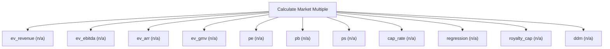

# Market multiples and comparable pricing

Market-multiple engine. Apply peer multiples (P/E, P/B, EV/EBITDA, EV/Sales, PEG and more) or derive implied multiples to price a company on a comparable basis. Use this for market-approach pricing where peers exist; it does peer multiples only — for intrinsic cash-flow value use calculate_dcf, and for residual-income or IFRS-basis measurement use calculate_residual.

## `ev_revenue`

EV/Revenue multiple applied to revenue

**Formula:** EV = revenue * multiple

**Approach:** n/a  
**Solution:** n/a

**Inputs**

| Name | Type | Description |
|------|------|-------------|
| `revenue` | number | Base-year revenue in reporting currency. |
| `ev_revenue_multiple` | number | EV/Revenue multiple. |

**Risks & limits**

## `ev_ebitda`

EV/EBITDA multiple applied to EBITDA

**Formula:** EV = EBITDA * multiple

**Approach:** n/a  
**Solution:** n/a

**Inputs**

| Name | Type | Description |
|------|------|-------------|
| `ebitda` | number | EBITDA in reporting currency. |
| `ev_ebitda_multiple` | number | EV/EBITDA multiple. |

**Risks & limits**

## `ev_arr`

EV/ARR multiple applied to ARR

**Formula:** EV = ARR * multiple

**Approach:** n/a  
**Solution:** n/a

**Inputs**

| Name | Type | Description |
|------|------|-------------|
| `arr` | number | Annual recurring revenue in reporting currency. |
| `ev_arr_multiple` | number | EV/ARR multiple. |

**Risks & limits**

## `ev_gmv`

EV/GMV multiple applied to GMV

**Formula:** EV = GMV * multiple

**Approach:** n/a  
**Solution:** n/a

**Inputs**

| Name | Type | Description |
|------|------|-------------|
| `gmv` | number | Gross merchandise value in reporting currency. |
| `ev_gmv_multiple` | number | EV/GMV multiple. |

**Risks & limits**

## `pe`

price/earnings multiple applied to EPS

**Formula:** P = EPS * P/E

**Approach:** n/a  
**Solution:** n/a

**Inputs**

| Name | Type | Description |
|------|------|-------------|
| `eps` | number | Earnings per share. |
| `pe_multiple` | number | Price/Earnings multiple. |

**Risks & limits**

## `pb`

price/book multiple applied to book value per share

**Formula:** P = BVPS * P/B

**Approach:** n/a  
**Solution:** n/a

**Inputs**

| Name | Type | Description |
|------|------|-------------|
| `book_value_per_share` | number | Book value per share. |
| `pb_multiple` | number | Price/Book multiple. |

**Risks & limits**

## `ps`

price/sales multiple applied to sales per share

**Formula:** P = SPS * P/S

**Approach:** n/a  
**Solution:** n/a

**Inputs**

| Name | Type | Description |
|------|------|-------------|
| `sales_per_share` | number | Sales per share. |
| `ps_multiple` | number | Price/Sales multiple. |

**Risks & limits**

## `cap_rate`

income capitalisation at a cap rate (IAS 40 / REIT)

**Formula:** V = NOI / cap rate

**Approach:** n/a  
**Solution:** n/a

**Inputs**

| Name | Type | Description |
|------|------|-------------|
| `net_operating_income` | number | Stabilised net operating income in reporting currency. |
| `cap_rate` | number | Capitalisation rate as a decimal (0.06 = 6%). |

**Risks & limits**

- Standards alignment is declared per method; see the cited clauses.

## `regression`

regression-adjusted multiple

**Formula:** M = b0 + b1*growth + b2*maturity

**Approach:** n/a  
**Solution:** n/a

**Inputs**

| Name | Type | Description |
|------|------|-------------|
| `intercept` | number | Regression intercept (base multiple). |
| `growth_rate` | number | Periodic growth rate as a decimal (0.03 = 3%). |
| `growth_coefficient` | number | Regression slope on growth. |
| `market_maturity` | number | Market maturity indicator. |
| `maturity_coefficient` | number | Regression slope on market maturity. |

**Risks & limits**

## `royalty_cap`

capitalised royalty stream

**Formula:** V = revenue*royalty rate / r

**Approach:** n/a  
**Solution:** n/a

**Inputs**

| Name | Type | Description |
|------|------|-------------|
| `revenue` | number | Base-year revenue in reporting currency. |
| `royalty_rate` | number | Royalty rate as a decimal (0.05 = 5% of revenue). |
| `discount_rate` | number | Discount rate as a decimal (0.10 = 10%); pre-tax when method=viu_pre_tax. |

**Risks & limits**

## `ddm`

dividend discount model

**Formula:** V = D1/(ke - g)

**Approach:** n/a  
**Solution:** n/a

**Inputs**

| Name | Type | Description |
|------|------|-------------|
| `dividend_per_share` | number | Dividend per share in reporting currency. |
| `cost_equity` | number | Cost of equity as a decimal (0.12 = 12%). |
| `growth_rate` | number | Periodic growth rate as a decimal (0.03 = 3%). |

**Risks & limits**
