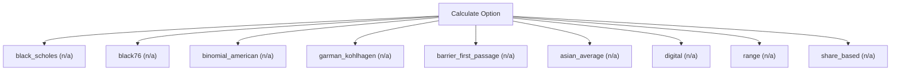

# Option and warrant pricing

Option-pricing engine. Price European and American options and warrants (Black-Scholes, Black-76, CRR binomial, Garman-Kohlhagen FX, digital, range, share-based) and their greeks. Use this for a single contingent claim or warrant on one underlying; it does NOT price listed structured payoffs such as CBBCs, inline/derivative warrants or autocallables (use calculate_structured_product).

## `black_scholes`

European analytic price

**Formula:** Black-Scholes-Merton

**Approach:** n/a  
**Solution:** n/a

**Inputs**

| Name | Type | Description |
|------|------|-------------|
| `spot` | number | Spot price of the underlying (or FX rate for garman_kohlhagen). |
| `strike` | number | Strike or exercise price in the same currency as spot. |
| `maturity` | number | Time to expiry in years (0.5 = six months); > 0. |
| `risk_free` | number | Continuously-compounded risk-free rate (decimal). |
| `volatility` | number | Annualized volatility (decimal, 0.30 = 30%); > 0. |
| `option_type` | string | Option right. |

**Risks & limits**

- Standards alignment is declared per method; see the cited clauses.

## `black76`

European price on a forward/futures

**Formula:** Black-76

**Approach:** n/a  
**Solution:** n/a

**Inputs**

| Name | Type | Description |
|------|------|-------------|
| `forward` | number | Forward/futures price of the underlying. |
| `strike` | number | Strike or exercise price in the same currency as spot. |
| `maturity` | number | Time to expiry in years (0.5 = six months); > 0. |
| `risk_free` | number | Continuously-compounded risk-free rate (decimal). |
| `volatility` | number | Annualized volatility (decimal, 0.30 = 30%); > 0. |
| `option_type` | string | Option right. |

**Risks & limits**

## `binomial_american`

CRR lattice with early exercise

**Formula:** Cox-Ross-Rubinstein; early exercise

**Approach:** n/a  
**Solution:** n/a

**Inputs**

| Name | Type | Description |
|------|------|-------------|
| `spot` | number | Spot price of the underlying (or FX rate for garman_kohlhagen). |
| `strike` | number | Strike or exercise price in the same currency as spot. |
| `maturity` | number | Time to expiry in years (0.5 = six months); > 0. |
| `risk_free` | number | Continuously-compounded risk-free rate (decimal). |
| `volatility` | number | Annualized volatility (decimal, 0.30 = 30%); > 0. |
| `option_type` | string | Option right. |
| `steps` | integer | Lattice steps for binomial_american (>=50). |

**Risks & limits**

## `garman_kohlhagen`

European FX option price

**Formula:** Garman-Kohlhagen

**Approach:** n/a  
**Solution:** n/a

**Inputs**

| Name | Type | Description |
|------|------|-------------|
| `spot` | number | Spot price of the underlying (or FX rate for garman_kohlhagen). |
| `strike` | number | Strike or exercise price in the same currency as spot. |
| `maturity` | number | Time to expiry in years (0.5 = six months); > 0. |
| `domestic_rate` | number | Domestic continuously-compounded rate (decimal). |
| `foreign_rate` | number | Foreign continuously-compounded rate (decimal). |
| `volatility` | number | Annualized volatility (decimal, 0.30 = 30%); > 0. |
| `option_type` | string | Option right. |

**Risks & limits**

## `barrier_first_passage`

knock-in/knock-out with continuous monitoring (e.g. HKEX CBBCs)

**Formula:** First-passage/barrier under GBM

**Approach:** n/a  
**Solution:** n/a

**Inputs**

| Name | Type | Description |
|------|------|-------------|
| `spot` | number | Spot price of the underlying (or FX rate for garman_kohlhagen). |
| `strike` | number | Strike or exercise price in the same currency as spot. |
| `maturity` | number | Time to expiry in years (0.5 = six months); > 0. |
| `risk_free` | number | Continuously-compounded risk-free rate (decimal). |
| `volatility` | number | Annualized volatility (decimal, 0.30 = 30%); > 0. |
| `option_type` | string | Option right. |
| `barrier` | number | Knock level for barrier_first_passage. |
| `barrier_type` | string | Barrier direction. |

**Risks & limits**

## `asian_average`

settlement averaging (e.g. HKEX derivative warrants)

**Formula:** Asian option

**Approach:** n/a  
**Solution:** n/a

**Inputs**

| Name | Type | Description |
|------|------|-------------|
| `spot` | number | Spot price of the underlying (or FX rate for garman_kohlhagen). |
| `strike` | number | Strike or exercise price in the same currency as spot. |
| `maturity` | number | Time to expiry in years (0.5 = six months); > 0. |
| `risk_free` | number | Continuously-compounded risk-free rate (decimal). |
| `volatility` | number | Annualized volatility (decimal, 0.30 = 30%); > 0. |
| `option_type` | string | Option right. |
| `average_type` | string | Averaging convention. |

**Risks & limits**

## `digital`

fixed payout when the condition is met

**Formula:** Cash-or-nothing digital

**Approach:** n/a  
**Solution:** n/a

**Inputs**

| Name | Type | Description |
|------|------|-------------|
| `spot` | number | Spot price of the underlying (or FX rate for garman_kohlhagen). |
| `strike` | number | Strike or exercise price in the same currency as spot. |
| `maturity` | number | Time to expiry in years (0.5 = six months); > 0. |
| `risk_free` | number | Continuously-compounded risk-free rate (decimal). |
| `volatility` | number | Annualized volatility (decimal, 0.30 = 30%); > 0. |
| `cash_payout` | number | Fixed cash amount paid when the digital condition is met. |

**Risks & limits**

## `range`

fixed payout when settlement is inside two strikes (e.g. HKEX inline warrants)

**Formula:** Difference of two range probabilities

**Approach:** n/a  
**Solution:** n/a

**Inputs**

| Name | Type | Description |
|------|------|-------------|
| `spot` | number | Spot price of the underlying (or FX rate for garman_kohlhagen). |
| `lower_strike` | number | Lower strike of the range. |
| `upper_strike` | number | Upper strike of the range. |
| `maturity` | number | Time to expiry in years (0.5 = six months); > 0. |
| `risk_free` | number | Continuously-compounded risk-free rate (decimal). |
| `volatility` | number | Annualized volatility (decimal, 0.30 = 30%); > 0. |
| `payout` | number | Fixed payout when the range condition is met. |

**Risks & limits**

## `share_based`

IFRS 2 grant-date fair value of an equity-settled award

**Formula:** IFRS 2 fair-value-based measurement

**Approach:** n/a  
**Solution:** n/a

**Inputs**

| Name | Type | Description |
|------|------|-------------|
| `share_price` | number | Grant-date share price (IFRS 2). |
| `exercise_price` | number | Exercise price of the award (IFRS 2). |
| `expected_life` | number | Expected life of the award in years (IFRS 2). |
| `volatility` | number | Annualized volatility (decimal, 0.30 = 30%); > 0. |
| `risk_free` | number | Continuously-compounded risk-free rate (decimal). |
| `dividend_yield` | number | Continuous dividend yield (decimal). |

**Risks & limits**

- Standards alignment is declared per method; see the cited clauses.
