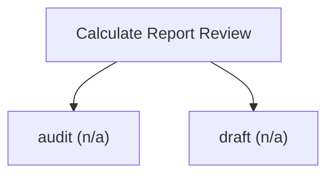

# Valuation report review and standards audit

Report-review engine. Audit a valuation document against an IVS 2025 and IFRS/HKFRS checklist: methodology, assumptions, discount rate, standards basis, fair-value conclusion, valuation date, and fair-value hierarchy, each mapped to the governing standard. Macro-enabled files are refused. Read-only. Returns the shared result envelope with findings and a compliance score.

## `audit`

audit a valuation document against methodology, assumptions and IFRS/HKFRS basis

**Formula:** IVS 2025 review; standards decision tree

**Approach:** n/a  
**Solution:** n/a

**Inputs**

| Name | Type | Description |
|------|------|-------------|
| `file_path` | string | Path to the report (.xlsx/.xls/.pdf/.docx/image). |

**Risks & limits**

- Standards alignment is declared per method; see the cited clauses.

## `draft`

draft the required structure of a valuation report

**Formula:** IVS 2025 / IFRS 13 report skeleton

**Approach:** n/a  
**Solution:** n/a

**Inputs**

| Name | Type | Description |
|------|------|-------------|
| `report_type` | string | Valuation report type to draft a structure for. |

**Risks & limits**

- Standards alignment is declared per method; see the cited clauses.
