# IFRS measurement, residual income and non-financial fair value

IFRS/HKFRS measurement engine. Compute goodwill and purchase-price allocation, impairment (IAS 36), inventory net realisable value, held-for-sale, debt waterfalls, cap tables, sum-of-the-parts and SPAC redemption; residual income and justified price-to-book; and non-financial asset fair value: investment property (IAS 40 / HKAS 40), PP&E revaluation via depreciated replacement cost (IAS 16) and biological assets at fair value less costs to sell (IAS 41). Use this for accounting-basis measurement of assets and equity; for going-concern cash flow use calculate_dcf and for peer multiples use calculate_market_multiple.

```mermaid
flowchart TD
  T[Calculate Residual]
  T --> calculate_residual_goodwill["goodwill (n/a)"]
  T --> calculate_residual_ppa["ppa (n/a)"]
  T --> calculate_residual_impairment_fvlcd["impairment_fvlcd (n/a)"]
  T --> calculate_residual_impairment_viu["impairment_viu (n/a)"]
  T --> calculate_residual_inventory_nrv["inventory_nrv (n/a)"]
  T --> calculate_residual_held_for_sale["held_for_sale (n/a)"]
  T --> calculate_residual_debt_waterfall["debt_waterfall (n/a)"]
  T --> calculate_residual_cap_table["cap_table (n/a)"]
  T --> calculate_residual_sotp["sotp (n/a)"]
  T --> calculate_residual_spac_redemption["spac_redemption (n/a)"]
  T --> calculate_residual_investment_property["investment_property (income)"]
  calculate_residual_investment_property -. cites .-> IVS_400_A10[IVS.400.A10]
  calculate_residual_investment_property -. cites .-> IFRS_13_62[IFRS.13.62]
  T --> calculate_residual_ppe_revaluation["ppe_revaluation (cost)"]
  calculate_residual_ppe_revaluation -. cites .-> IVS_300_A10[IVS.300.A10]
  calculate_residual_ppe_revaluation -. cites .-> IFRS_13_62[IFRS.13.62]
  T --> calculate_residual_biological_asset["biological_asset (n/a)"]
  T --> calculate_residual_residual_income["residual_income (n/a)"]
  T --> calculate_residual_justified_pb["justified_pb (n/a)"]
  T --> calculate_residual_relief_from_royalty["relief_from_royalty (income)"]
  calculate_residual_relief_from_royalty -. cites .-> IVS_210_A10[IVS.210.A10]
  calculate_residual_relief_from_royalty -. cites .-> IFRS_13_62[IFRS.13.62]
  T --> calculate_residual_mpeem["mpeem (income)"]
  calculate_residual_mpeem -. cites .-> IVS_210_A10[IVS.210.A10]
  calculate_residual_mpeem -. cites .-> IFRS_13_62[IFRS.13.62]
  T --> calculate_residual_with_without["with_without (income)"]
  calculate_residual_with_without -. cites .-> IVS_210_A10[IVS.210.A10]
  calculate_residual_with_without -. cites .-> IFRS_13_62[IFRS.13.62]
  T --> calculate_residual_recoverable_amount["recoverable_amount (income)"]
  calculate_residual_recoverable_amount -. cites .-> IVS_103_A10[IVS.103.A10]
  calculate_residual_recoverable_amount -. cites .-> IAS_36_18[IAS.36.18]
  T --> calculate_residual_liability_fulfilment["liability_fulfilment (income)"]
  calculate_residual_liability_fulfilment -. cites .-> IVS_220_A10[IVS.220.A10]
  calculate_residual_liability_fulfilment -. cites .-> IFRS_13_62[IFRS.13.62]
  T --> calculate_residual_inventory_residual["inventory_residual (income)"]
  calculate_residual_inventory_residual -. cites .-> IVS_230_A10[IVS.230.A10]
  calculate_residual_inventory_residual -. cites .-> IFRS_13_62[IFRS.13.62]
  T --> calculate_residual_development_residual["development_residual (income)"]
  calculate_residual_development_residual -. cites .-> IVS_410_A10[IVS.410.A10]
  calculate_residual_development_residual -. cites .-> IFRS_13_62[IFRS.13.62]
```

## `goodwill`

goodwill as consideration less net identifiable assets

**Formula:** IFRS 3 goodwill residual

**Approach:** n/a  
**Solution:** n/a

**Inputs**

| Name | Type | Description |
|------|------|-------------|
| `purchase_price` | number | Consideration transferred in reporting currency. |
| `fair_value_net_identifiable_assets` | number | Fair value of net identifiable assets. |

**Risks & limits**

- Standards alignment is declared per method; see the cited clauses.

## `ppa`

purchase price allocation residual

**Formula:** goodwill = price - (tangible + intangibles)

**Approach:** n/a  
**Solution:** n/a

**Inputs**

| Name | Type | Description |
|------|------|-------------|
| `purchase_price` | number | Consideration transferred in reporting currency. |
| `tangible_assets_fv` | number | Fair value of tangible assets. |
| `identified_intangibles_fv` | number | Fair value of separately identified intangibles. |

**Risks & limits**

- Standards alignment is declared per method; see the cited clauses.

## `impairment_fvlcd`

impairment against fair value less costs to dispose

**Formula:** IAS 36: loss = max(0, CV - FVLCD)

**Approach:** n/a  
**Solution:** n/a

**Inputs**

| Name | Type | Description |
|------|------|-------------|
| `carrying_value` | number | Carrying amount before the test. |
| `fair_value_less_costs_to_dispose` | number | FVLCD in reporting currency. |

**Risks & limits**

- Standards alignment is declared per method; see the cited clauses.

## `impairment_viu`

impairment against value in use

**Formula:** IAS 36: loss = max(0, CV - VIU)

**Approach:** n/a  
**Solution:** n/a

**Inputs**

| Name | Type | Description |
|------|------|-------------|
| `carrying_value` | number | Carrying amount before the test. |
| `value_in_use` | number | Value in use in reporting currency. |

**Risks & limits**

- Standards alignment is declared per method; see the cited clauses.

## `inventory_nrv`

inventory write-down to net realisable value

**Formula:** IAS 2: write-down = max(0, cost - NRV)

**Approach:** n/a  
**Solution:** n/a

**Inputs**

| Name | Type | Description |
|------|------|-------------|
| `carrying_value` | number | Carrying amount before the test. |
| `net_realisable_value` | number | Estimated NRV in reporting currency. |

**Risks & limits**

- Standards alignment is declared per method; see the cited clauses.

## `held_for_sale`

measure at lower of carrying amount and FV less costs to sell

**Formula:** IFRS 5 held-for-sale

**Approach:** n/a  
**Solution:** n/a

**Inputs**

| Name | Type | Description |
|------|------|-------------|
| `carrying_value` | number | Carrying amount before the test. |
| `fair_value_less_costs_to_sell` | number | FV less costs to sell in reporting currency. |

**Risks & limits**

- Standards alignment is declared per method; see the cited clauses.

## `debt_waterfall`

distribute enterprise value across ordered claims

**Formula:** priority waterfall

**Approach:** n/a  
**Solution:** n/a

**Inputs**

| Name | Type | Description |
|------|------|-------------|
| `enterprise_value` | number | Enterprise value distributed across claims. |
| `claims` | array | Ordered claims [{name, amount, priority}] for a waterfall. |

**Risks & limits**

## `cap_table`

allocate equity across the cap table

**Formula:** cap-table allocation

**Approach:** n/a  
**Solution:** n/a

**Inputs**

| Name | Type | Description |
|------|------|-------------|
| `enterprise_value` | number | Enterprise value distributed across claims. |
| `claims` | array | Ordered claims [{name, amount, priority}] for a waterfall. |

**Risks & limits**

## `sotp`

sum-of-the-parts less net debt and a holding discount

**Formula:** SOTP = sum(parts) - net debt, less holding discount

**Approach:** n/a  
**Solution:** n/a

**Inputs**

| Name | Type | Description |
|------|------|-------------|
| `segments` | array | Segments [{name, value}] for a sum-of-the-parts. |
| `net_debt` | number | Total debt minus cash and equivalents. |
| `holding_discount` | number | Holding-company discount as a decimal. |

**Risks & limits**

- Standards alignment is declared per method; see the cited clauses.

## `spac_redemption`

SPAC trust redemption value per share

**Formula:** redemption value = min(trust cash / shares, redemption price)

**Approach:** n/a  
**Solution:** n/a

**Inputs**

| Name | Type | Description |
|------|------|-------------|
| `trust_cash` | number | SPAC trust cash available for redemption. |
| `shares_outstanding` | number | Shares outstanding. |
| `redemption_price` | number | SPAC redemption price per share. |

**Risks & limits**

- Standards alignment is declared per method; see the cited clauses.

## `investment_property`

investment property at fair value

**Formula:** V = NOI / cap rate (IAS 40 / HKAS 40 income approach)

**Approach:** income  
**Solution:** closed_form

**Inputs**

| Name | Type | Description |
|------|------|-------------|
| `noi` | number | Net operating income of the property (IAS 40). |
| `cap_rate` | number | Capitalisation rate as a decimal (0.06 = 6%). |

**Standards (verbatim)**

- **IVS.400.A10** — Income capitalisation
  > A20.10 In some instances, particularly when the asset is operating at a stabilised level of growth and profits at the valuation date, it may not be necessary to consider an explicit forecast period and a terminal value may form the only basis of value (sometimes referred to as an income capitalisation method).
  > — International Valuation Standards Council (IVSC) (source/ivs-2025.md#ivs-400-real-property-interests)
- **IFRS.13.62** — Three valuation techniques
  > The objective of using a valuation technique is to estimate the price at which an orderly transaction to sell the asset or to transfer the liability would take place between market participants at the measurement date under current market conditions. Three widely used valuation techniques are the market approach, the cost approach and the income approach. The main aspects of those approaches are summarised in paragraphs B5–B11. An entity shall use valuation techniques consistent with one or more of those approaches to measure fair value.
  > — IFRS Foundation (source/ifrs-13.md#paragraph-62)

**IVS ↔ IFRS/IAS divergences**

- `capitalisation_rate`: IVS — IVS 400 income capitalisation of stabilised net income; IFRS/IAS — IAS 40 fair value (income approach under IFRS 13)

**Risks & limits**

- Deterministic model: the result is a point value with no modelled distribution; input error and model error are not quantified here.
- IVS/IFRS divergence on 'capitalisation_rate': the two regimes treat this differently (IVS 400 income capitalisation of stabilised net income vs IAS 40 fair value (income approach under IFRS 13)); the choice is the caller's, not a default.
- Standards alignment is declared per method; see the cited clauses.

## `ppe_revaluation`

PP&E revaluation via depreciated replacement cost

**Formula:** V = replacement cost - accumulated depreciation (IAS 16)

**Approach:** cost  
**Solution:** closed_form

**Inputs**

| Name | Type | Description |
|------|------|-------------|
| `replacement_cost` | number | Depreciated-replacement-cost gross value of PP&E (IAS 16). |
| `accumulated_depreciation` | number | Accumulated depreciation to deduct (IAS 16). |

**Standards (verbatim)**

- **IVS.300.A10** — Depreciated replacement cost
  > A30.03 Usually replacement cost is adjusted for physical deterioration and all relevant forms of obsolescence. After such adjustments, this can be referred to as depreciated replacement cost.
  > — International Valuation Standards Council (IVSC) (source/ivs-2025.md#ivs-300-plant-equipment-and-infrastructure)
- **IFRS.13.62** — Three valuation techniques
  > The objective of using a valuation technique is to estimate the price at which an orderly transaction to sell the asset or to transfer the liability would take place between market participants at the measurement date under current market conditions. Three widely used valuation techniques are the market approach, the cost approach and the income approach. The main aspects of those approaches are summarised in paragraphs B5–B11. An entity shall use valuation techniques consistent with one or more of those approaches to measure fair value.
  > — IFRS Foundation (source/ifrs-13.md#paragraph-62)

**IVS ↔ IFRS/IAS divergences**

- `obsolescence`: IVS — IVS 300 depreciated replacement cost (physical/functional/external obsolescence); IFRS/IAS — IAS 16 revaluation to fair value under IFRS 13

**Risks & limits**

- Deterministic model: the result is a point value with no modelled distribution; input error and model error are not quantified here.
- IVS/IFRS divergence on 'obsolescence': the two regimes treat this differently (IVS 300 depreciated replacement cost (physical/functional/external obsolescence) vs IAS 16 revaluation to fair value under IFRS 13); the choice is the caller's, not a default.
- Standards alignment is declared per method; see the cited clauses.

## `biological_asset`

biological assets at fair value less costs to sell

**Formula:** V = price * quantity - costs to sell (IAS 41)

**Approach:** n/a  
**Solution:** n/a

**Inputs**

| Name | Type | Description |
|------|------|-------------|
| `expected_price` | number | Expected market price per biological-asset unit (IAS 41). |
| `quantity` | number | Number of units (biological assets). |
| `costs_to_sell` | number | Incremental costs to sell / dispose (IAS 41). |

**Risks & limits**

- Standards alignment is declared per method; see the cited clauses.

## `residual_income`

residual income model

**Formula:** V = BV + (NI - ke*BV)/ke

**Approach:** n/a  
**Solution:** n/a

**Inputs**

| Name | Type | Description |
|------|------|-------------|
| `book_value` | number | Book value of equity in reporting currency. |
| `net_income` | number | Net income in reporting currency. |
| `cost_equity` | number | Cost of equity as a decimal (0.12 = 12%). |

**Risks & limits**

## `justified_pb`

justified price-to-book from ROE

**Formula:** P/B = (ROE - g)/(ke - g)

**Approach:** n/a  
**Solution:** n/a

**Inputs**

| Name | Type | Description |
|------|------|-------------|
| `roe` | number | Return on equity (decimal). |
| `cost_equity` | number | Cost of equity as a decimal (0.12 = 12%). |
| `growth_rate` | number | Periodic growth rate as a decimal (0.03 = 3%). |

**Risks & limits**

## `relief_from_royalty`

intangible value as the present value of hypothetical royalty savings

**Formula:** IVS 210 relief-from-royalty: PV of royalty savings

**Approach:** income  
**Solution:** closed_form

**Inputs**

| Name | Type | Description |
|------|------|-------------|
| `revenue` | number | Base-year revenue in reporting currency. |
| `royalty_rate` | number | Royalty rate as a decimal (0.05 = 5% of revenue). |
| `discount_rate` | number | Discount rate as a decimal (0.10 = 10%); pre-tax when method=viu_pre_tax. |
| `periods` | integer | Number of periods n (>=1). |

**Standards (verbatim)**

- **IVS.210.A10** — Intangible asset methods
  > 60.08 The excess earnings method can be applied by using: (a) several periods of forecasted cash flows ("multi-period excess earnings method" or "MPEEM"), (b) a single period of forecasted cash flows ("single-period excess earnings method"), or (c) by capitalising a single period of forecasted cash flows ("capitalised excess earnings method" or the "formula method"). 60.18 Under the relief-from-royalty method, the value of an intangible asset is determined by the value of the hypothetical royalty payments that would be saved by owning the asset compared with licensing the intangible asset from a third party. Conceptually, the method may also be viewed as a discounted cash flow method applied to the cash flow that the owner of the intangible asset could receive through licensing the intangible asset to third parties.
  > — International Valuation Standards Council (IVSC) (source/ivs-2025.md#ivs-210-intangible-assets)
- **IFRS.13.62** — Three valuation techniques
  > The objective of using a valuation technique is to estimate the price at which an orderly transaction to sell the asset or to transfer the liability would take place between market participants at the measurement date under current market conditions. Three widely used valuation techniques are the market approach, the cost approach and the income approach. The main aspects of those approaches are summarised in paragraphs B5–B11. An entity shall use valuation techniques consistent with one or more of those approaches to measure fair value.
  > — IFRS Foundation (source/ifrs-13.md#paragraph-62)

**IVS ↔ IFRS/IAS divergences**

- `royalty_rate`: IVS — IVS 210.60.20 royalty rate from comparable licences or a profit split; IFRS/IAS — IFRS 13.62 income approach; market-participant royalty in the asset's highest and best use

**Risks & limits**

- Deterministic model: the result is a point value with no modelled distribution; input error and model error are not quantified here.
- IVS/IFRS divergence on 'royalty_rate': the two regimes treat this differently (IVS 210.60.20 royalty rate from comparable licences or a profit split vs IFRS 13.62 income approach; market-participant royalty in the asset's highest and best use); the choice is the caller's, not a default.
- Standards alignment is declared per method; see the cited clauses.

## `mpeem`

multi-period excess earnings after contributory-asset charges

**Formula:** IVS 210 MPEEM: PV of earnings less contributory asset charges

**Approach:** income  
**Solution:** closed_form

**Inputs**

| Name | Type | Description |
|------|------|-------------|
| `cash_flows` | array | Projected cash flows in reporting currency, indexed t=1..n. |
| `contributory_charges` | array | Contributory-asset charges (economic rent) per period, aligned with cash_flows (IVS 210 MPEEM). |
| `discount_rate` | number | Discount rate as a decimal (0.10 = 10%); pre-tax when method=viu_pre_tax. |

**Standards (verbatim)**

- **IVS.210.A10** — Intangible asset methods
  > 60.08 The excess earnings method can be applied by using: (a) several periods of forecasted cash flows ("multi-period excess earnings method" or "MPEEM"), (b) a single period of forecasted cash flows ("single-period excess earnings method"), or (c) by capitalising a single period of forecasted cash flows ("capitalised excess earnings method" or the "formula method"). 60.18 Under the relief-from-royalty method, the value of an intangible asset is determined by the value of the hypothetical royalty payments that would be saved by owning the asset compared with licensing the intangible asset from a third party. Conceptually, the method may also be viewed as a discounted cash flow method applied to the cash flow that the owner of the intangible asset could receive through licensing the intangible asset to third parties.
  > — International Valuation Standards Council (IVSC) (source/ivs-2025.md#ivs-210-intangible-assets)
- **IFRS.13.62** — Three valuation techniques
  > The objective of using a valuation technique is to estimate the price at which an orderly transaction to sell the asset or to transfer the liability would take place between market participants at the measurement date under current market conditions. Three widely used valuation techniques are the market approach, the cost approach and the income approach. The main aspects of those approaches are summarised in paragraphs B5–B11. An entity shall use valuation techniques consistent with one or more of those approaches to measure fair value.
  > — IFRS Foundation (source/ifrs-13.md#paragraph-62)

**IVS ↔ IFRS/IAS divergences**

- `contributory_charges`: IVS — IVS 210.60.16 contributory asset charges at economic rent; IFRS/IAS — IFRS 13.62 income approach; charges from the market participant's perspective

**Risks & limits**

- Deterministic model: the result is a point value with no modelled distribution; input error and model error are not quantified here.
- IVS/IFRS divergence on 'contributory_charges': the two regimes treat this differently (IVS 210.60.16 contributory asset charges at economic rent vs IFRS 13.62 income approach; charges from the market participant's perspective); the choice is the caller's, not a default.
- Standards alignment is declared per method; see the cited clauses.

## `with_without`

with-and-without (premium profit) present value of the increment

**Formula:** IVS 210 with-and-without: PV(with) - PV(without)

**Approach:** income  
**Solution:** closed_form

**Inputs**

| Name | Type | Description |
|------|------|-------------|
| `with_cash_flows` | array | After-tax cash flows with the asset in use (IVS 210 with-and-without). |
| `without_cash_flows` | array | After-tax cash flows absent the asset (IVS 210 with-and-without), aligned with with_cash_flows. |
| `discount_rate` | number | Discount rate as a decimal (0.10 = 10%); pre-tax when method=viu_pre_tax. |

**Standards (verbatim)**

- **IVS.210.A10** — Intangible asset methods
  > 60.08 The excess earnings method can be applied by using: (a) several periods of forecasted cash flows ("multi-period excess earnings method" or "MPEEM"), (b) a single period of forecasted cash flows ("single-period excess earnings method"), or (c) by capitalising a single period of forecasted cash flows ("capitalised excess earnings method" or the "formula method"). 60.18 Under the relief-from-royalty method, the value of an intangible asset is determined by the value of the hypothetical royalty payments that would be saved by owning the asset compared with licensing the intangible asset from a third party. Conceptually, the method may also be viewed as a discounted cash flow method applied to the cash flow that the owner of the intangible asset could receive through licensing the intangible asset to third parties.
  > — International Valuation Standards Council (IVSC) (source/ivs-2025.md#ivs-210-intangible-assets)
- **IFRS.13.62** — Three valuation techniques
  > The objective of using a valuation technique is to estimate the price at which an orderly transaction to sell the asset or to transfer the liability would take place between market participants at the measurement date under current market conditions. Three widely used valuation techniques are the market approach, the cost approach and the income approach. The main aspects of those approaches are summarised in paragraphs B5–B11. An entity shall use valuation techniques consistent with one or more of those approaches to measure fair value.
  > — IFRS Foundation (source/ifrs-13.md#paragraph-62)

**Risks & limits**

- Deterministic model: the result is a point value with no modelled distribution; input error and model error are not quantified here.
- Standards alignment is declared per method; see the cited clauses.

## `recoverable_amount`

higher of fair value less costs of disposal and value in use

**Formula:** IAS 36.18: recoverable amount = max(FVLCD, VIU)

**Approach:** income  
**Solution:** closed_form

**Inputs**

| Name | Type | Description |
|------|------|-------------|
| `fair_value_less_costs_to_dispose` | number | FVLCD in reporting currency. |
| `value_in_use` | number | Value in use in reporting currency. |

**Standards (verbatim)**

- **IVS.103.A10** — Valuation approaches
  > 10.01 Consideration must be given to the relevant and appropriate valuation approaches. One or more valuation approaches may be used in order to arrive at the value in accordance with the basis of value. The three approaches described and defined below are the principle valuation approaches: 20.01 The market approach provides an indication of value by comparing the asset and/or liability with identical or comparable (that is similar) asset and/or liability for which price information is available. 40.01 The cost approach provides an indication of value using the economic principle that a buyer would not pay more for an asset than the amount for which it could replace the asset with an equivalent asset.
  > — International Valuation Standards Council (IVSC) (source/ivs-2025.md#ivs-103-valuation-approaches)
- **IAS.36.18** — Recoverable amount
  > This Standard defines recoverable amount as the higher of an asset's or cash-generating unit's fair value less costs of disposal and its value in use.
  > — IFRS Foundation (source/ias-36.md#paragraph-18)

**IVS ↔ IFRS/IAS divergences**

- `measurement_objective`: IVS — IVS 103 basis of value and premise (e.g. market value); IFRS/IAS — IAS 36.18 recoverable amount = higher of FVLCD and value in use (entity-specific)

**Risks & limits**

- Deterministic model: the result is a point value with no modelled distribution; input error and model error are not quantified here.
- IVS/IFRS divergence on 'measurement_objective': the two regimes treat this differently (IVS 103 basis of value and premise (e.g. market value) vs IAS 36.18 recoverable amount = higher of FVLCD and value in use (entity-specific)); the choice is the caller's, not a default.
- Standards alignment is declared per method; see the cited clauses.

## `liability_fulfilment`

non-financial liability as discounted costs to fulfil plus a mark-up

**Formula:** IVS 220.60.04 Bottom-Up: PV of fulfilment costs plus mark-up

**Approach:** income  
**Solution:** closed_form

**Inputs**

| Name | Type | Description |
|------|------|-------------|
| `fulfilment_costs` | array | Costs required to fulfil the performance obligation per period (IVS 220 Bottom-Up). |
| `mark_up` | number | Reasonable mark-up on fulfilment costs (decimal, IVS 220 Bottom-Up). |
| `discount_rate` | number | Discount rate as a decimal (0.10 = 10%); pre-tax when method=viu_pre_tax. |

**Standards (verbatim)**

- **IVS.220.A10** — Non-financial liability (Bottom-Up)
  > 60.04 Under the Bottom-Up Method, the non-financial liability is measured as the costs required to fulfil the performance obligation, plus a reasonable mark-up on those costs, discounted to present value. These costs may or may not include certain overhead items.
  > — International Valuation Standards Council (IVSC) (source/ivs-2025.md#ivs-220-non-financial-liabilities)
- **IFRS.13.62** — Three valuation techniques
  > The objective of using a valuation technique is to estimate the price at which an orderly transaction to sell the asset or to transfer the liability would take place between market participants at the measurement date under current market conditions. Three widely used valuation techniques are the market approach, the cost approach and the income approach. The main aspects of those approaches are summarised in paragraphs B5–B11. An entity shall use valuation techniques consistent with one or more of those approaches to measure fair value.
  > — IFRS Foundation (source/ifrs-13.md#paragraph-62)

**IVS ↔ IFRS/IAS divergences**

- `mark_up`: IVS — IVS 220.60.04 includes a reasonable mark-up on fulfilment costs; IFRS/IAS — IAS 37 best estimate of the expenditure required to settle (no profit margin)

**Risks & limits**

- Deterministic model: the result is a point value with no modelled distribution; input error and model error are not quantified here.
- IVS/IFRS divergence on 'mark_up': the two regimes treat this differently (IVS 220.60.04 includes a reasonable mark-up on fulfilment costs vs IAS 37 best estimate of the expenditure required to settle (no profit margin)); the choice is the caller's, not a default.
- Standards alignment is declared per method; see the cited clauses.

## `inventory_residual`

inventory value as selling price less remaining costs and profit

**Formula:** IVS 230.60.03 top-down residual method

**Approach:** income  
**Solution:** closed_form

**Inputs**

| Name | Type | Description |
|------|------|-------------|
| `selling_price` | number | Estimated selling price of the finished inventory (IVS 230 top-down). |
| `costs_to_complete` | number | Remaining costs to complete work-in-process inventory (IVS 230). |
| `profit_allowance` | number | Estimated profit allowance on the completion/disposal effort. |

**Standards (verbatim)**

- **IVS.230.A10** — Inventory top-down residual
  > 60.03 The top-down method is a residual method that begins with the estimated selling price and deducts remaining costs and estimated profit.
  > — International Valuation Standards Council (IVSC) (source/ivs-2025.md#ivs-230-inventory)
- **IFRS.13.62** — Three valuation techniques
  > The objective of using a valuation technique is to estimate the price at which an orderly transaction to sell the asset or to transfer the liability would take place between market participants at the measurement date under current market conditions. Three widely used valuation techniques are the market approach, the cost approach and the income approach. The main aspects of those approaches are summarised in paragraphs B5–B11. An entity shall use valuation techniques consistent with one or more of those approaches to measure fair value.
  > — IFRS Foundation (source/ifrs-13.md#paragraph-62)

**IVS ↔ IFRS/IAS divergences**

- `profit_allowance`: IVS — IVS 230.60.03 top-down deducts estimated profit; IFRS/IAS — IAS 2 measures at the lower of cost and NRV (no profit deduction)

**Risks & limits**

- Deterministic model: the result is a point value with no modelled distribution; input error and model error are not quantified here.
- IVS/IFRS divergence on 'profit_allowance': the two regimes treat this differently (IVS 230.60.03 top-down deducts estimated profit vs IAS 2 measures at the lower of cost and NRV (no profit deduction)); the choice is the caller's, not a default.
- Standards alignment is declared per method; see the cited clauses.

## `development_residual`

development property value as completed value less costs and profit

**Formula:** IVS 410.100.03 residual method

**Approach:** income  
**Solution:** closed_form

**Inputs**

| Name | Type | Description |
|------|------|-------------|
| `gross_development_value` | number | Anticipated value of the completed development (IVS 410 residual method). |
| `development_costs` | number | All known/anticipated costs to complete the development. |
| `developer_profit` | number | Required developer's profit/risk allowance (IVS 410). |

**Standards (verbatim)**

- **IVS.410.A10** — Development property residual
  > 100.03 The residual method is so called because it indicates the residual amount after deducting all known or anticipated costs required to complete the development from the anticipated value of the project when completed after consideration of the risks associated with completion of the project. This is known as the residual value.
  > — International Valuation Standards Council (IVSC) (source/ivs-2025.md#ivs-410-development-property)
- **IFRS.13.62** — Three valuation techniques
  > The objective of using a valuation technique is to estimate the price at which an orderly transaction to sell the asset or to transfer the liability would take place between market participants at the measurement date under current market conditions. Three widely used valuation techniques are the market approach, the cost approach and the income approach. The main aspects of those approaches are summarised in paragraphs B5–B11. An entity shall use valuation techniques consistent with one or more of those approaches to measure fair value.
  > — IFRS Foundation (source/ifrs-13.md#paragraph-62)

**IVS ↔ IFRS/IAS divergences**

- `developer_profit`: IVS — IVS 410.100.03 residual deducts anticipated developer profit and risk; IFRS/IAS — IFRS 13 measures the completed asset at fair value (profit is in the exit price)

**Risks & limits**

- Deterministic model: the result is a point value with no modelled distribution; input error and model error are not quantified here.
- IVS/IFRS divergence on 'developer_profit': the two regimes treat this differently (IVS 410.100.03 residual deducts anticipated developer profit and risk vs IFRS 13 measures the completed asset at fair value (profit is in the exit price)); the choice is the caller's, not a default.
- Standards alignment is declared per method; see the cited clauses.
