# Sector-specific operating metrics

Sector-metric engine. Compute the metrics that anchor valuation in specific industries: SaaS (ARR, NRR, magic number, Rule of 40), marketplaces (take rate, GMV multiple), lending (LTV/CAC), and crypto (NVT, Metcalfe). It returns operating metrics, not a valuation; use them as inputs to calculate_market_multiple or calculate_dcf.

```mermaid
flowchart TD
  T[Calculate Sector Metrics]
  T --> calculate_sector_metrics_ltv["ltv (n/a)"]
  T --> calculate_sector_metrics_cac["cac (n/a)"]
  T --> calculate_sector_metrics_arr["arr (n/a)"]
  T --> calculate_sector_metrics_nrr["nrr (n/a)"]
  T --> calculate_sector_metrics_magic_number["magic_number (n/a)"]
  T --> calculate_sector_metrics_rule_of_40["rule_of_40 (n/a)"]
  T --> calculate_sector_metrics_take_rate["take_rate (n/a)"]
  T --> calculate_sector_metrics_gmv_multiple["gmv_multiple (n/a)"]
  T --> calculate_sector_metrics_retention["retention (n/a)"]
  T --> calculate_sector_metrics_trl["trl (n/a)"]
  T --> calculate_sector_metrics_break_even["break_even (n/a)"]
  T --> calculate_sector_metrics_gross_margin["gross_margin (n/a)"]
  T --> calculate_sector_metrics_token["token (n/a)"]
  T --> calculate_sector_metrics_nvt["nvt (n/a)"]
  T --> calculate_sector_metrics_metcalfe["metcalfe (n/a)"]
```

## `ltv`

SaaS customer lifetime value

**Formula:** LTV = ARPU*margin/churn

**Approach:** n/a  
**Solution:** n/a

**Inputs**

| Name | Type | Description |
|------|------|-------------|
| `arpu` | number | Average revenue per user per period. |
| `gross_margin` | number | Gross margin as a decimal (0.80 = 80%). |
| `churn_rate` | number | Periodic churn rate as a decimal. |

**Risks & limits**

## `cac`

customer acquisition cost

**Formula:** CAC = S&M/new customers

**Approach:** n/a  
**Solution:** n/a

**Inputs**

| Name | Type | Description |
|------|------|-------------|
| `sales_marketing_expense` | number | Sales and marketing spend for the period. |
| `new_customers` | integer | Customers acquired in the period. |

**Risks & limits**

## `arr`

annual recurring revenue from subscriptions

**Formula:** ARR = sum(subscriptions)

**Approach:** n/a  
**Solution:** n/a

**Inputs**

| Name | Type | Description |
|------|------|-------------|
| `subscription_values` | array | Subscription revenue per customer. |

**Risks & limits**

## `nrr`

net revenue retention

**Formula:** NRR = (ending+expansion)/starting

**Approach:** n/a  
**Solution:** n/a

**Inputs**

| Name | Type | Description |
|------|------|-------------|
| `starting_revenue` | number | Revenue from the cohort at period start. |
| `ending_revenue` | number | Revenue from the cohort at period end. |
| `expansion_revenue` | number | Expansion revenue from the cohort. |

**Risks & limits**

## `magic_number`

SaaS magic number

**Formula:** net new ARR / prior S&M

**Approach:** n/a  
**Solution:** n/a

**Inputs**

| Name | Type | Description |
|------|------|-------------|
| `net_new_arr` | number | Net new ARR in the period. |
| `sales_marketing_expense_prior` | number | Prior-period sales and marketing spend. |

**Risks & limits**

## `rule_of_40`

growth plus margin

**Formula:** growth + margin

**Approach:** n/a  
**Solution:** n/a

**Inputs**

| Name | Type | Description |
|------|------|-------------|
| `growth_rate` | number | Periodic growth rate as a decimal (0.03 = 3%). |
| `profit_margin` | number | Profit margin as a decimal. |

**Risks & limits**

## `take_rate`

marketplace take rate

**Formula:** take rate = revenue/GMV

**Approach:** n/a  
**Solution:** n/a

**Inputs**

| Name | Type | Description |
|------|------|-------------|
| `revenue` | number | Base-year revenue in reporting currency. |
| `gmv` | number | Gross merchandise value in reporting currency. |

**Risks & limits**

## `gmv_multiple`

GMV multiple valuation

**Formula:** value = GMV * multiple

**Approach:** n/a  
**Solution:** n/a

**Inputs**

| Name | Type | Description |
|------|------|-------------|
| `gmv` | number | Gross merchandise value in reporting currency. |
| `ev_gmv_multiple` | number | EV/GMV multiple. |

**Risks & limits**

## `retention`

customer retention rate

**Formula:** retention = retained/starting

**Approach:** n/a  
**Solution:** n/a

**Inputs**

| Name | Type | Description |
|------|------|-------------|
| `retained_customers` | integer | Customers retained at period end. |
| `starting_customers` | integer | Customers at period start. |

**Risks & limits**

## `trl`

technology-readiness risk-adjusted value

**Formula:** value = market*share*margin*multiple*(1-discount)

**Approach:** n/a  
**Solution:** n/a

**Inputs**

| Name | Type | Description |
|------|------|-------------|
| `market_size` | number | Total addressable market in reporting currency. |
| `market_share` | number | Achievable market share as a decimal. |
| `margin` | number | Operating margin as a decimal. |
| `exit_multiple` | number | Exit multiple on the final flow, e.g. 8.0 for 8x. |
| `trl_discount` | number | Technology-readiness risk discount as a decimal. |

**Risks & limits**

## `break_even`

break-even volume

**Formula:** volume = FC/(ASP-VC)

**Approach:** n/a  
**Solution:** n/a

**Inputs**

| Name | Type | Description |
|------|------|-------------|
| `fixed_costs` | number | Period fixed costs. |
| `asp` | number | Average selling price per unit. |
| `variable_cost` | number | Variable cost per unit. |

**Risks & limits**

## `gross_margin`

unit gross margin

**Formula:** (ASP-VC)/ASP

**Approach:** n/a  
**Solution:** n/a

**Inputs**

| Name | Type | Description |
|------|------|-------------|
| `asp` | number | Average selling price per unit. |
| `variable_cost` | number | Variable cost per unit. |

**Risks & limits**

## `token`

equation-of-exchange token value

**Formula:** V = (volume*price)/(velocity*supply)

**Approach:** n/a  
**Solution:** n/a

**Inputs**

| Name | Type | Description |
|------|------|-------------|
| `transaction_volume` | number | Transaction volume for the period. |
| `price_per_tx` | number | Value per transaction. |
| `velocity` | number | Token velocity. |
| `supply` | number | Token supply. |

**Risks & limits**

## `nvt`

network value to transactions ratio

**Formula:** NVT = market cap / volume

**Approach:** n/a  
**Solution:** n/a

**Inputs**

| Name | Type | Description |
|------|------|-------------|
| `market_cap` | number | Market capitalisation. |
| `transaction_volume` | number | Transaction volume for the period. |

**Risks & limits**

## `metcalfe`

Metcalfe network value

**Formula:** value = k*n^2

**Approach:** n/a  
**Solution:** n/a

**Inputs**

| Name | Type | Description |
|------|------|-------------|
| `n` | integer | Node/participant count n (>=0). |
| `coefficient` | number | Scaling coefficient (Metcalfe). |

**Risks & limits**
