# Structured product and derivative pricing

Structured-product engine. Value HKEX-listed and OTC structures: CBBCs, derivative and inline warrants, equity-linked notes and investments, autocallables, accumulators and decumulators, credit-linked notes, TRS, and CFDs. Use this for equity-linked and credit-linked payoff structures; for a plain option or warrant use calculate_option.

```mermaid
flowchart TD
  T[Calculate Structured Product]
  T --> calculate_structured_product_cbbc["cbbc (market)"]
  calculate_structured_product_cbbc -. cites .-> IVS_500_A10[IVS.500.A10]
  calculate_structured_product_cbbc -. cites .-> IFRS_13_62[IFRS.13.62]
  T --> calculate_structured_product_cbbc_residual["cbbc_residual (market)"]
  calculate_structured_product_cbbc_residual -. cites .-> IVS_500_A10[IVS.500.A10]
  calculate_structured_product_cbbc_residual -. cites .-> IFRS_13_62[IFRS.13.62]
  T --> calculate_structured_product_derivative_warrant["derivative_warrant (income)"]
  calculate_structured_product_derivative_warrant -. cites .-> IVS_500_A10[IVS.500.A10]
  calculate_structured_product_derivative_warrant -. cites .-> IFRS_13_62[IFRS.13.62]
  T --> calculate_structured_product_inline_warrant["inline_warrant (income)"]
  calculate_structured_product_inline_warrant -. cites .-> IVS_500_A10[IVS.500.A10]
  calculate_structured_product_inline_warrant -. cites .-> IFRS_13_62[IFRS.13.62]
  T --> calculate_structured_product_inline_warrant_avg["inline_warrant_avg (income)"]
  calculate_structured_product_inline_warrant_avg -. cites .-> IVS_500_A10[IVS.500.A10]
  calculate_structured_product_inline_warrant_avg -. cites .-> IFRS_13_62[IFRS.13.62]
  T --> calculate_structured_product_eli["eli (income)"]
  calculate_structured_product_eli -. cites .-> IVS_500_A10[IVS.500.A10]
  calculate_structured_product_eli -. cites .-> IFRS_13_62[IFRS.13.62]
  T --> calculate_structured_product_eln["eln (income)"]
  calculate_structured_product_eln -. cites .-> IVS_500_A10[IVS.500.A10]
  calculate_structured_product_eln -. cites .-> IFRS_13_62[IFRS.13.62]
  T --> calculate_structured_product_autocallable["autocallable (income)"]
  calculate_structured_product_autocallable -. cites .-> IVS_500_A10[IVS.500.A10]
  calculate_structured_product_autocallable -. cites .-> IFRS_13_62[IFRS.13.62]
  T --> calculate_structured_product_credit_linked_note["credit_linked_note (income)"]
  calculate_structured_product_credit_linked_note -. cites .-> IVS_500_A10[IVS.500.A10]
  calculate_structured_product_credit_linked_note -. cites .-> IFRS_13_62[IFRS.13.62]
  T --> calculate_structured_product_accumulator["accumulator (income)"]
  calculate_structured_product_accumulator -. cites .-> IVS_500_A10[IVS.500.A10]
  calculate_structured_product_accumulator -. cites .-> IFRS_13_62[IFRS.13.62]
  T --> calculate_structured_product_decumulator["decumulator (income)"]
  calculate_structured_product_decumulator -. cites .-> IVS_500_A10[IVS.500.A10]
  calculate_structured_product_decumulator -. cites .-> IFRS_13_62[IFRS.13.62]
  T --> calculate_structured_product_trs["trs (income)"]
  calculate_structured_product_trs -. cites .-> IVS_500_A10[IVS.500.A10]
  calculate_structured_product_trs -. cites .-> IFRS_13_62[IFRS.13.62]
  T --> calculate_structured_product_cfd["cfd (income)"]
  calculate_structured_product_cfd -. cites .-> IVS_500_A10[IVS.500.A10]
  calculate_structured_product_cfd -. cites .-> IFRS_13_62[IFRS.13.62]
```

## `cbbc`

callable bull/bear contract with mandatory call

**Formula:** First-passage barrier with mandatory call and residual value

**Approach:** market  
**Solution:** numeric

**Inputs**

| Name | Type | Description |
|------|------|-------------|
| `notional` | number | Contract notional/face amount in reporting currency. |
| `spot` | number | Spot price of the underlying (or FX rate for garman_kohlhagen). |
| `strike` | number | Strike or exercise price in the same currency as spot. |
| `barrier` | number | Knock level for barrier_first_passage. |
| `barrier_type` | string | Barrier direction. |
| `maturity` | number | Time to expiry in years (0.5 = six months); > 0. |
| `risk_free` | number | Continuously-compounded risk-free rate (decimal). |
| `volatility` | number | Annualized volatility (decimal, 0.30 = 30%); > 0. |
| `option_type` | string | Option right. |

**Standards (verbatim)**

- **IVS.500.A10** — Financial instrument valuation models
  > 100.02 The valuer must determine that the valuation model is appropriate, which for the purposes of IVS 500 Financial Instruments means "fit for use" in terms of assets and/or liabilities being valued, the scope of work, and the valuation method.
  > — International Valuation Standards Council (IVSC) (source/ivs-2025.md#ivs-500-financial-instruments)
- **IFRS.13.62** — Three valuation techniques
  > The objective of using a valuation technique is to estimate the price at which an orderly transaction to sell the asset or to transfer the liability would take place between market participants at the measurement date under current market conditions. Three widely used valuation techniques are the market approach, the cost approach and the income approach. The main aspects of those approaches are summarised in paragraphs B5–B11. An entity shall use valuation techniques consistent with one or more of those approaches to measure fair value.
  > — IFRS Foundation (source/ifrs-13.md#paragraph-62)

**Risks & limits**

- Deterministic model: the result is a point value with no modelled distribution; input error and model error are not quantified here.

## `cbbc_residual`

CBBC with HKEX knock-out residual value

**Formula:** First-passage barrier; residual = (trigger-call)/entitlement on knock-out

**Approach:** market  
**Solution:** numeric

**Inputs**

| Name | Type | Description |
|------|------|-------------|
| `notional` | number | Contract notional/face amount in reporting currency. |
| `spot` | number | Spot price of the underlying (or FX rate for garman_kohlhagen). |
| `call_price` | number | CBBC call price (mandatory-call trigger level). |
| `entitlement` | number | CBBC entitlement: units of underlying per contract. |
| `barrier` | number | Knock level for barrier_first_passage. |
| `barrier_type` | string | Barrier direction. |
| `maturity` | number | Time to expiry in years (0.5 = six months); > 0. |
| `risk_free` | number | Continuously-compounded risk-free rate (decimal). |
| `volatility` | number | Annualized volatility (decimal, 0.30 = 30%); > 0. |
| `option_type` | string | Option right. |

**Standards (verbatim)**

- **IVS.500.A10** — Financial instrument valuation models
  > 100.02 The valuer must determine that the valuation model is appropriate, which for the purposes of IVS 500 Financial Instruments means "fit for use" in terms of assets and/or liabilities being valued, the scope of work, and the valuation method.
  > — International Valuation Standards Council (IVSC) (source/ivs-2025.md#ivs-500-financial-instruments)
- **IFRS.13.62** — Three valuation techniques
  > The objective of using a valuation technique is to estimate the price at which an orderly transaction to sell the asset or to transfer the liability would take place between market participants at the measurement date under current market conditions. Three widely used valuation techniques are the market approach, the cost approach and the income approach. The main aspects of those approaches are summarised in paragraphs B5–B11. An entity shall use valuation techniques consistent with one or more of those approaches to measure fair value.
  > — IFRS Foundation (source/ifrs-13.md#paragraph-62)

**Risks & limits**

- Deterministic model: the result is a point value with no modelled distribution; input error and model error are not quantified here.

## `derivative_warrant`

cash-settled derivative warrant (averaged settlement)

**Formula:** Asian-settled European warrant

**Approach:** income  
**Solution:** closed_form

**Inputs**

| Name | Type | Description |
|------|------|-------------|
| `notional` | number | Contract notional/face amount in reporting currency. |
| `spot` | number | Spot price of the underlying (or FX rate for garman_kohlhagen). |
| `strike` | number | Strike or exercise price in the same currency as spot. |
| `maturity` | number | Time to expiry in years (0.5 = six months); > 0. |
| `risk_free` | number | Continuously-compounded risk-free rate (decimal). |
| `volatility` | number | Annualized volatility (decimal, 0.30 = 30%); > 0. |
| `average_type` | string | Averaging convention. |
| `option_type` | string | Option right. |

**Standards (verbatim)**

- **IVS.500.A10** — Financial instrument valuation models
  > 100.02 The valuer must determine that the valuation model is appropriate, which for the purposes of IVS 500 Financial Instruments means "fit for use" in terms of assets and/or liabilities being valued, the scope of work, and the valuation method.
  > — International Valuation Standards Council (IVSC) (source/ivs-2025.md#ivs-500-financial-instruments)
- **IFRS.13.62** — Three valuation techniques
  > The objective of using a valuation technique is to estimate the price at which an orderly transaction to sell the asset or to transfer the liability would take place between market participants at the measurement date under current market conditions. Three widely used valuation techniques are the market approach, the cost approach and the income approach. The main aspects of those approaches are summarised in paragraphs B5–B11. An entity shall use valuation techniques consistent with one or more of those approaches to measure fair value.
  > — IFRS Foundation (source/ifrs-13.md#paragraph-62)

**Risks & limits**

- Deterministic model: the result is a point value with no modelled distribution; input error and model error are not quantified here.

## `inline_warrant`

range digital inline warrant (HKEX)

**Formula:** Range digital

**Approach:** income  
**Solution:** closed_form

**Inputs**

| Name | Type | Description |
|------|------|-------------|
| `notional` | number | Contract notional/face amount in reporting currency. |
| `spot` | number | Spot price of the underlying (or FX rate for garman_kohlhagen). |
| `lower_strike` | number | Lower strike of the range. |
| `upper_strike` | number | Upper strike of the range. |
| `maturity` | number | Time to expiry in years (0.5 = six months); > 0. |
| `risk_free` | number | Continuously-compounded risk-free rate (decimal). |
| `volatility` | number | Annualized volatility (decimal, 0.30 = 30%); > 0. |
| `payout` | number | Fixed payout when the range condition is met. |

**Standards (verbatim)**

- **IVS.500.A10** — Financial instrument valuation models
  > 100.02 The valuer must determine that the valuation model is appropriate, which for the purposes of IVS 500 Financial Instruments means "fit for use" in terms of assets and/or liabilities being valued, the scope of work, and the valuation method.
  > — International Valuation Standards Council (IVSC) (source/ivs-2025.md#ivs-500-financial-instruments)
- **IFRS.13.62** — Three valuation techniques
  > The objective of using a valuation technique is to estimate the price at which an orderly transaction to sell the asset or to transfer the liability would take place between market participants at the measurement date under current market conditions. Three widely used valuation techniques are the market approach, the cost approach and the income approach. The main aspects of those approaches are summarised in paragraphs B5–B11. An entity shall use valuation techniques consistent with one or more of those approaches to measure fair value.
  > — IFRS Foundation (source/ifrs-13.md#paragraph-62)

**Risks & limits**

- Deterministic model: the result is a point value with no modelled distribution; input error and model error are not quantified here.

## `inline_warrant_avg`

inline range warrant settled on an n-day average

**Formula:** Range digital on averaged fixings (HKEX settlement)

**Approach:** income  
**Solution:** numeric

**Inputs**

| Name | Type | Description |
|------|------|-------------|
| `notional` | number | Contract notional/face amount in reporting currency. |
| `spot` | number | Spot price of the underlying (or FX rate for garman_kohlhagen). |
| `lower_strike` | number | Lower strike of the range. |
| `upper_strike` | number | Upper strike of the range. |
| `maturity` | number | Time to expiry in years (0.5 = six months); > 0. |
| `risk_free` | number | Continuously-compounded risk-free rate (decimal). |
| `volatility` | number | Annualized volatility (decimal, 0.30 = 30%); > 0. |
| `payout` | number | Fixed payout when the range condition is met. |
| `fixing_days` | integer | Number of closing fixings averaged for settlement (>=1). |

**Standards (verbatim)**

- **IVS.500.A10** — Financial instrument valuation models
  > 100.02 The valuer must determine that the valuation model is appropriate, which for the purposes of IVS 500 Financial Instruments means "fit for use" in terms of assets and/or liabilities being valued, the scope of work, and the valuation method.
  > — International Valuation Standards Council (IVSC) (source/ivs-2025.md#ivs-500-financial-instruments)
- **IFRS.13.62** — Three valuation techniques
  > The objective of using a valuation technique is to estimate the price at which an orderly transaction to sell the asset or to transfer the liability would take place between market participants at the measurement date under current market conditions. Three widely used valuation techniques are the market approach, the cost approach and the income approach. The main aspects of those approaches are summarised in paragraphs B5–B11. An entity shall use valuation techniques consistent with one or more of those approaches to measure fair value.
  > — IFRS Foundation (source/ifrs-13.md#paragraph-62)

**Risks & limits**

- Deterministic model: the result is a point value with no modelled distribution; input error and model error are not quantified here.

## `eli`

equity-linked investment

**Formula:** Debt plus short equity option

**Approach:** income  
**Solution:** closed_form

**Inputs**

| Name | Type | Description |
|------|------|-------------|
| `notional` | number | Contract notional/face amount in reporting currency. |
| `spot` | number | Spot price of the underlying (or FX rate for garman_kohlhagen). |
| `strike` | number | Strike or exercise price in the same currency as spot. |
| `maturity` | number | Time to expiry in years (0.5 = six months); > 0. |
| `risk_free` | number | Continuously-compounded risk-free rate (decimal). |
| `volatility` | number | Annualized volatility (decimal, 0.30 = 30%); > 0. |
| `coupon_rate` | number | Annual coupon rate (decimal). |

**Standards (verbatim)**

- **IVS.500.A10** — Financial instrument valuation models
  > 100.02 The valuer must determine that the valuation model is appropriate, which for the purposes of IVS 500 Financial Instruments means "fit for use" in terms of assets and/or liabilities being valued, the scope of work, and the valuation method.
  > — International Valuation Standards Council (IVSC) (source/ivs-2025.md#ivs-500-financial-instruments)
- **IFRS.13.62** — Three valuation techniques
  > The objective of using a valuation technique is to estimate the price at which an orderly transaction to sell the asset or to transfer the liability would take place between market participants at the measurement date under current market conditions. Three widely used valuation techniques are the market approach, the cost approach and the income approach. The main aspects of those approaches are summarised in paragraphs B5–B11. An entity shall use valuation techniques consistent with one or more of those approaches to measure fair value.
  > — IFRS Foundation (source/ifrs-13.md#paragraph-62)

**Risks & limits**

- Deterministic model: the result is a point value with no modelled distribution; input error and model error are not quantified here.

## `eln`

equity-linked note

**Formula:** Debt plus embedded equity option

**Approach:** income  
**Solution:** closed_form

**Inputs**

| Name | Type | Description |
|------|------|-------------|
| `notional` | number | Contract notional/face amount in reporting currency. |
| `spot` | number | Spot price of the underlying (or FX rate for garman_kohlhagen). |
| `strike` | number | Strike or exercise price in the same currency as spot. |
| `maturity` | number | Time to expiry in years (0.5 = six months); > 0. |
| `risk_free` | number | Continuously-compounded risk-free rate (decimal). |
| `volatility` | number | Annualized volatility (decimal, 0.30 = 30%); > 0. |
| `coupon_rate` | number | Annual coupon rate (decimal). |

**Standards (verbatim)**

- **IVS.500.A10** — Financial instrument valuation models
  > 100.02 The valuer must determine that the valuation model is appropriate, which for the purposes of IVS 500 Financial Instruments means "fit for use" in terms of assets and/or liabilities being valued, the scope of work, and the valuation method.
  > — International Valuation Standards Council (IVSC) (source/ivs-2025.md#ivs-500-financial-instruments)
- **IFRS.13.62** — Three valuation techniques
  > The objective of using a valuation technique is to estimate the price at which an orderly transaction to sell the asset or to transfer the liability would take place between market participants at the measurement date under current market conditions. Three widely used valuation techniques are the market approach, the cost approach and the income approach. The main aspects of those approaches are summarised in paragraphs B5–B11. An entity shall use valuation techniques consistent with one or more of those approaches to measure fair value.
  > — IFRS Foundation (source/ifrs-13.md#paragraph-62)

**Risks & limits**

- Deterministic model: the result is a point value with no modelled distribution; input error and model error are not quantified here.

## `autocallable`

autocallable note

**Formula:** Correlated Monte-Carlo with autocall/knock-out

**Approach:** income  
**Solution:** numeric

**Inputs**

| Name | Type | Description |
|------|------|-------------|
| `notional` | number | Contract notional/face amount in reporting currency. |
| `spot` | number | Spot price of the underlying (or FX rate for garman_kohlhagen). |
| `knock_out_level` | number | Knock-out level for autocallables and accumulators. |
| `observation_dates` | array | Observation dates in years for path-dependent products. |
| `coupon_rate_structured` | number | Conditional coupon rate (decimal). |
| `maturity` | number | Time to expiry in years (0.5 = six months); > 0. |
| `risk_free` | number | Continuously-compounded risk-free rate (decimal). |
| `volatility` | number | Annualized volatility (decimal, 0.30 = 30%); > 0. |

**Standards (verbatim)**

- **IVS.500.A10** — Financial instrument valuation models
  > 100.02 The valuer must determine that the valuation model is appropriate, which for the purposes of IVS 500 Financial Instruments means "fit for use" in terms of assets and/or liabilities being valued, the scope of work, and the valuation method.
  > — International Valuation Standards Council (IVSC) (source/ivs-2025.md#ivs-500-financial-instruments)
- **IFRS.13.62** — Three valuation techniques
  > The objective of using a valuation technique is to estimate the price at which an orderly transaction to sell the asset or to transfer the liability would take place between market participants at the measurement date under current market conditions. Three widely used valuation techniques are the market approach, the cost approach and the income approach. The main aspects of those approaches are summarised in paragraphs B5–B11. An entity shall use valuation techniques consistent with one or more of those approaches to measure fair value.
  > — IFRS Foundation (source/ifrs-13.md#paragraph-62)

**Risks & limits**

- Deterministic model: the result is a point value with no modelled distribution; input error and model error are not quantified here.

## `credit_linked_note`

credit-linked note

**Formula:** Debt plus reference-credit hazard

**Approach:** income  
**Solution:** numeric

**Inputs**

| Name | Type | Description |
|------|------|-------------|
| `notional` | number | Contract notional/face amount in reporting currency. |
| `credit_spread` | number | Credit spread over the risk-free rate (decimal). |
| `recovery` | number | Recovery rate in [0,1]. |
| `maturity` | number | Time to expiry in years (0.5 = six months); > 0. |
| `risk_free` | number | Continuously-compounded risk-free rate (decimal). |
| `coupon_rate_structured` | number | Conditional coupon rate (decimal). |

**Standards (verbatim)**

- **IVS.500.A10** — Financial instrument valuation models
  > 100.02 The valuer must determine that the valuation model is appropriate, which for the purposes of IVS 500 Financial Instruments means "fit for use" in terms of assets and/or liabilities being valued, the scope of work, and the valuation method.
  > — International Valuation Standards Council (IVSC) (source/ivs-2025.md#ivs-500-financial-instruments)
- **IFRS.13.62** — Three valuation techniques
  > The objective of using a valuation technique is to estimate the price at which an orderly transaction to sell the asset or to transfer the liability would take place between market participants at the measurement date under current market conditions. Three widely used valuation techniques are the market approach, the cost approach and the income approach. The main aspects of those approaches are summarised in paragraphs B5–B11. An entity shall use valuation techniques consistent with one or more of those approaches to measure fair value.
  > — IFRS Foundation (source/ifrs-13.md#paragraph-62)

**Risks & limits**

- Deterministic model: the result is a point value with no modelled distribution; input error and model error are not quantified here.
- Standards alignment is declared per method; see the cited clauses.

## `accumulator`

accumulator (periodic obligation to buy)

**Formula:** Multi-date lattice/Monte-Carlo with knock-out and multiplier

**Approach:** income  
**Solution:** numeric

**Inputs**

| Name | Type | Description |
|------|------|-------------|
| `notional` | number | Contract notional/face amount in reporting currency. |
| `spot` | number | Spot price of the underlying (or FX rate for garman_kohlhagen). |
| `strike` | number | Strike or exercise price in the same currency as spot. |
| `knock_out_level` | number | Knock-out level for autocallables and accumulators. |
| `observation_dates` | array | Observation dates in years for path-dependent products. |
| `risk_free` | number | Continuously-compounded risk-free rate (decimal). |
| `volatility` | number | Annualized volatility (decimal, 0.30 = 30%); > 0. |

**Standards (verbatim)**

- **IVS.500.A10** — Financial instrument valuation models
  > 100.02 The valuer must determine that the valuation model is appropriate, which for the purposes of IVS 500 Financial Instruments means "fit for use" in terms of assets and/or liabilities being valued, the scope of work, and the valuation method.
  > — International Valuation Standards Council (IVSC) (source/ivs-2025.md#ivs-500-financial-instruments)
- **IFRS.13.62** — Three valuation techniques
  > The objective of using a valuation technique is to estimate the price at which an orderly transaction to sell the asset or to transfer the liability would take place between market participants at the measurement date under current market conditions. Three widely used valuation techniques are the market approach, the cost approach and the income approach. The main aspects of those approaches are summarised in paragraphs B5–B11. An entity shall use valuation techniques consistent with one or more of those approaches to measure fair value.
  > — IFRS Foundation (source/ifrs-13.md#paragraph-62)

**Risks & limits**

- Deterministic model: the result is a point value with no modelled distribution; input error and model error are not quantified here.

## `decumulator`

decumulator (periodic obligation to sell)

**Formula:** Multi-date lattice/Monte-Carlo with knock-out and multiplier

**Approach:** income  
**Solution:** numeric

**Inputs**

| Name | Type | Description |
|------|------|-------------|
| `notional` | number | Contract notional/face amount in reporting currency. |
| `spot` | number | Spot price of the underlying (or FX rate for garman_kohlhagen). |
| `strike` | number | Strike or exercise price in the same currency as spot. |
| `knock_out_level` | number | Knock-out level for autocallables and accumulators. |
| `observation_dates` | array | Observation dates in years for path-dependent products. |
| `risk_free` | number | Continuously-compounded risk-free rate (decimal). |
| `volatility` | number | Annualized volatility (decimal, 0.30 = 30%); > 0. |

**Standards (verbatim)**

- **IVS.500.A10** — Financial instrument valuation models
  > 100.02 The valuer must determine that the valuation model is appropriate, which for the purposes of IVS 500 Financial Instruments means "fit for use" in terms of assets and/or liabilities being valued, the scope of work, and the valuation method.
  > — International Valuation Standards Council (IVSC) (source/ivs-2025.md#ivs-500-financial-instruments)
- **IFRS.13.62** — Three valuation techniques
  > The objective of using a valuation technique is to estimate the price at which an orderly transaction to sell the asset or to transfer the liability would take place between market participants at the measurement date under current market conditions. Three widely used valuation techniques are the market approach, the cost approach and the income approach. The main aspects of those approaches are summarised in paragraphs B5–B11. An entity shall use valuation techniques consistent with one or more of those approaches to measure fair value.
  > — IFRS Foundation (source/ifrs-13.md#paragraph-62)

**Risks & limits**

- Deterministic model: the result is a point value with no modelled distribution; input error and model error are not quantified here.

## `trs`

equity total-return swap

**Formula:** Forward/DCF plus CVA/DVA

**Approach:** income  
**Solution:** closed_form

**Inputs**

| Name | Type | Description |
|------|------|-------------|
| `notional` | number | Contract notional/face amount in reporting currency. |
| `spot` | number | Spot price of the underlying (or FX rate for garman_kohlhagen). |
| `maturity` | number | Time to expiry in years (0.5 = six months); > 0. |
| `risk_free` | number | Continuously-compounded risk-free rate (decimal). |
| `dividend_yield` | number | Continuous dividend yield (decimal). |

**Standards (verbatim)**

- **IVS.500.A10** — Financial instrument valuation models
  > 100.02 The valuer must determine that the valuation model is appropriate, which for the purposes of IVS 500 Financial Instruments means "fit for use" in terms of assets and/or liabilities being valued, the scope of work, and the valuation method.
  > — International Valuation Standards Council (IVSC) (source/ivs-2025.md#ivs-500-financial-instruments)
- **IFRS.13.62** — Three valuation techniques
  > The objective of using a valuation technique is to estimate the price at which an orderly transaction to sell the asset or to transfer the liability would take place between market participants at the measurement date under current market conditions. Three widely used valuation techniques are the market approach, the cost approach and the income approach. The main aspects of those approaches are summarised in paragraphs B5–B11. An entity shall use valuation techniques consistent with one or more of those approaches to measure fair value.
  > — IFRS Foundation (source/ifrs-13.md#paragraph-62)

**Risks & limits**

- Deterministic model: the result is a point value with no modelled distribution; input error and model error are not quantified here.

## `cfd`

contract for difference

**Formula:** Cash-settled price difference

**Approach:** income  
**Solution:** closed_form

**Inputs**

| Name | Type | Description |
|------|------|-------------|
| `notional` | number | Contract notional/face amount in reporting currency. |
| `spot` | number | Spot price of the underlying (or FX rate for garman_kohlhagen). |
| `strike` | number | Strike or exercise price in the same currency as spot. |
| `maturity` | number | Time to expiry in years (0.5 = six months); > 0. |
| `risk_free` | number | Continuously-compounded risk-free rate (decimal). |

**Standards (verbatim)**

- **IVS.500.A10** — Financial instrument valuation models
  > 100.02 The valuer must determine that the valuation model is appropriate, which for the purposes of IVS 500 Financial Instruments means "fit for use" in terms of assets and/or liabilities being valued, the scope of work, and the valuation method.
  > — International Valuation Standards Council (IVSC) (source/ivs-2025.md#ivs-500-financial-instruments)
- **IFRS.13.62** — Three valuation techniques
  > The objective of using a valuation technique is to estimate the price at which an orderly transaction to sell the asset or to transfer the liability would take place between market participants at the measurement date under current market conditions. Three widely used valuation techniques are the market approach, the cost approach and the income approach. The main aspects of those approaches are summarised in paragraphs B5–B11. An entity shall use valuation techniques consistent with one or more of those approaches to measure fair value.
  > — IFRS Foundation (source/ifrs-13.md#paragraph-62)

**Risks & limits**

- Deterministic model: the result is a point value with no modelled distribution; input error and model error are not quantified here.
