# Structured product and derivative pricing

Structured-product engine. Value HKEX-listed and OTC structures: CBBCs, derivative and inline warrants, equity-linked notes and investments, autocallables, accumulators and decumulators, credit-linked notes, TRS, and CFDs. Use this for equity-linked and credit-linked payoff structures; for a plain option or warrant use calculate_option.

```mermaid
flowchart TD
  T[Calculate Structured Product]
  T --> calculate_structured_product_cbbc["cbbc (n/a)"]
  T --> calculate_structured_product_cbbc_residual["cbbc_residual (n/a)"]
  T --> calculate_structured_product_derivative_warrant["derivative_warrant (n/a)"]
  T --> calculate_structured_product_inline_warrant["inline_warrant (n/a)"]
  T --> calculate_structured_product_inline_warrant_avg["inline_warrant_avg (n/a)"]
  T --> calculate_structured_product_eli["eli (n/a)"]
  T --> calculate_structured_product_eln["eln (n/a)"]
  T --> calculate_structured_product_autocallable["autocallable (n/a)"]
  T --> calculate_structured_product_credit_linked_note["credit_linked_note (n/a)"]
  T --> calculate_structured_product_accumulator["accumulator (n/a)"]
  T --> calculate_structured_product_decumulator["decumulator (n/a)"]
  T --> calculate_structured_product_trs["trs (n/a)"]
  T --> calculate_structured_product_cfd["cfd (n/a)"]
```

## `cbbc`

callable bull/bear contract with mandatory call

**Formula:** First-passage barrier with mandatory call and residual value

**Approach:** n/a  
**Solution:** n/a

**Inputs**

| Name | Type | Description |
|------|------|-------------|
| `notional` | number | Contract notional/face amount in reporting currency. |
| `spot` | number | Spot price of the underlying (or FX rate for garman_kohlhagen). |
| `strike` | number | Strike or exercise price in the same currency as spot. |
| `barrier` | number | Knock level for barrier_first_passage. |
| `barrier_type` | string | Barrier direction. |
| `maturity` | number | Time to expiry in years (0.5 = six months); > 0. |
| `risk_free` | number | Continuously-compounded risk-free rate (decimal). |
| `volatility` | number | Annualized volatility (decimal, 0.30 = 30%); > 0. |
| `option_type` | string | Option right. |

**Risks & limits**

## `cbbc_residual`

CBBC with HKEX knock-out residual value

**Formula:** First-passage barrier; residual = (trigger-call)/entitlement on knock-out

**Approach:** n/a  
**Solution:** n/a

**Inputs**

| Name | Type | Description |
|------|------|-------------|
| `notional` | number | Contract notional/face amount in reporting currency. |
| `spot` | number | Spot price of the underlying (or FX rate for garman_kohlhagen). |
| `call_price` | number | CBBC call price (mandatory-call trigger level). |
| `entitlement` | number | CBBC entitlement: units of underlying per contract. |
| `barrier` | number | Knock level for barrier_first_passage. |
| `barrier_type` | string | Barrier direction. |
| `maturity` | number | Time to expiry in years (0.5 = six months); > 0. |
| `risk_free` | number | Continuously-compounded risk-free rate (decimal). |
| `volatility` | number | Annualized volatility (decimal, 0.30 = 30%); > 0. |
| `option_type` | string | Option right. |

**Risks & limits**

## `derivative_warrant`

cash-settled derivative warrant (averaged settlement)

**Formula:** Asian-settled European warrant

**Approach:** n/a  
**Solution:** n/a

**Inputs**

| Name | Type | Description |
|------|------|-------------|
| `notional` | number | Contract notional/face amount in reporting currency. |
| `spot` | number | Spot price of the underlying (or FX rate for garman_kohlhagen). |
| `strike` | number | Strike or exercise price in the same currency as spot. |
| `maturity` | number | Time to expiry in years (0.5 = six months); > 0. |
| `risk_free` | number | Continuously-compounded risk-free rate (decimal). |
| `volatility` | number | Annualized volatility (decimal, 0.30 = 30%); > 0. |
| `average_type` | string | Averaging convention. |
| `option_type` | string | Option right. |

**Risks & limits**

## `inline_warrant`

range digital inline warrant (HKEX)

**Formula:** Range digital

**Approach:** n/a  
**Solution:** n/a

**Inputs**

| Name | Type | Description |
|------|------|-------------|
| `notional` | number | Contract notional/face amount in reporting currency. |
| `spot` | number | Spot price of the underlying (or FX rate for garman_kohlhagen). |
| `lower_strike` | number | Lower strike of the range. |
| `upper_strike` | number | Upper strike of the range. |
| `maturity` | number | Time to expiry in years (0.5 = six months); > 0. |
| `risk_free` | number | Continuously-compounded risk-free rate (decimal). |
| `volatility` | number | Annualized volatility (decimal, 0.30 = 30%); > 0. |
| `payout` | number | Fixed payout when the range condition is met. |

**Risks & limits**

## `inline_warrant_avg`

inline range warrant settled on an n-day average

**Formula:** Range digital on averaged fixings (HKEX settlement)

**Approach:** n/a  
**Solution:** n/a

**Inputs**

| Name | Type | Description |
|------|------|-------------|
| `notional` | number | Contract notional/face amount in reporting currency. |
| `spot` | number | Spot price of the underlying (or FX rate for garman_kohlhagen). |
| `lower_strike` | number | Lower strike of the range. |
| `upper_strike` | number | Upper strike of the range. |
| `maturity` | number | Time to expiry in years (0.5 = six months); > 0. |
| `risk_free` | number | Continuously-compounded risk-free rate (decimal). |
| `volatility` | number | Annualized volatility (decimal, 0.30 = 30%); > 0. |
| `payout` | number | Fixed payout when the range condition is met. |
| `fixing_days` | integer | Number of closing fixings averaged for settlement (>=1). |

**Risks & limits**

## `eli`

equity-linked investment

**Formula:** Debt plus short equity option

**Approach:** n/a  
**Solution:** n/a

**Inputs**

| Name | Type | Description |
|------|------|-------------|
| `notional` | number | Contract notional/face amount in reporting currency. |
| `spot` | number | Spot price of the underlying (or FX rate for garman_kohlhagen). |
| `strike` | number | Strike or exercise price in the same currency as spot. |
| `maturity` | number | Time to expiry in years (0.5 = six months); > 0. |
| `risk_free` | number | Continuously-compounded risk-free rate (decimal). |
| `volatility` | number | Annualized volatility (decimal, 0.30 = 30%); > 0. |
| `coupon_rate` | number | Annual coupon rate (decimal). |

**Risks & limits**

## `eln`

equity-linked note

**Formula:** Debt plus embedded equity option

**Approach:** n/a  
**Solution:** n/a

**Inputs**

| Name | Type | Description |
|------|------|-------------|
| `notional` | number | Contract notional/face amount in reporting currency. |
| `spot` | number | Spot price of the underlying (or FX rate for garman_kohlhagen). |
| `strike` | number | Strike or exercise price in the same currency as spot. |
| `maturity` | number | Time to expiry in years (0.5 = six months); > 0. |
| `risk_free` | number | Continuously-compounded risk-free rate (decimal). |
| `volatility` | number | Annualized volatility (decimal, 0.30 = 30%); > 0. |
| `coupon_rate` | number | Annual coupon rate (decimal). |

**Risks & limits**

## `autocallable`

autocallable note

**Formula:** Correlated Monte-Carlo with autocall/knock-out

**Approach:** n/a  
**Solution:** n/a

**Inputs**

| Name | Type | Description |
|------|------|-------------|
| `notional` | number | Contract notional/face amount in reporting currency. |
| `spot` | number | Spot price of the underlying (or FX rate for garman_kohlhagen). |
| `knock_out_level` | number | Knock-out level for autocallables and accumulators. |
| `observation_dates` | array | Observation dates in years for path-dependent products. |
| `coupon_rate_structured` | number | Conditional coupon rate (decimal). |
| `maturity` | number | Time to expiry in years (0.5 = six months); > 0. |
| `risk_free` | number | Continuously-compounded risk-free rate (decimal). |
| `volatility` | number | Annualized volatility (decimal, 0.30 = 30%); > 0. |

**Risks & limits**

## `credit_linked_note`

credit-linked note

**Formula:** Debt plus reference-credit hazard

**Approach:** n/a  
**Solution:** n/a

**Inputs**

| Name | Type | Description |
|------|------|-------------|
| `notional` | number | Contract notional/face amount in reporting currency. |
| `credit_spread` | number | Credit spread over the risk-free rate (decimal). |
| `recovery` | number | Recovery rate in [0,1]. |
| `maturity` | number | Time to expiry in years (0.5 = six months); > 0. |
| `risk_free` | number | Continuously-compounded risk-free rate (decimal). |
| `coupon_rate_structured` | number | Conditional coupon rate (decimal). |

**Risks & limits**

- Standards alignment is declared per method; see the cited clauses.

## `accumulator`

accumulator (periodic obligation to buy)

**Formula:** Multi-date lattice/Monte-Carlo with knock-out and multiplier

**Approach:** n/a  
**Solution:** n/a

**Inputs**

| Name | Type | Description |
|------|------|-------------|
| `notional` | number | Contract notional/face amount in reporting currency. |
| `spot` | number | Spot price of the underlying (or FX rate for garman_kohlhagen). |
| `strike` | number | Strike or exercise price in the same currency as spot. |
| `knock_out_level` | number | Knock-out level for autocallables and accumulators. |
| `observation_dates` | array | Observation dates in years for path-dependent products. |
| `risk_free` | number | Continuously-compounded risk-free rate (decimal). |
| `volatility` | number | Annualized volatility (decimal, 0.30 = 30%); > 0. |

**Risks & limits**

## `decumulator`

decumulator (periodic obligation to sell)

**Formula:** Multi-date lattice/Monte-Carlo with knock-out and multiplier

**Approach:** n/a  
**Solution:** n/a

**Inputs**

| Name | Type | Description |
|------|------|-------------|
| `notional` | number | Contract notional/face amount in reporting currency. |
| `spot` | number | Spot price of the underlying (or FX rate for garman_kohlhagen). |
| `strike` | number | Strike or exercise price in the same currency as spot. |
| `knock_out_level` | number | Knock-out level for autocallables and accumulators. |
| `observation_dates` | array | Observation dates in years for path-dependent products. |
| `risk_free` | number | Continuously-compounded risk-free rate (decimal). |
| `volatility` | number | Annualized volatility (decimal, 0.30 = 30%); > 0. |

**Risks & limits**

## `trs`

equity total-return swap

**Formula:** Forward/DCF plus CVA/DVA

**Approach:** n/a  
**Solution:** n/a

**Inputs**

| Name | Type | Description |
|------|------|-------------|
| `notional` | number | Contract notional/face amount in reporting currency. |
| `spot` | number | Spot price of the underlying (or FX rate for garman_kohlhagen). |
| `maturity` | number | Time to expiry in years (0.5 = six months); > 0. |
| `risk_free` | number | Continuously-compounded risk-free rate (decimal). |
| `dividend_yield` | number | Continuous dividend yield (decimal). |

**Risks & limits**

## `cfd`

contract for difference

**Formula:** Cash-settled price difference

**Approach:** n/a  
**Solution:** n/a

**Inputs**

| Name | Type | Description |
|------|------|-------------|
| `notional` | number | Contract notional/face amount in reporting currency. |
| `spot` | number | Spot price of the underlying (or FX rate for garman_kohlhagen). |
| `strike` | number | Strike or exercise price in the same currency as spot. |
| `maturity` | number | Time to expiry in years (0.5 = six months); > 0. |
| `risk_free` | number | Continuously-compounded risk-free rate (decimal). |

**Risks & limits**
